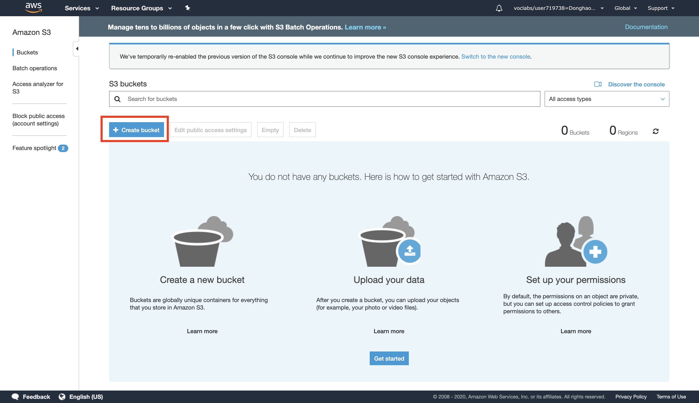
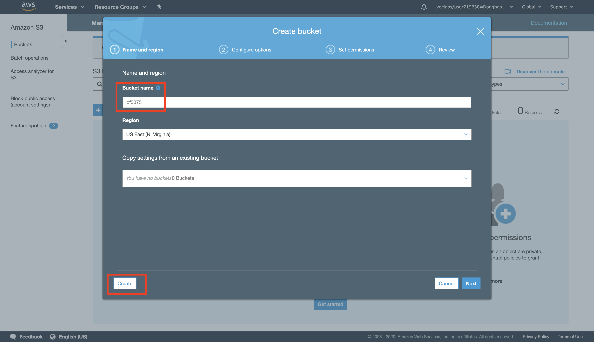
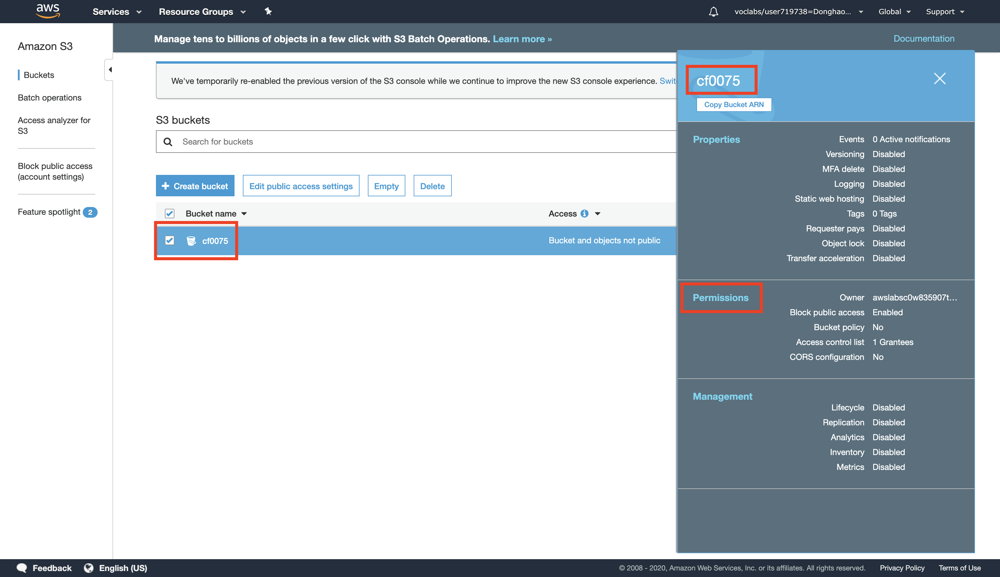
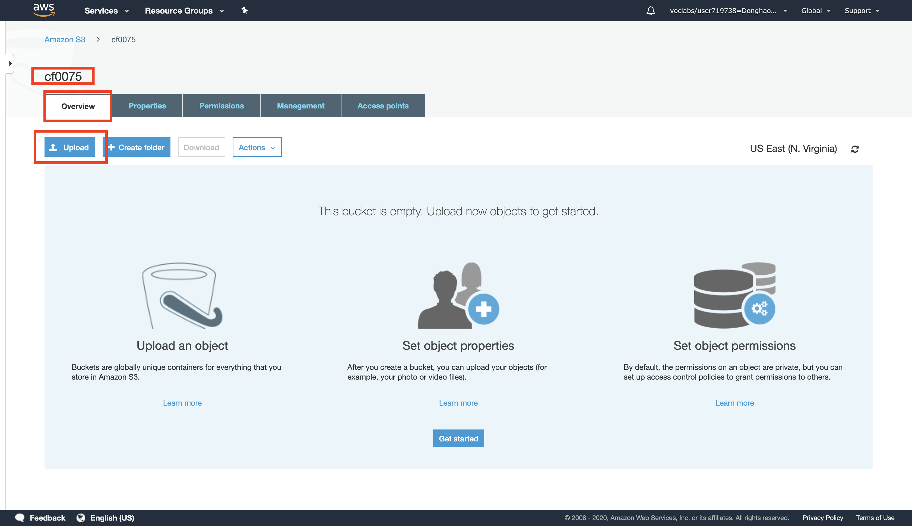
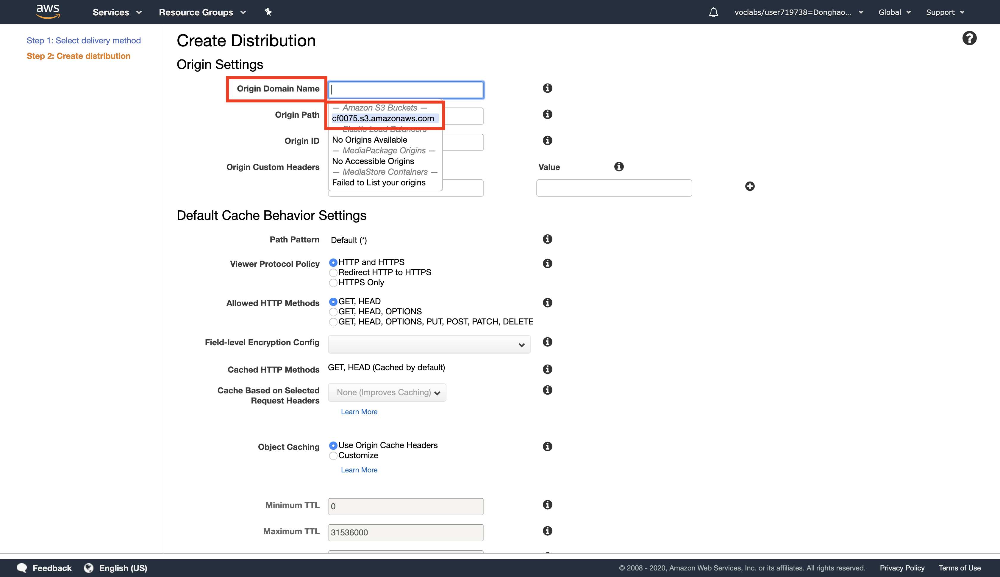
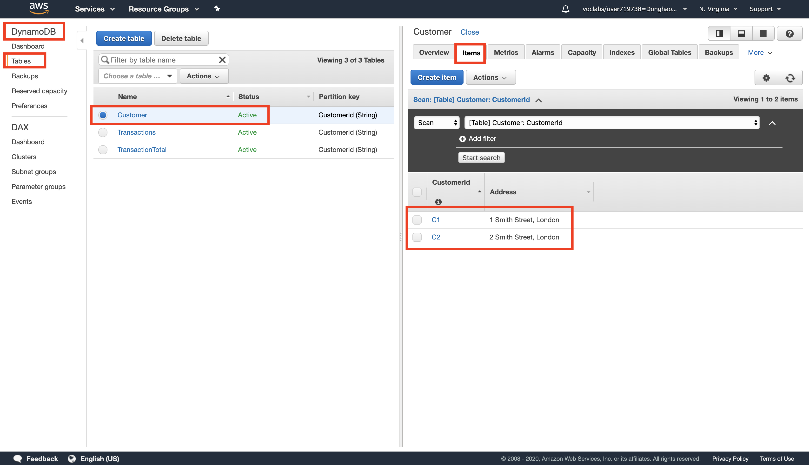

# AWS solution architect (Part 5)

- #### Click here: [BACK TO NAVIGASTION](https://github.com/DonghaoWu/AWS/blob/master/README.md)

## `Section: Introduction to Amazon CloudFront.`

### `Summary`: In this documentation, we learn Creating a new Amazon CloudFront distribution.

- This guide introduces you to Amazon CloudFront. In this lab you will create an Amazon CloudFront distribution that will use a CloudFront domain name in the url to distribute a publicly accessible image file stored in an Amazon S3 bucket.

### `Check Dependencies:`

------------------------------------------------------------

#### `本章背景：`
1. 使用到的 AWS 部件：

- CloudFront
- S3

- 关键词：
    - CloufFront: Amazon CloudFront is a content delivery web service. It integrates with other Amazon Web Services products to give developers and businesses an easy way to distribute content to end users with `low latency, high data transfer speeds, and no minimum usage commitments.`

```diff

```
------------------------------------------------------------

### <span id="5.0">`Brief Contents & codes position`</span>

- #### Click here: [BACK TO NAVIGASTION](https://github.com/DonghaoWu/AWS/blob/master/README.md)

- [5.1 Store a Publicly Accessible Image File in an Amazon S3 Bucket.](#5.1)
- [5.2 Create an Amazon CloudFront Web Distribution.](#5.2)
- [5.3 Create a Link to Your Object.](#5.3)
- [5.4 Delete Your Amazon CloudFront Distribution.](#5.4)
- [5.5 Delete Your Amazon S3 Bucket.](#5.5)

------------------------------------------------------------

### <span id="5.1">`Step1: Store a Publicly Accessible Image File in an Amazon S3 Bucket.`</span>

- #### Click here: [BACK TO CONTENT](#5.0)

1. Create a bucket.
<p align="center">
    
</p>

------------------------------------------------------------------------

<p align="center">
    
</p>

------------------------------------------------------------------------
<p align="center">
    
</p>

------------------------------------------------------------------------

2. Set up the bucket permissions.
<p align="center">
    
</p>

------------------------------------------------------------------------
<p align="center">
    
</p>

------------------------------------------------------------------------
<p align="center">
    
</p>

------------------------------------------------------------------------

3. Upload an image file to the bucket.
<p align="center">
    
</p>

------------------------------------------------------------------------
<p align="center">
    
</p>

------------------------------------------------------------------------
<p align="center">
    
</p>

------------------------------------------------------------------------
<p align="center">
    
</p>

------------------------------------------------------------------------

4. Image info.
<p align="center">
    
</p>

------------------------------------------------------------------------

#### `Comment:`
1. __`除了 bucket 需要设置 permission 之外，bucket 内上传的 file 也需要单独设置 permission.`__

### <span id="5.2">`Step2:  Create an Amazon CloudFront Web Distribution.`</span>

- #### Click here: [BACK TO CONTENT](#5.0)

1. Create contribution.
<p align="center">
    
</p>

------------------------------------------------------------------------
<p align="center">
    
</p>

------------------------------------------------------------------------

2. Select the origin domain name.
<p align="center">
    
</p>

------------------------------------------------------------------------

3. Result.
<p align="center">
    
</p>

------------------------------------------------------------------------

#### `Comment:`
1. 


### <span id="5.3">`Step3: Create a Link to Your Object.`</span>

- #### Click here: [BACK TO CONTENT](#5.0)

1. Create a html file.

```html
<html>

    <head>My CloudFront Test</head>

    <body>
        <p>My text content goes here.</p>
        <p>
            
        </p>
    </body>

</html>
```

#### `Comment:`
1. 
    1. Replace DOMAIN with your Amazon CloudFront Domain Name for your distribution. You should see this on the CloudFront Distributions page.

    2. Replace OBJECT with the name of the file that you uploaded to your Amazon S3 bucket

    3. Save the text file to your computer as myimage.html

    4. Now you get.

    ```html
        <html>

            <head>My CloudFront Test</head>

            <body>
                <p>My text content goes here.</p>
                <p>
                    
                </p>
            </body>

        </html>
    ```html

2. Open the web page you just created in a browser to ensure that you can see your content.

3. Result.
<p align="center">
    
</p>

------------------------------------------------------------------------

### <span id="5.4">`Step4: Delete Your Amazon CloudFront Distribution.`</span>

- #### Click here: [BACK TO CONTENT](#5.0)

<p align="center">
    
</p>

------------------------------------------------------------------------

#### `Comment:`
1. 


### <span id="5.5">`Step5: Delete Your Amazon S3 Bucket.`</span>

- #### Click here: [BACK TO CONTENT](#5.0)

1. Upload the Transactions File.

<p align="center">
    
</p>

--------------------------------------------------------------------

2. Check the DynamoDB tables.

<p align="center">
    
</p>

--------------------------------------------------------------------

#### `Comment:`
1. 

--------------------------------------------------------------------

- #### Click here: [BACK TO CONTENT](#5.0)
- #### Click here: [BACK TO NAVIGASTION](https://github.com/DonghaoWu/AWS/blob/master/README.md)

--------------------------------------------------------------------