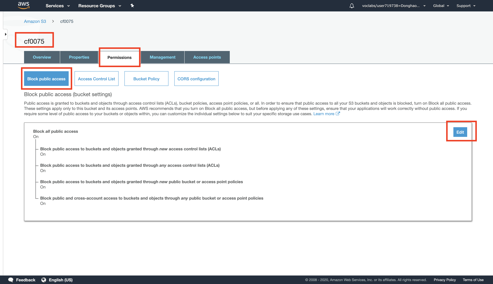
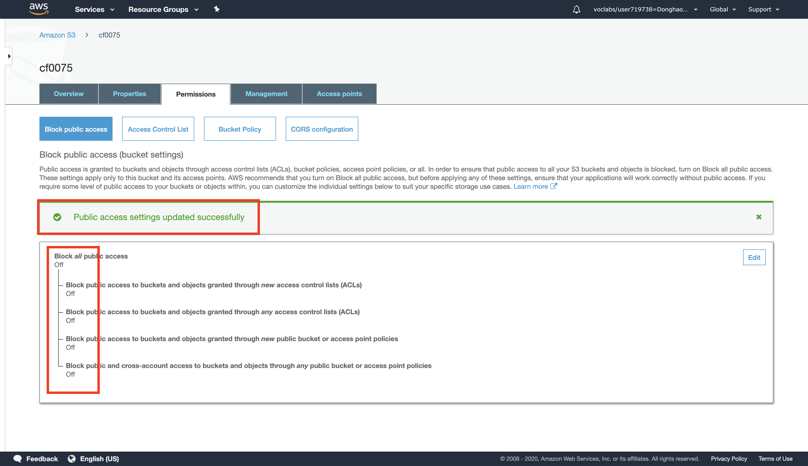
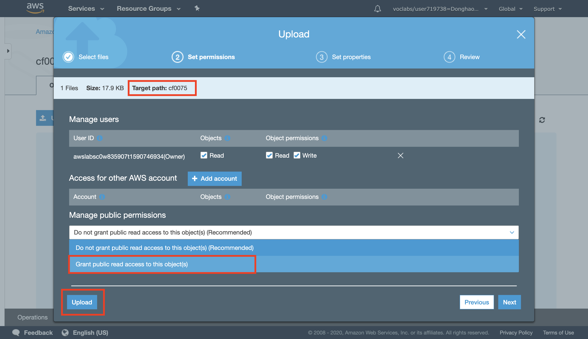
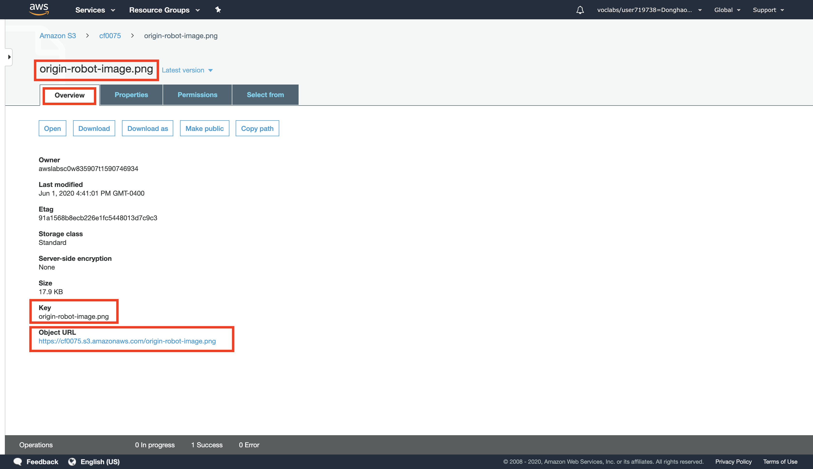
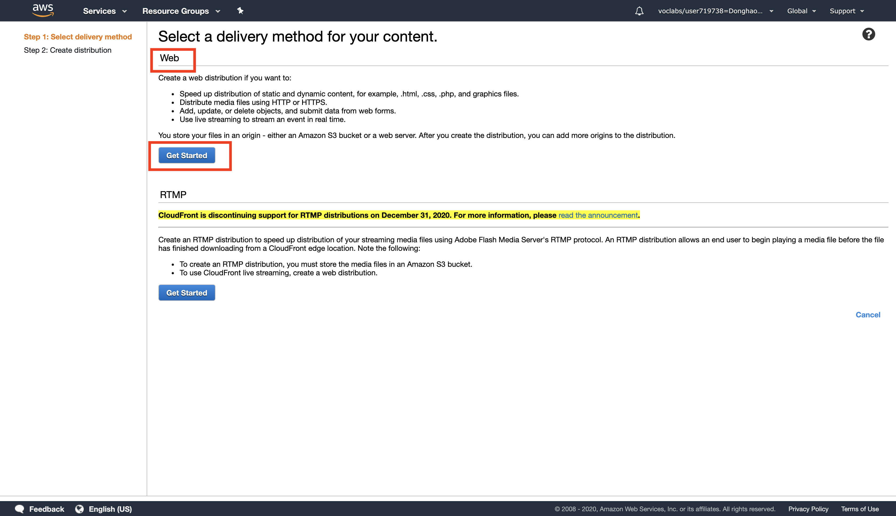
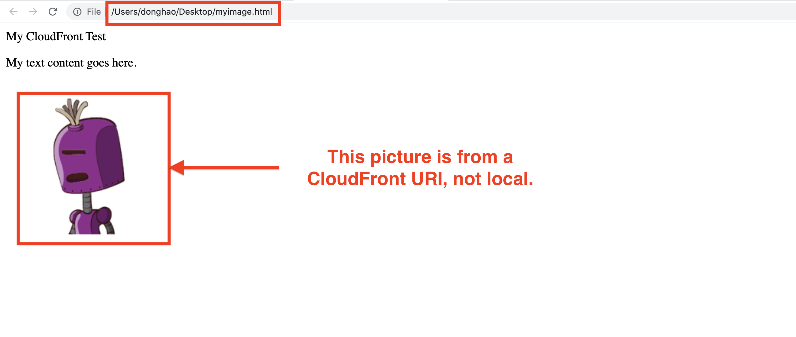
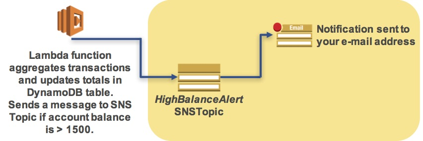
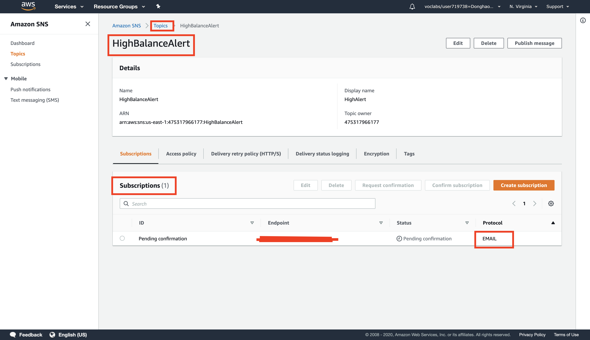
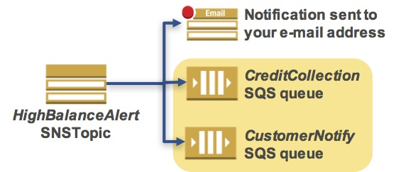
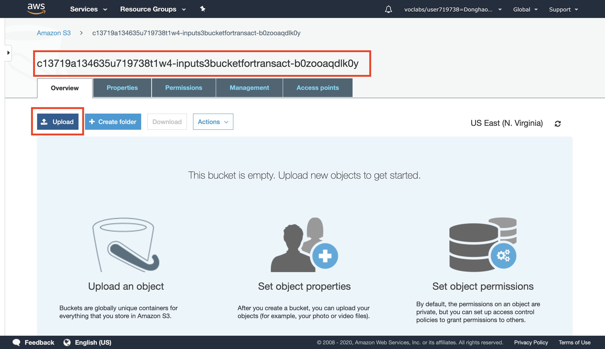

# AWS solution architect (Part 5)

- #### Click here: [BACK TO NAVIGASTION](https://github.com/DonghaoWu/AWS/blob/master/README.md)

## `Section: Introduction to Amazon CloudFront.`

### `Summary`: In this documentation, we learn Creating a new Amazon CloudFront distribution.

- This guide introduces you to Amazon CloudFront. In this lab you will create an Amazon CloudFront distribution that will use a CloudFront domain name in the url to distribute a publicly accessible image file stored in an Amazon S3 bucket.

### `Check Dependencies:`

------------------------------------------------------------

#### `本章背景：`
1. 使用到的 AWS 部件：

- CloudFront
- S3

- 关键词：
    - CloufFront: Amazon CloudFront is a content delivery web service. It integrates with other Amazon Web Services products to give developers and businesses an easy way to distribute content to end users with `low latency, high data transfer speeds, and no minimum usage commitments.`

```diff

```
------------------------------------------------------------

### <span id="5.0">`Brief Contents & codes position`</span>

- #### Click here: [BACK TO NAVIGASTION](https://github.com/DonghaoWu/AWS/blob/master/README.md)

- [5.1 Store a Publicly Accessible Image File in an Amazon S3 Bucket.](#5.1)
- [5.2 Create an Amazon CloudFront Web Distribution.](#5.2)
- [5.3 Create a Link to Your Object.](#5.3)
- [5.4 Delete Your Amazon CloudFront Distribution.](#5.4)
- [5.5 Delete Your Amazon S3 Bucket.](#5.5)

------------------------------------------------------------

### <span id="5.1">`Step1: Store a Publicly Accessible Image File in an Amazon S3 Bucket.`</span>

- #### Click here: [BACK TO CONTENT](#5.0)

1. Create a bucket.
<p align="center">
    
</p>

------------------------------------------------------------------------

<p align="center">
    
</p>

------------------------------------------------------------------------
<p align="center">
    
</p>

------------------------------------------------------------------------

2. Set up the bucket permissions.
<p align="center">
    
</p>

------------------------------------------------------------------------
<p align="center">
    
</p>

------------------------------------------------------------------------
<p align="center">
    
</p>

------------------------------------------------------------------------

3. Upload an image file to the bucket.
<p align="center">
    
</p>

------------------------------------------------------------------------
<p align="center">
    
</p>

------------------------------------------------------------------------
<p align="center">
    
</p>

------------------------------------------------------------------------
<p align="center">
    
</p>

------------------------------------------------------------------------

4. Image info.
<p align="center">
    
</p>

------------------------------------------------------------------------

#### `Comment:`
1. 

### <span id="5.2">`Step2:  Create an Amazon CloudFront Web Distribution.`</span>

- #### Click here: [BACK TO CONTENT](#5.0)

1. Create contribution.
<p align="center">
    
</p>

------------------------------------------------------------------------
<p align="center">
    
</p>

------------------------------------------------------------------------

2. Select the origin domain name.
<p align="center">
    
</p>

------------------------------------------------------------------------

3. Result.
<p align="center">
    
</p>

------------------------------------------------------------------------

#### `Comment:`
1. 


### <span id="5.3">`Step3: Create a Link to Your Object.`</span>

- #### Click here: [BACK TO CONTENT](#5.0)

<p align="center">
    
</p>

------------------------------------------------------------------------
- Create topic.

<p align="center">
    
</p>

------------------------------------------------------------------------
- Create subscription.
<p align="center">
    
</p>

------------------------------------------------------------------------

- Finished.
<p align="center">
    
</p>

------------------------------------------------------------------------
#### `Comment:`
1. 


### <span id="5.4">`Step4: Delete Your Amazon CloudFront Distribution.`</span>

- #### Click here: [BACK TO CONTENT](#5.0)

<p align="center">
    
</p>

------------------------------------------------------------------------

#### `Comment:`
1. 


### <span id="5.5">`Step5: Delete Your Amazon S3 Bucket.`</span>

- #### Click here: [BACK TO CONTENT](#5.0)

1. Upload the Transactions File.

<p align="center">
    
</p>

--------------------------------------------------------------------

2. Check the DynamoDB tables.

<p align="center">
    
</p>

--------------------------------------------------------------------

#### `Comment:`
1. 

--------------------------------------------------------------------

- #### Click here: [BACK TO CONTENT](#5.0)
- #### Click here: [BACK TO NAVIGASTION](https://github.com/DonghaoWu/AWS/blob/master/README.md)

--------------------------------------------------------------------