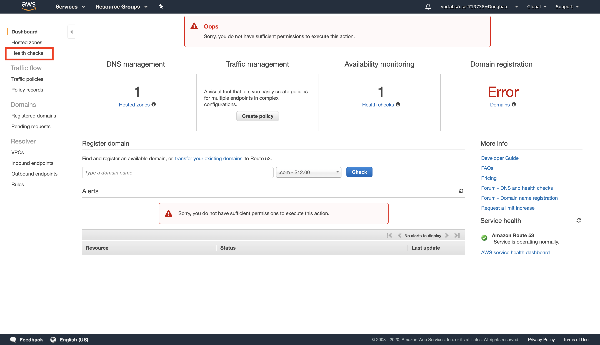
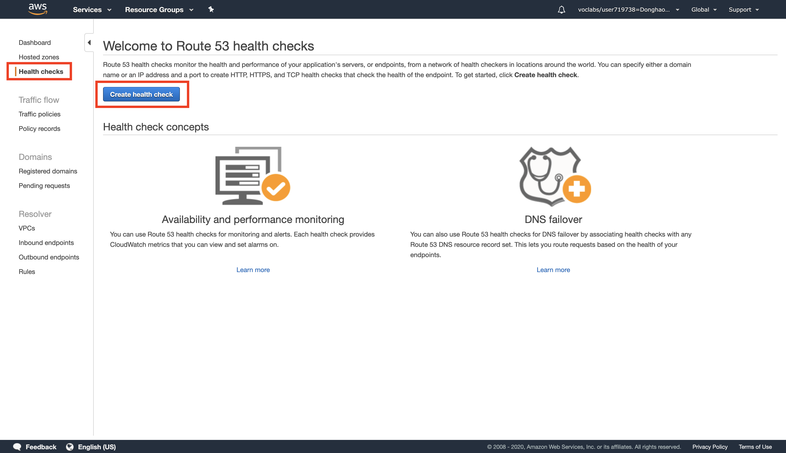
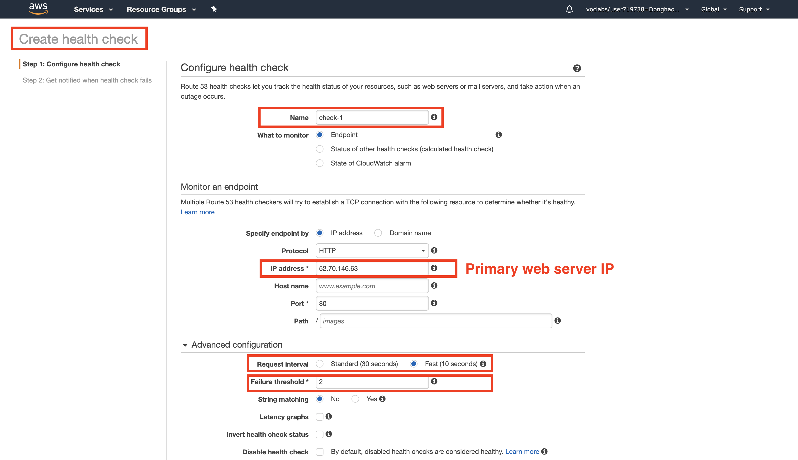
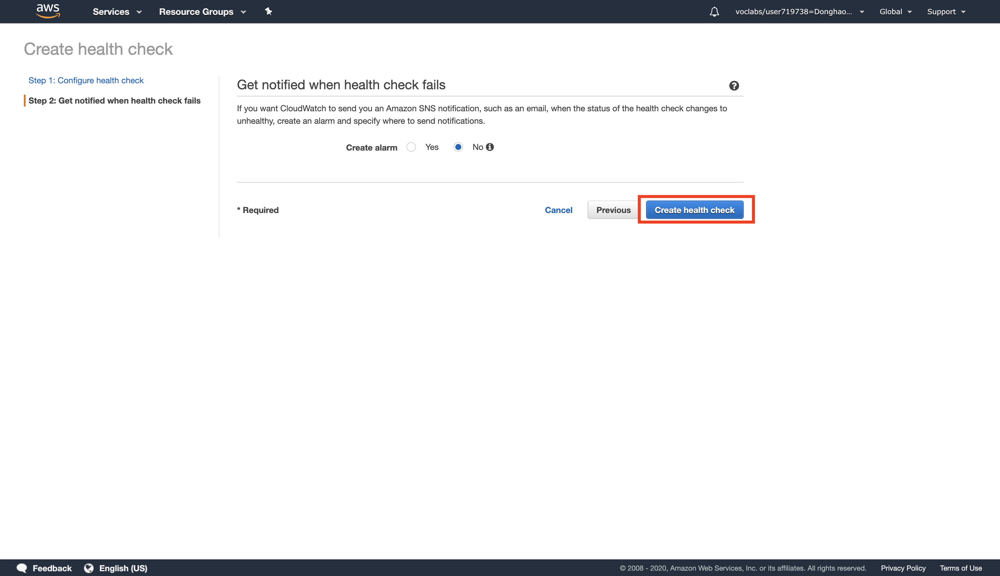
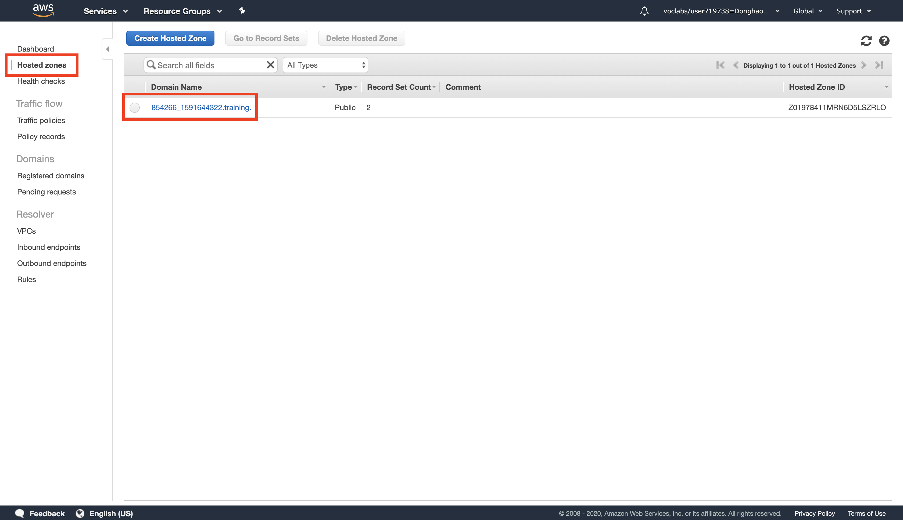
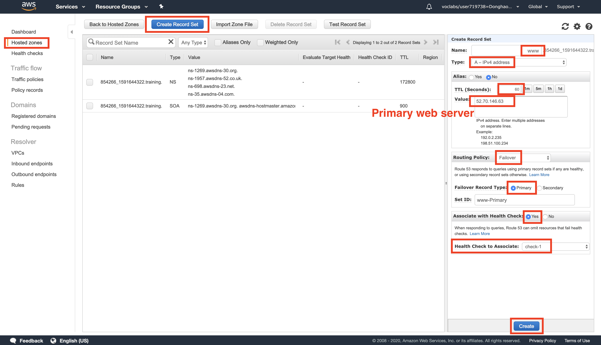
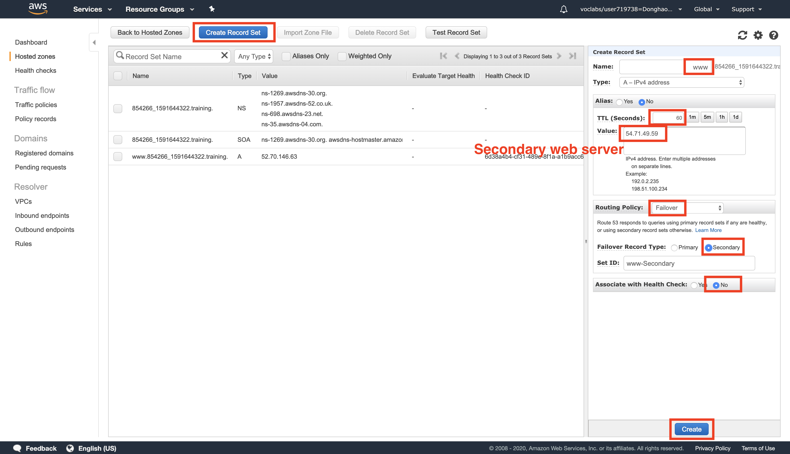
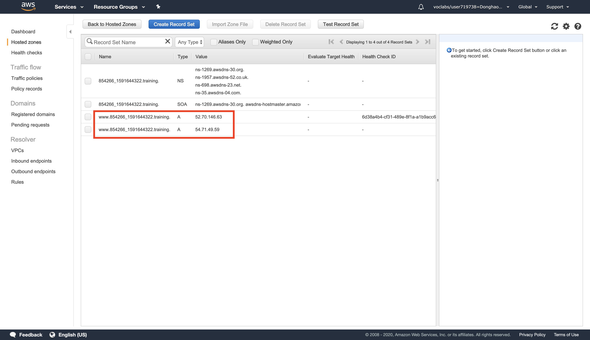
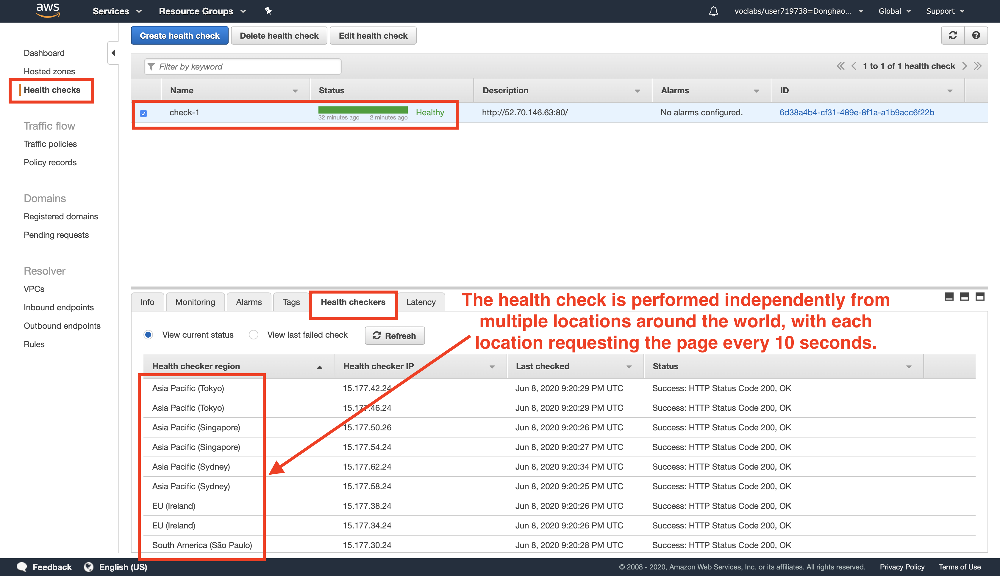

# AWS solution architect (Part 6)

- #### Click here: [BACK TO NAVIGASTION](https://github.com/DonghaoWu/AWS/blob/master/README.md)

## `Section: Multi-Region Failover with Amazon Route 53.`

### `Summary`: In this documentation, we learn Creating a new Amazon CloudFront distribution.

- Region-wide events such as natural disasters can disrupt the availability of a region for an extended length of time, making cross-region availability a critical component to ensure that an application is highly available. Amazon Route 53 can help keep your web application available with a minimal amount of downtime.

### `Check Dependencies:`

------------------------------------------------------------

#### `本章背景：`
1. 使用到的 AWS 部件：

- Route 53

2. 实现目标：

    1. Configure a domain in Amazon Route 53 to send traffic to the primary region.
    2. Configure a Health Check on the primary region. If the health check fails, traffic will be sent to the secondary region.
    3. Test the failover by stopping the instance in the primary region.

<p align="center">
    
</p>

3. 学习目标：

    1. Use Route 53 to configure cross-region failover of a web application.
    2. Use Route 53 health checks to determine the health of a resource.

```diff
+ 这里需要强调的是 Route 53 是针对 Region 的区域停顿，LoadBalancer 针对的是 AZ。
```
------------------------------------------------------------

### <span id="6.0">`Brief Contents & codes position`</span>

- #### Click here: [BACK TO NAVIGASTION](https://github.com/DonghaoWu/AWS/blob/master/README.md)

- [6.1 Inspect Your Environment.](#6.1)
- [6.2 Configure a Health Check.](#6.2)
- [6.3 Configure your Domain in Route 53.](#6.3)
- [6.4 Check the DNS Resolution.](#6.4)
- [6.5 Test Your Failover.](#6.5)

------------------------------------------------------------

### <span id="6.1">`Step1: Inspect Your Environment.`</span>

- #### Click here: [BACK TO CONTENT](#6.0)

1. Take note of your regions and the IPv4 Public IP addresses of the instance in each region.

    - In this lab, we have two regions, each region has one instance. Example:

        1. Primary Region: US East (N. Virginia), instance IPv4 Public IP: 52.70.146.63
        2. Secondary Region: US West (Oregon), instance IPv4 Public IP: 54.71.49.59

#### `Comment:`
1. 

### <span id="6.2">`Step2:  Configure a Health Check.`</span>

- #### Click here: [BACK TO CONTENT](#6.0)

1. Select Route 53 service.

<p align="center">
    
</p>

------------------------------------------------------------------------
<p align="center">
    
</p>

------------------------------------------------------------------------

<p align="center">
    
</p>

------------------------------------------------------------------------

<p align="center">
    
</p>

------------------------------------------------------------------------

#### `Comment:`
1. The health check will now start monitoring your primary web server.

### <span id="6.3">`Step3: Configure your Domain in Route 53.`</span>

- #### Click here: [BACK TO CONTENT](#6.0)

<p align="center">
    
</p>

------------------------------------------------------------------------

- Associat the record with a Health Check.
<p align="center">
    
</p>

------------------------------------------------------------------------

- 设定转移 region.
<p align="center">
    
</p>

------------------------------------------------------------------------

- 成功创建两个 A record.
<p align="center">
    
</p>

------------------------------------------------------------------------

- Result:

<p align="center">
    
</p>

------------------------------------------------------------------------

#### `Comment:`
1. You are not associating the secondary record with a Health Check because there is no third site available.

2. You have now configured your web application to failover across two regions.
------------------------------------------------------------------------

### <span id="6.4">`Step4: Check the DNS Resolution.`</span>

- #### Click here: [BACK TO CONTENT](#6.0)

<p align="center">
    
</p>

------------------------------------------------------------------------

#### `Comment:`
1. 

### <span id="6.5">`Step5: Test Your Failover.`</span>

- #### Click here: [BACK TO CONTENT](#6.0)

<p align="center">
    
</p>

------------------------------------------------------------------------

#### `Comment:`
1. 

--------------------------------------------------------------------

- #### Click here: [BACK TO CONTENT](#6.0)
- #### Click here: [BACK TO NAVIGASTION](https://github.com/DonghaoWu/AWS/blob/master/README.md)

--------------------------------------------------------------------