# AWS solution architect (Part 6)

- #### Click here: [BACK TO NAVIGASTION](https://github.com/DonghaoWu/AWS/blob/master/README.md)

## `Section: Multi-Region Failover with Amazon Route 53.`

### `Summary`: In this documentation, we learn Creating a new Amazon CloudFront distribution.

- Region-wide events such as natural disasters can disrupt the availability of a region for an extended length of time, making cross-region availability a critical component to ensure that an application is highly available. Amazon Route 53 can help keep your web application available with a minimal amount of downtime.

### `Check Dependencies:`

------------------------------------------------------------

#### `本章背景：`
1. 使用到的 AWS 部件：

- Route 53

2. 实现目标：

    1. Configure a domain in Amazon Route 53 to send traffic to the primary region.
    2. Configure a Health Check on the primary region. If the health check fails, traffic will be sent to the secondary region.
    3. Test the failover by stopping the instance in the primary region.

<p align="center">
    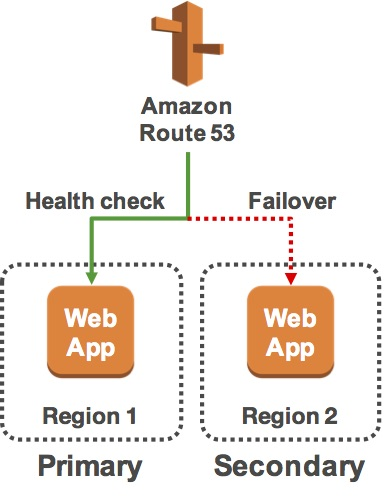
</p>

3. 学习目标：

    1. Use Route 53 to configure cross-region failover of a web application.
    2. Use Route 53 health checks to determine the health of a resource.

```diff
+ 这里需要强调的是 Route 53 是针对 Region 的区域停顿，LoadBalancer 针对的是 AZ。
```
------------------------------------------------------------

### <span id="6.0">`Brief Contents & codes position`</span>

- #### Click here: [BACK TO NAVIGASTION](https://github.com/DonghaoWu/AWS/blob/master/README.md)

- [6.1 Inspect Your Environment.](#6.1)
- [6.2 Configure a Health Check.](#6.2)
- [6.3 Configure your Domain in Route 53.](#6.3)
- [6.4 Check the DNS Resolution.](#6.4)
- [6.5 Test Your Failover.](#6.5)

------------------------------------------------------------

### <span id="6.1">`Step1: Inspect Your Environment.`</span>

- #### Click here: [BACK TO CONTENT](#6.0)

1. Create a bucket.
<p align="center">
    
</p>

------------------------------------------------------------------------

<p align="center">
    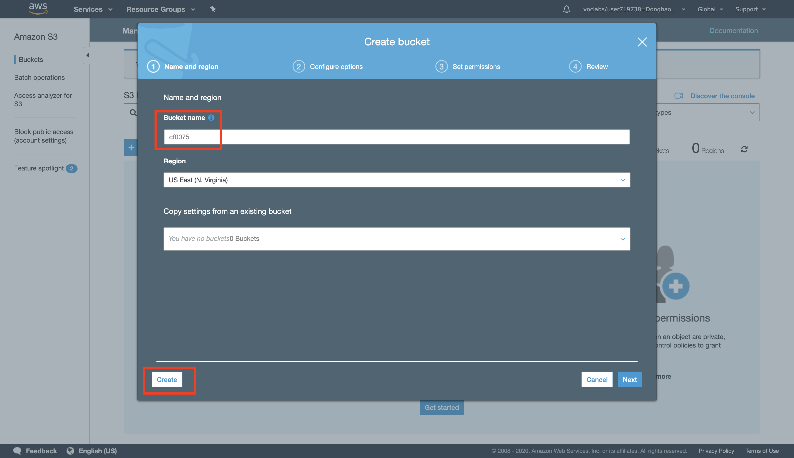
</p>

------------------------------------------------------------------------
<p align="center">
    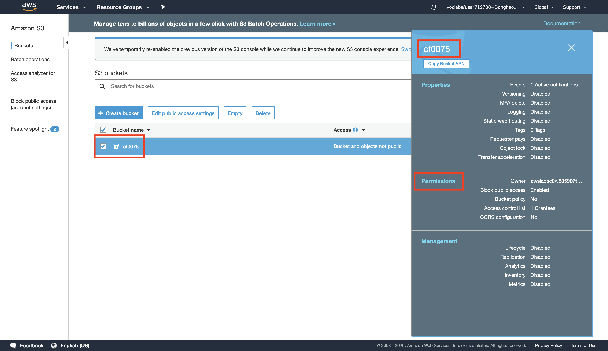
</p>

------------------------------------------------------------------------

2. Set up the bucket permissions.
<p align="center">
    
</p>

------------------------------------------------------------------------
<p align="center">
    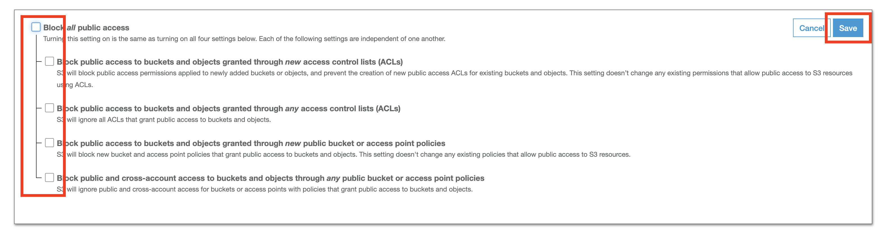
</p>

------------------------------------------------------------------------
<p align="center">
    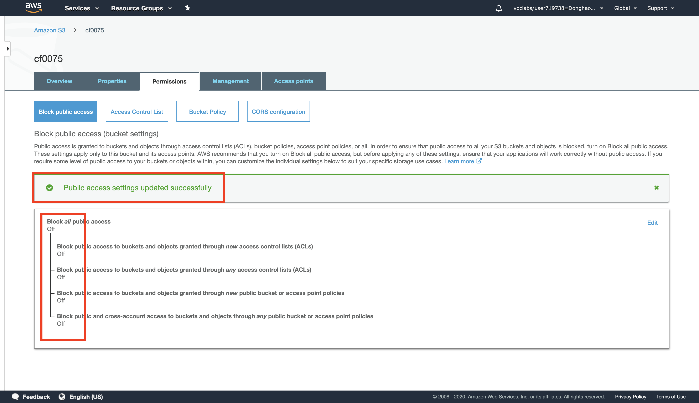
</p>

------------------------------------------------------------------------

3. Upload an image file to the bucket.
<p align="center">
    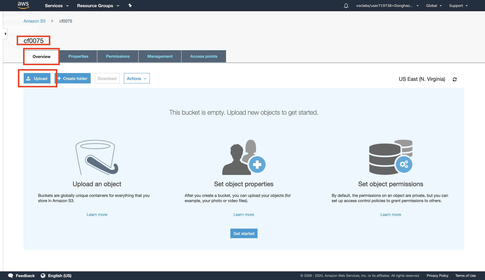
</p>

------------------------------------------------------------------------
<p align="center">
    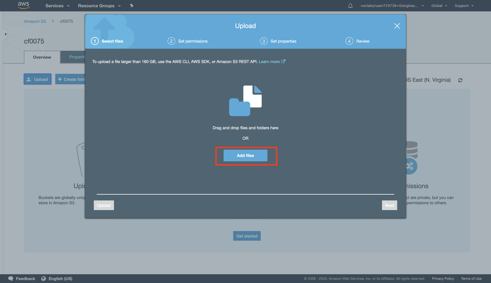
</p>

------------------------------------------------------------------------
<p align="center">
    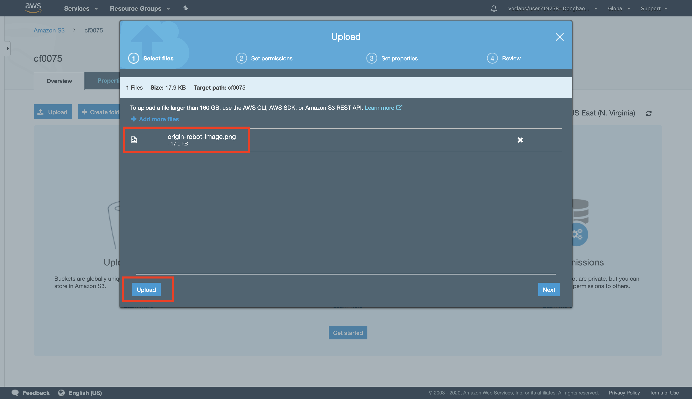
</p>

------------------------------------------------------------------------
<p align="center">
    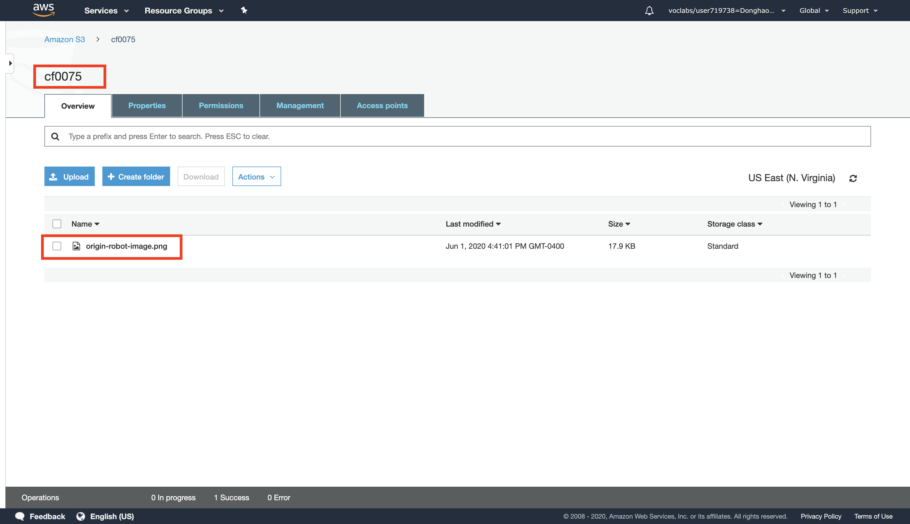
</p>

------------------------------------------------------------------------

4. Image info.
<p align="center">
    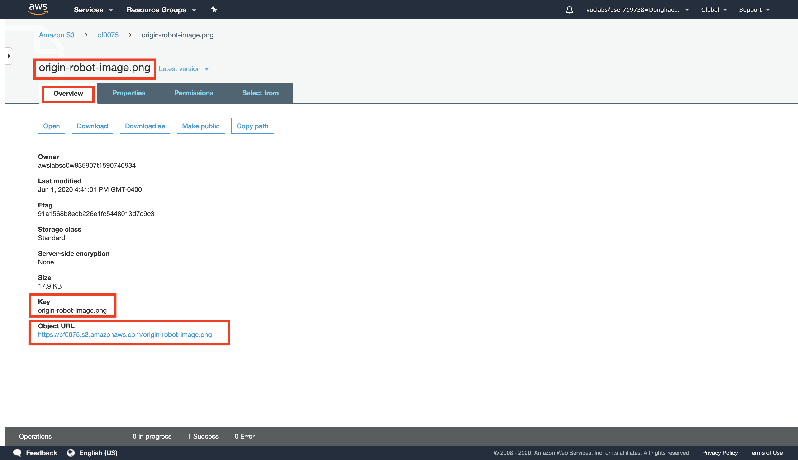
</p>

------------------------------------------------------------------------

#### `Comment:`
1. __`除了 bucket 需要设置 permission 之外，bucket 内上传的 file 也需要单独设置 permission.`__

### <span id="5.2">`Step2:  Create an Amazon CloudFront Web Distribution.`</span>

- #### Click here: [BACK TO CONTENT](#5.0)

1. Create contribution.
<p align="center">
    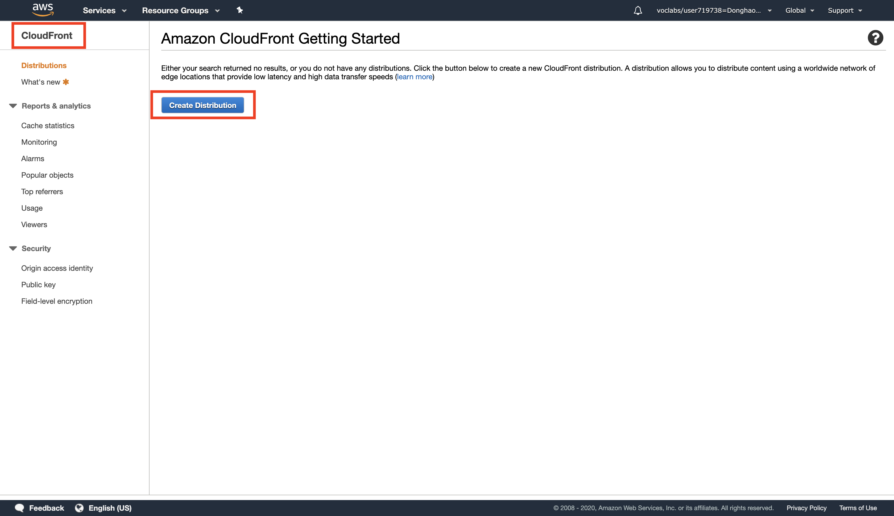
</p>

------------------------------------------------------------------------
<p align="center">
    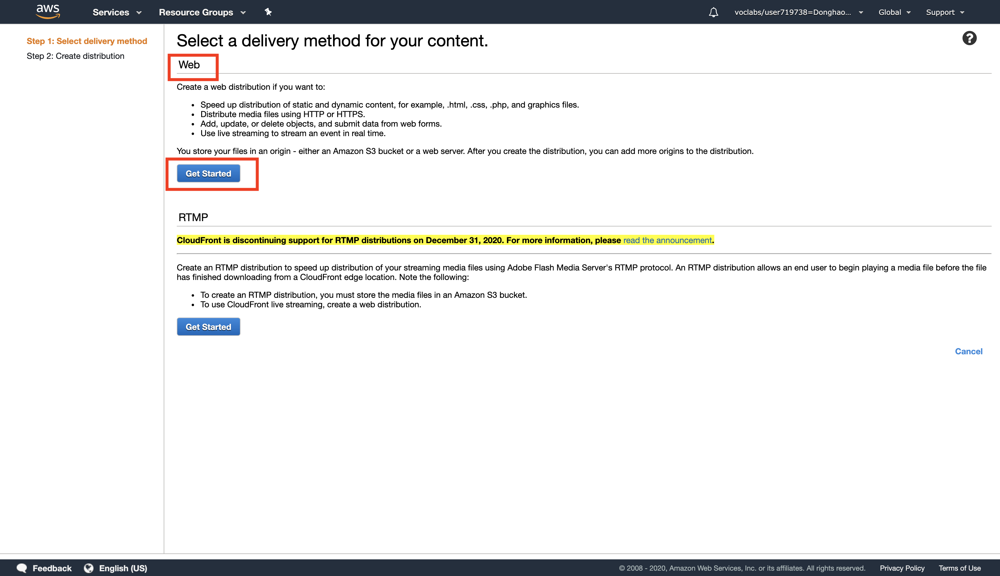
</p>

------------------------------------------------------------------------

2. Select the origin domain name.
<p align="center">
    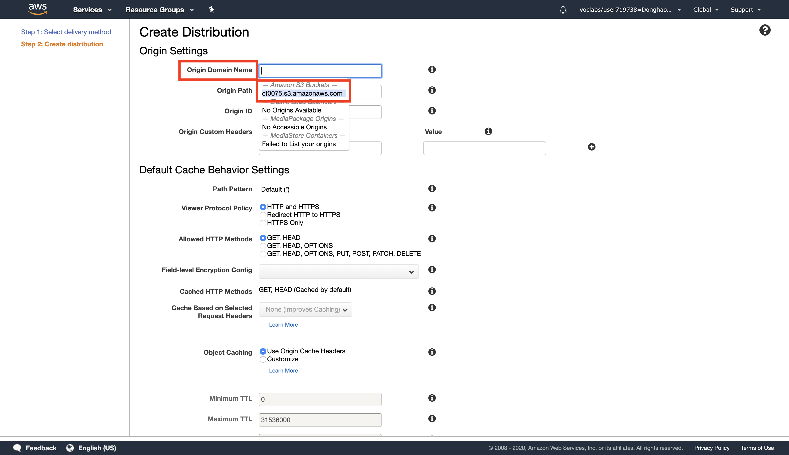
</p>

------------------------------------------------------------------------

3. Result.
<p align="center">
    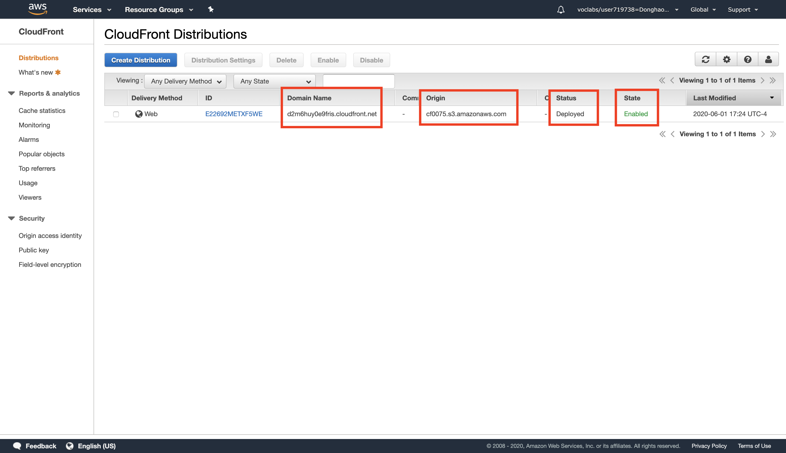
</p>

------------------------------------------------------------------------

#### `Comment:`
1. 


### <span id="5.3">`Step3: Create a Link to Your Object.`</span>

- #### Click here: [BACK TO CONTENT](#5.0)

1. Create a html file.

```html
<html>

    <head>My CloudFront Test</head>

    <body>
        <p>My text content goes here.</p>
        <p>
            
        </p>
    </body>

</html>
```

#### `Comment:`
1. Create a html file.

    1. Replace DOMAIN with your Amazon CloudFront Domain Name for your distribution. You should see this on the CloudFront Distributions page.

    2. Replace OBJECT with the name of the file that you uploaded to your Amazon S3 bucket

    3. Save the text file to your computer as myimage.html

    4. Now you get.

    ```html
    <html>

        <head>My CloudFront Test</head>

        <body>
            <p>My text content goes here.</p>
            <p>
                
            </p>
        </body>

    </html>
    ```

2. Open the web page you just created in a browser to ensure that you can see your content.

3. Result.
<p align="center">
    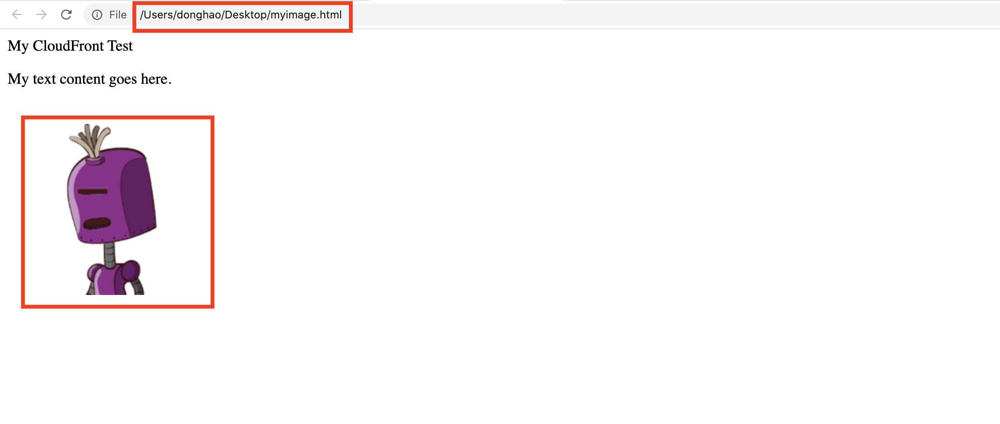
</p>

------------------------------------------------------------------------

### <span id="5.4">`Step4: Delete Your Amazon CloudFront Distribution.`</span>

- #### Click here: [BACK TO CONTENT](#5.0)

<p align="center">
    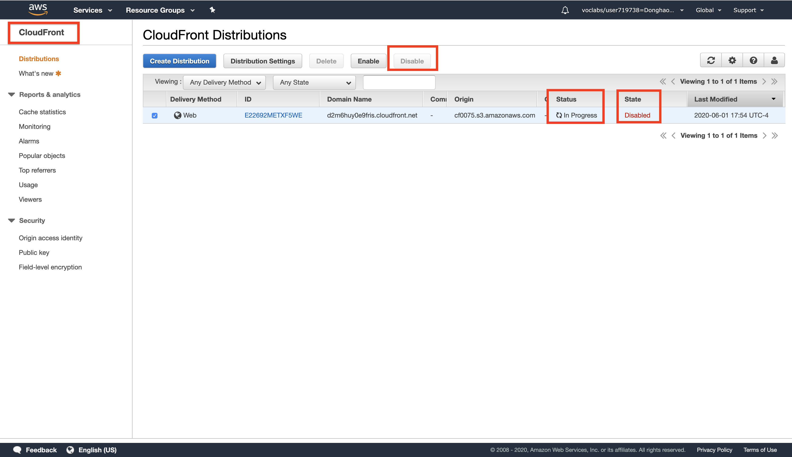
</p>

------------------------------------------------------------------------

#### `Comment:`
1. 

### <span id="5.5">`Step5: Delete Your Amazon S3 Bucket.`</span>

- #### Click here: [BACK TO CONTENT](#5.0)

<p align="center">
    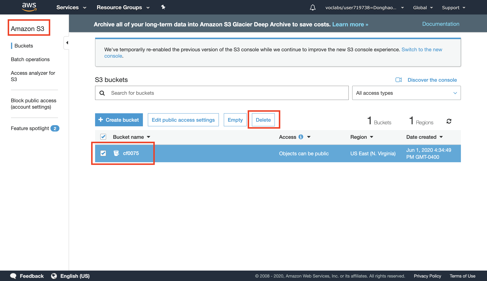
</p>

------------------------------------------------------------------------

#### `Comment:`
1. 

--------------------------------------------------------------------

- #### Click here: [BACK TO CONTENT](#5.0)
- #### Click here: [BACK TO NAVIGASTION](https://github.com/DonghaoWu/AWS/blob/master/README.md)

--------------------------------------------------------------------