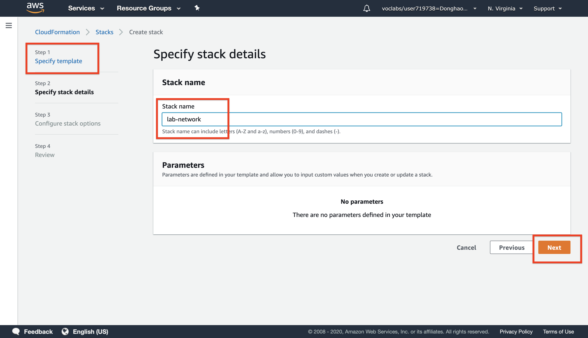
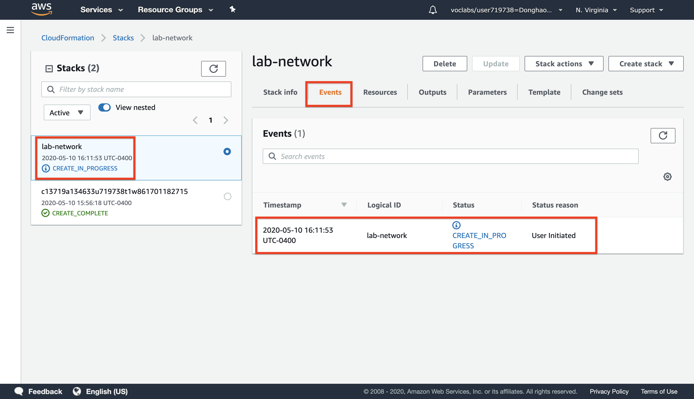
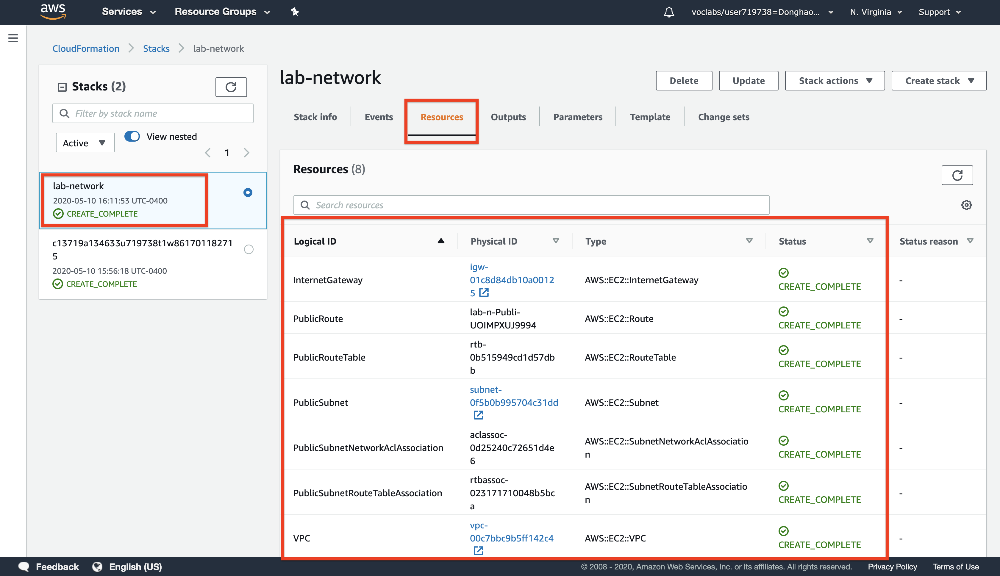
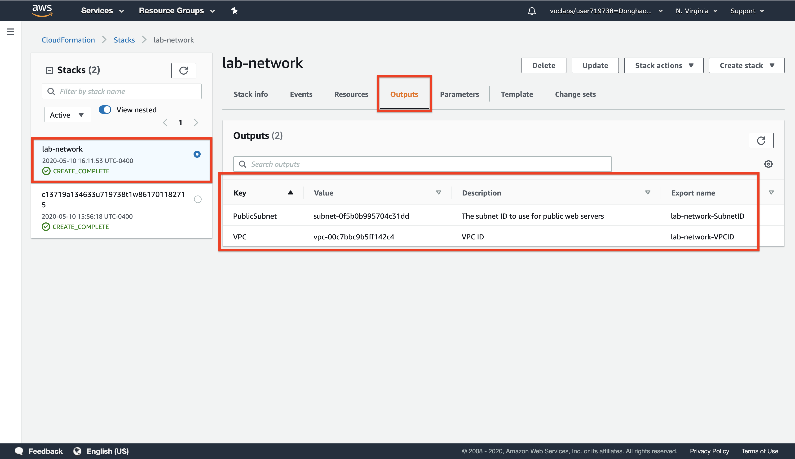
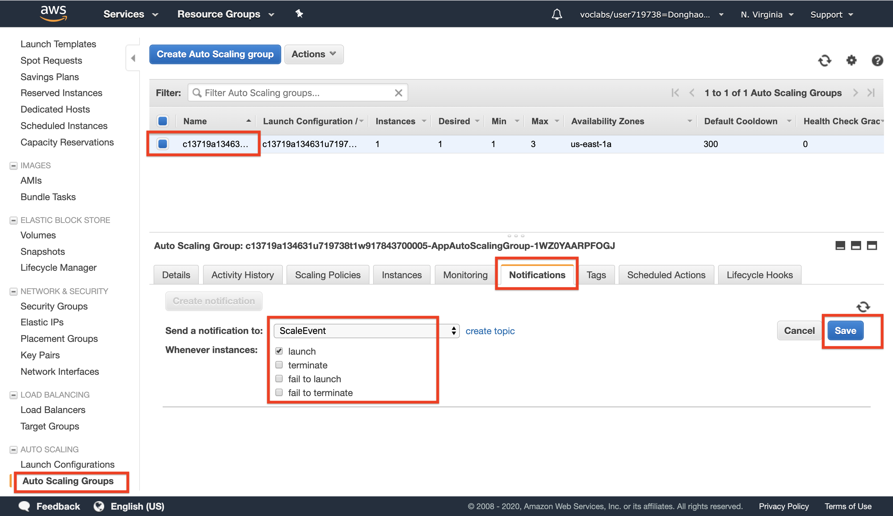
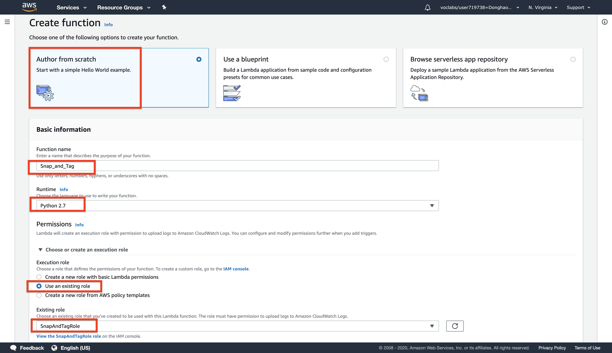
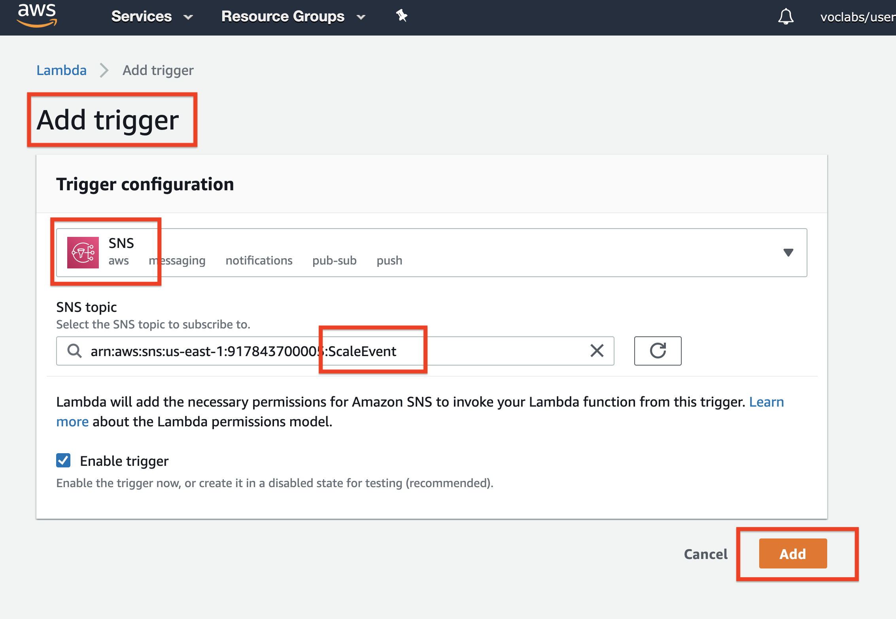
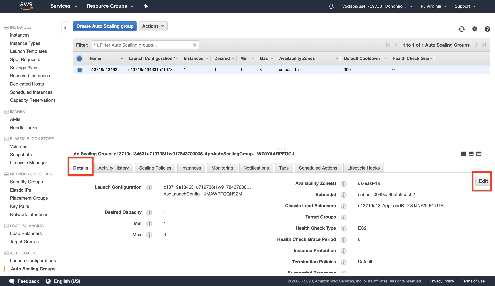
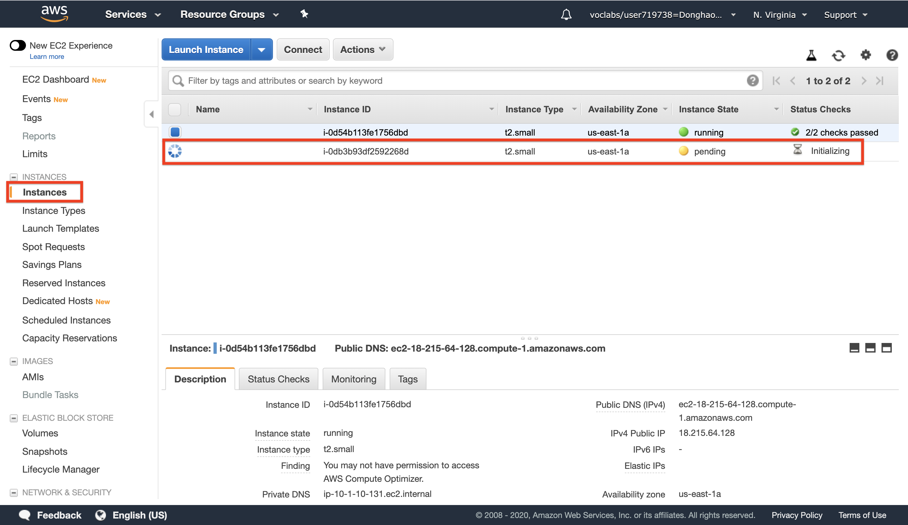
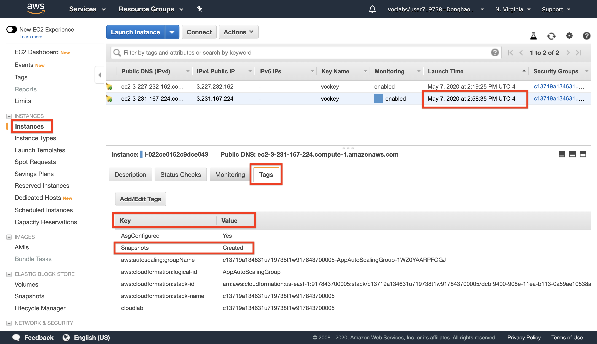

# AWS solution architect (Part 3)

- #### Click here: [BACK TO NAVIGASTION](https://github.com/DonghaoWu/AWS/blob/master/README.md)

## `Section: CloudFormation.`

### `Summary`: In this documentation, we learn Automating Infrastructure Deployment with AWS CloudFormation.

### `Check Dependencies:`

------------------------------------------------------------

#### `本章背景：`
1. 这一部分的内容是使用 CloudFormation 部署多层网络架构，同时学习更新和删除一个栈（栈就是用 CloudFormation 建立起来的架构）。

- 内容：
    - Use AWS CloudFormation to deploy a VPC networking layer

    - Use AWS CloudFormation to deploy an application layer that references the networking layer

    - Explore templates with AWS CloudFormation Designer

    - Delete a stack that has a Deletion Policy

2. 这其中一个关键点是如何在 CloudFormation 中把 networking layer 和 application layer 自动串联连接。

------------------------------------------------------------

### <span id="3.0">`Brief Contents & codes position`</span>

- #### Click here: [BACK TO NAVIGASTION](https://github.com/DonghaoWu/AWS/blob/master/README.md)

- [3.1 Use AWS CloudFormation to deploy a VPC networking layer.](#3.1)
- [3.2 Use AWS CloudFormation to deploy an application layer that references the networking layer.](#3.2)
- [3.3 Explore templates with AWS CloudFormation Designer.](#3.3)
- [3.4 Delete a stack that has a Deletion Policy.](#3.4)
- [3.5 Result.](#3.5)

------------------------------------------------------------

### <span id="3.1">`Step1: Use AWS CloudFormation to deploy a VPC networking layer.`</span>

- #### Click here: [BACK TO CONTENT](#3.0)

<p align="center">
    
</p>

------------------------------------------------------------

<p align="center">
    
</p>

------------------------------------------------------------

<p align="center">
    
</p>

------------------------------------------------------------

<p align="center">
    
</p>

------------------------------------------------------------

<p align="center">
    
</p>

------------------------------------------------------------

<p align="center">
    
</p>

------------------------------------------------------------

<p align="center">
    
</p>

------------------------------------------------------------

<p align="center">
    
</p>

------------------------------------------------------------

<p align="center">
    
</p>

------------------------------------------------------------

<p align="center">
    
</p>

------------------------------------------------------------

#### `Comment:`
1. lab-network.yaml template:

```yaml
AWSTemplateFormatVersion: 2010-09-09
Description: >-
  Network Template: Sample template that creates a VPC with DNS and public IPs enabled.

# This template creates:
#   VPC
#   Internet Gateway
#   Public Route Table
#   Public Subnet

######################
# Resources section
######################

Resources:

  ## VPC

  VPC:
    Type: AWS::EC2::VPC
    Properties:
      EnableDnsSupport: true
      EnableDnsHostnames: true
      CidrBlock: 10.0.0.0/16
      
  ## Internet Gateway

  InternetGateway:
    Type: AWS::EC2::InternetGateway
  
  VPCGatewayAttachment:
    Type: AWS::EC2::VPCGatewayAttachment
    Properties:
      VpcId: !Ref VPC
      InternetGatewayId: !Ref InternetGateway
  
  ## Public Route Table

  PublicRouteTable:
    Type: AWS::EC2::RouteTable
    Properties:
      VpcId: !Ref VPC
  
  PublicRoute:
    Type: AWS::EC2::Route
    DependsOn: VPCGatewayAttachment
    Properties:
      RouteTableId: !Ref PublicRouteTable
      DestinationCidrBlock: 0.0.0.0/0
      GatewayId: !Ref InternetGateway
  
  ## Public Subnet
  
  PublicSubnet:
    Type: AWS::EC2::Subnet
    Properties:
      VpcId: !Ref VPC
      CidrBlock: 10.0.0.0/24
  
  PublicSubnetRouteTableAssociation:
    Type: AWS::EC2::SubnetRouteTableAssociation
    Properties:
      SubnetId: !Ref PublicSubnet
      RouteTableId: !Ref PublicRouteTable
  
  PublicSubnetNetworkAclAssociation:
    Type: AWS::EC2::SubnetNetworkAclAssociation
    Properties:
      SubnetId: !Ref PublicSubnet
      NetworkAclId: !GetAtt 
        - VPC
        - DefaultNetworkAcl
  
######################
# Outputs section
######################

Outputs:
  
  VPC:
    Description: VPC ID
    Value: !Ref VPC
    Export:
      Name: !Sub '${AWS::StackName}-VPCID'
  
  PublicSubnet:
    Description: The subnet ID to use for public web servers
    Value: !Ref PublicSubnet
    Export:
      Name: !Sub '${AWS::StackName}-SubnetID'
```

### <span id="2.2">`Step2: Configure Auto Scaling to Send Events.`</span>

- #### Click here: [BACK TO CONTENT](#2.0)

<p align="center">
    
</p>

------------------------------------------------------------

#### `Comment:`
1. 

### <span id="2.3">`Step3: An IAM Role for the Lambda function.`</span>

- #### Click here: [BACK TO CONTENT](#2.0)

<p align="center">
    
</p>

------------------------------------------------------------

#### `Comment:`
1. 名词：IAM Role policy，这里设置的 `policy: SnapAndTagRole` 会应用在第四步 `Lambda role` 设置中。

### <span id="2.4">`Step4: Create a Lambda Function.`</span>

- #### Click here: [BACK TO CONTENT](#2.0)

<p align="center">
    
</p>

------------------------------------------------------------------------

1. Congigure Lambda function.
<p align="center">
    
</p>

------------------------------------------------------------------------

2. Add Lambda code.
<p align="center">
    
</p>

------------------------------------------------------------------------

3. Add trigger (SNS topic)
<p align="center">
    
</p>

------------------------------------------------------------------------

4. Finished set up.
<p align="center">
    
</p>

------------------------------------------------------------------------

#### `Comment:`
1. Lambda function code (runtime: python 2.7)

```py
# Snap_and_Tag Lambda function
#
# This function is triggered when Auto Scaling launches a new instance.
# A snapshot of EBS volumes will be created and a tag will be added.

from __future__ import print_function

import json, boto3

def lambda_handler(event, context):
    print("Received event: " + json.dumps(event, indent=2))

    # Extract the EC2 instance ID from the Auto Scaling event notification
    message = event['Records'][0]['Sns']['Message']
    autoscalingInfo = json.loads(message)
    ec2InstanceId = autoscalingInfo['EC2InstanceId']

    # Snapshot all EBS volumes attached to the instance
    ec2 = boto3.resource('ec2')
    for v in ec2.volumes.filter(Filters=[{'Name': 'attachment.instance-id', 'Values': [ec2InstanceId]}]):
        description = 'Autosnap-%s-%s' % ( ec2InstanceId, v.volume_id )

        if v.create_snapshot(Description = description):
            print("\t\tSnapshot created with description [%s]" % description)

    # Add a tag to the EC2 instance: Key = Snapshots, Value = Created
    ec2 = boto3.client('ec2')
    response = ec2.create_tags(
        Resources=[ec2InstanceId],
        Tags=[{'Key': 'Snapshots', 'Value': 'Created'}]
    )
    print ("***Tag added to EC2 instance with id: " + ec2InstanceId)

    # Finished!
    return ec2InstanceId
```

2. Examine the code. It is performing the following steps:

    - Extract the EC2 instance ID from the notification message
    - Create a snapshot of all EBS volumes attached to the instance
    - Add a tag to the instance to indicate that snapshots were created

### <span id="2.5">`Step5: Scale-Out the Auto Scaling Group to Trigger the Lambda function.`</span>

- #### Click here: [BACK TO CONTENT](#2.0)

<p align="center">
    
</p>

------------------------------------------------------------------------

<p align="center">
    
</p>

------------------------------------------------------------------------

<p align="center">
    
</p>

------------------------------------------------------------------------

#### `Comment:`
1. 如上图修改 `Desired capacity` 之后 ASG 就会自动启动一个新的 EC2。

### <span id="2.6">`Step6: Result.`</span>

- #### Click here: [BACK TO CONTENT](#2.0)

1. Lambda Function code.
<p align="center">
    
</p>

------------------------------------------------------------------------

2. `The new EC2 has a new tag from Lambda Function.`
<p align="center">
    
</p>

------------------------------------------------------------------------

3. Two new snapshots created at a same time.
<p align="center">
    
</p>

------------------------------------------------------------------------

4. 查看原来的 EC2 附带的 Volumes，上面一共有两个，说明 Lambda 运行成功。
<p align="center">
    
</p>

------------------------------------------------------------------------

#### `Comment:`
1. 

------------------------------------------------------------------------

- #### Click here: [BACK TO CONTENT](#2.0)
- #### Click here: [BACK TO NAVIGASTION](https://github.com/DonghaoWu/AWS/blob/master/README.md)

<p align="center">
    
</p>