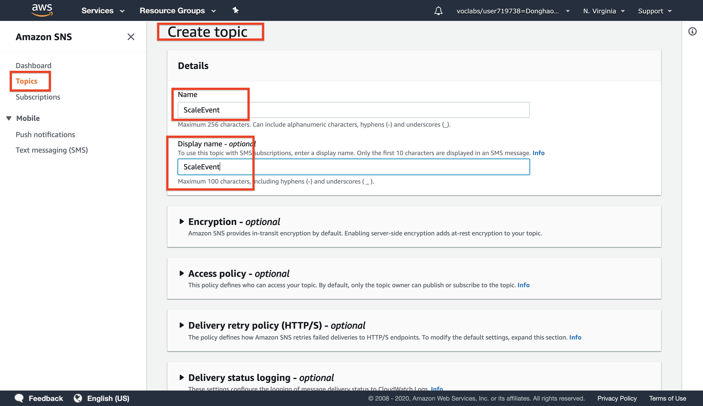
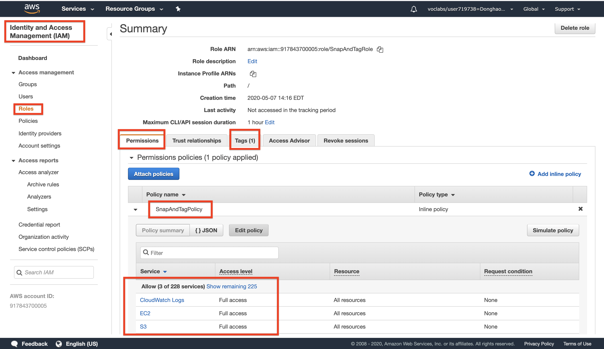
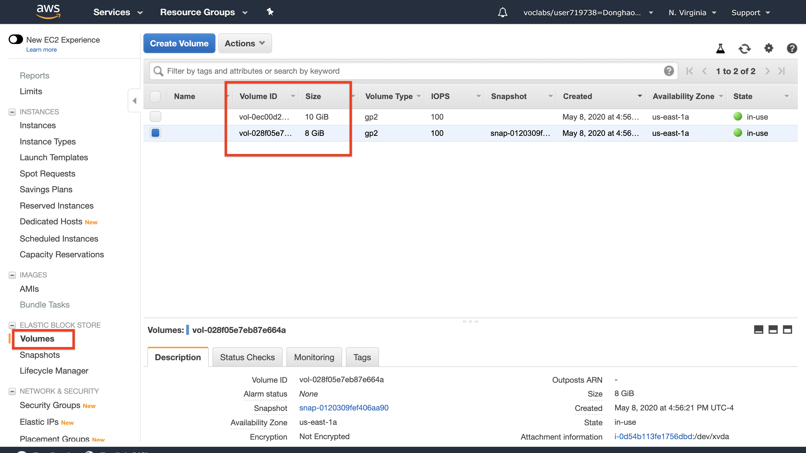

# AWS solution architect (Part 2)

- #### Click here: [BACK TO NAVIGASTION](https://github.com/DonghaoWu/AWS/blob/master/README.md)

## `Section: Making Your Environment Highly Available - part2`

### `Summary`: In this documentation, we learn using notifications to trigger AWS Lambda.

### `Check Dependencies:`

------------------------------------------------------------

#### `本章背景：`
1. 这一部分的内容是要求在已经建立好的简单 VPC 基础上添加 ASG, SNS, Lambda, CloudWatch 从而使整个系统的 `持续可用能力` 提高。

- 整体规划图：

<p align="center">
    
</p>

------------------------------------------------------------

<p align="center">
    
</p>

------------------------------------------------------------

2. 引用服务先后顺序：

```diff
+ ASG add new EC2 -> SNS topic -> Trigger Lambda function -> Create EBS snapshot  + Send info to CloudWatch
```

3. 在实验过程中有一个疑惑的地方，就是 Lambda 生成了一个 snapshot ，但是有两个新的 volume 。（5月8日更正，原本有2个 volume，生成后也有两个 snapshot。）

- 设计 HA 整体的步骤是：

```diff
+ ASG
+ SNS
+ Lambda
+ CloudWatch
```

------------------------------------------------------------

### <span id="2.0">`Brief Contents & codes position`</span>

- #### Click here: [BACK TO NAVIGASTION](https://github.com/DonghaoWu/AWS/blob/master/README.md)

- [2.1 Create an SNS Topic.](#2.1)
- [2.2 Configure Auto Scaling to Send Events.](#2.2)
- [2.3 An IAM Role for the Lambda function.](#2.3)
- [2.4 Create a Lambda Function.](#2.4)
- [2.5 Scale-Out the Auto Scaling Group to Trigger the Lambda function.](#2.5)
- [2.6 Result.](#2.6)

------------------------------------------------------------

### <span id="2.1">`Step1: Create an SNS Topic.`</span>

- #### Click here: [BACK TO CONTENT](#2.0)

<p align="center">
    
</p>

------------------------------------------------------------

#### `Comment:`
1. 名词：SNS Topic

### <span id="2.2">`Step2: Configure Auto Scaling to Send Events.`</span>

- #### Click here: [BACK TO CONTENT](#2.0)

<p align="center">
    
</p>

------------------------------------------------------------

#### `Comment:`
1. 

### <span id="2.3">`Step3: An IAM Role for the Lambda function.`</span>

- #### Click here: [BACK TO CONTENT](#2.0)

<p align="center">
    
</p>

------------------------------------------------------------

#### `Comment:`
1. 名词：IAM Role policy，这里设置的 `policy: SnapAndTagRole` 会应用在第四步 `Lambda role` 设置中。

### <span id="2.4">`Step4: Create a Lambda Function.`</span>

- #### Click here: [BACK TO CONTENT](#2.0)

<p align="center">
    
</p>

------------------------------------------------------------------------

1. Congigure Lambda function.
<p align="center">
    
</p>

------------------------------------------------------------------------

2. Add Lambda code.
<p align="center">
    
</p>

------------------------------------------------------------------------

3. Add trigger (SNS topic)
<p align="center">
    
</p>

------------------------------------------------------------------------

4. Finished set up.
<p align="center">
    
</p>

------------------------------------------------------------------------

#### `Comment:`
1. Lambda function code (runtime: python 2.7)

```py
# Snap_and_Tag Lambda function
#
# This function is triggered when Auto Scaling launches a new instance.
# A snapshot of EBS volumes will be created and a tag will be added.

from __future__ import print_function

import json, boto3

def lambda_handler(event, context):
    print("Received event: " + json.dumps(event, indent=2))

    # Extract the EC2 instance ID from the Auto Scaling event notification
    message = event['Records'][0]['Sns']['Message']
    autoscalingInfo = json.loads(message)
    ec2InstanceId = autoscalingInfo['EC2InstanceId']

    # Snapshot all EBS volumes attached to the instance
    ec2 = boto3.resource('ec2')
    for v in ec2.volumes.filter(Filters=[{'Name': 'attachment.instance-id', 'Values': [ec2InstanceId]}]):
        description = 'Autosnap-%s-%s' % ( ec2InstanceId, v.volume_id )

        if v.create_snapshot(Description = description):
            print("\t\tSnapshot created with description [%s]" % description)

    # Add a tag to the EC2 instance: Key = Snapshots, Value = Created
    ec2 = boto3.client('ec2')
    response = ec2.create_tags(
        Resources=[ec2InstanceId],
        Tags=[{'Key': 'Snapshots', 'Value': 'Created'}]
    )
    print ("***Tag added to EC2 instance with id: " + ec2InstanceId)

    # Finished!
    return ec2InstanceId
```

2. Examine the code. It is performing the following steps:

    - Extract the EC2 instance ID from the notification message
    - Create a snapshot of all EBS volumes attached to the instance
    - Add a tag to the instance to indicate that snapshots were created

### <span id="2.5">`Step5: Scale-Out the Auto Scaling Group to Trigger the Lambda function.`</span>

- #### Click here: [BACK TO CONTENT](#2.0)

<p align="center">
    
</p>

------------------------------------------------------------------------

<p align="center">
    
</p>

------------------------------------------------------------------------

#### `Comment:`
1. 如上图修改 `Desired capacity` 之后 ASG 就会自动启动一个新的 EC2。

### <span id="2.6">`Step6: Result.`</span>

- #### Click here: [BACK TO CONTENT](#2.0)

1. Lambda Function code.
<p align="center">
    
</p>

------------------------------------------------------------------------

2. `The new EC2 has a new tag from Lambda Function.`
<p align="center">
    
</p>

------------------------------------------------------------------------

3. Two new snapshots created at a same time.
<p align="center">
    
</p>

------------------------------------------------------------------------

4. 查看原来的 EC2 附带的 Volumes，上面一共有两个，说明 Lambda 运行成功。
<p align="center">
    
</p>

------------------------------------------------------------------------

#### `Comment:`
1. 

------------------------------------------------------------------------

- #### Click here: [BACK TO CONTENT](#2.0)
- #### Click here: [BACK TO NAVIGASTION](https://github.com/DonghaoWu/AWS/blob/master/README.md)

<p align="center">
    
</p>