# AWS solution architect (Part 1)

- #### Click here: [BACK TO NAVIGASTION](https://github.com/DonghaoWu/AWS/blob/master/README.md)

## `Section: Making Your Environment Highly Available`

### `Summary`: In this documentation, we learn Making Your Environment Highly Available.

### `Check Dependencies:`

------------------------------------------------------------

#### `本章背景：`
1. 这一部分的内容是要求在已经建立好的简单 VPC 基础上添加 Load balancer 和 Auto Scaling Group 从而使整个系统的 `持续可用能力` 提高。

2. To build a highly available application, `it is a best practice to launch resources in multiple Availability Zones`.

3. Creating an Auto Scaling group that deploys Amazon EC2 instances across your Private Subnets is best practice security for deploying applications because instances in a private subnet cannot be accessed from the Internet.

4. 本章设置的地址池：

    - VPC：`10.200.0.0/20`
    - Public subnet 1: `10.200.0.0/24`
    - Private subnet 1: `10.200.2.0/23`
    - Public subnet 2: `10.200.1.0/24`
    - Private subnet 2: `10.200.4.0/23`

5. 数据流管道：

outbound：
```diff
+ EC2 -> Private subnet + Route Table -> NAT gateway -> Public subnet + Route Table -> Internet Gateway 
```

6. NAT gateway 必须是在 `public subnet CIDR` 内。

7. Load Balancer 建议架设在 VPC 的 `public subnet 之间，且最好是不同 AZ 的 public subnet。`

8. Auto scaling group 建议应用在 VPC 内`处于 private subnet 的 EC2，且最好是不同 AZ 的 private subnet。`

9. Load Balancer is a critical component of a Highly Available architecture because it `performs health checks on instances and only sends requests to healthy instances.`(除了平均分配之外，更重要的是服务器健康监测。)

10. Auto Scaling is a service designed to launch or terminate Amazon EC2 instances automatically based on user-defined policies, schedules, and health checks. It also `automatically distributes instances across multiple Availability Zones` to make applications Highly Available.

- 设计 HA 整体的步骤是：

```diff
+ AMI
+ AZ
+ Application Load Balancer
+ Auto Scaling Group
```

<p align="center">
    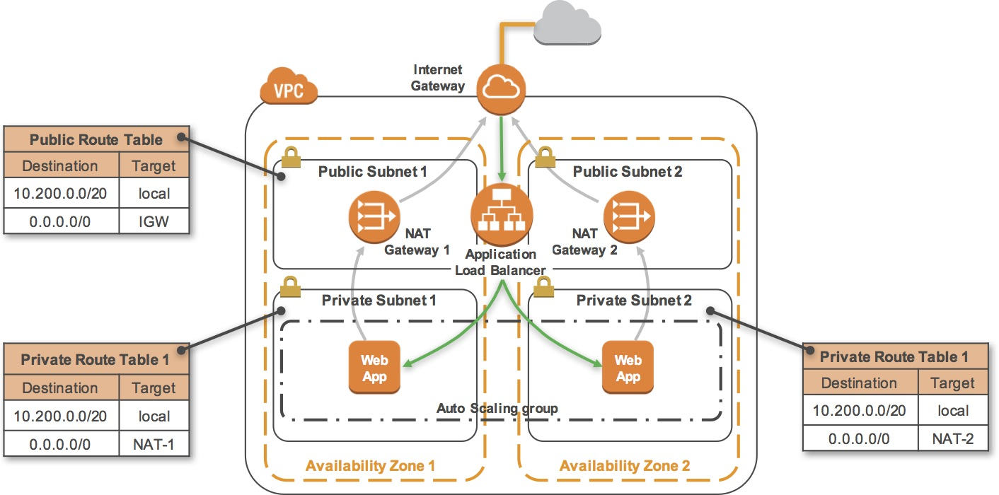
</p>

------------------------------------------------------------

### <span id="1.0">`Brief Contents & codes position`</span>

- #### Click here: [BACK TO NAVIGASTION](https://github.com/DonghaoWu/AWS/blob/master/README.md)

- [1.1 Inspect Your environment.](#1.1)
- [1.2 Using SSH to Connect(Mac).](#1.2)
- [1.3 Download, Install, and Launch Your Web Server's PHP Application.](#1.3)
- [1.4 Create an Amazon Machine Image (AMI).](#1.4)
- [1.5 Configure a Second Availability Zone.](#1.5)
- [1.6 Create an Application Load Balancer.](#1.6)
- [1.7 Create an Auto Scaling Group.](#1.7)


------------------------------------------------------------

### <span id="1.1">`Step1: Inspect Your environment.`</span>

- #### Click here: [BACK TO CONTENT](#1.0)

1. 设定好的基本的 VPC 结构：

    - IPv4 CIDR：10.200.0.0/20 - 10.200.15.255 。一共`4096`个地址（包含几个 aws 保留地址），这些地址都是只能够在 VPC 内部使用的，也是所谓的地址池。

    - Route Table：这个是很多部件都有的。

    - Subnets：理解成把内部地址切割成小部分，这是 VPC 里面很重要的部件设定。
    - Availability Zone：每个 subnet 都要设定所属的 AZ。
    - Internet Gateway：相当于一个 VPC 跟 Internet 的交流处，所有 VPC 内需要跟 Internet 交流的服务都需要在 `Route Table` 中接上它。

    - Security Group：一个用来限制出入协议类型和地址范围的安全设定，可以套用在很多地方，比如 EC2，Load Balancer，Auto Scaling Group 等等。在 VPC 层面可以查看所有已经生成的 SG 规则。`这是个常用策略，后续详细分解。`

2. Subnet

    - Route Table：一个 public subnet 的 Route Table 设置有基本两条设定：
        - Destination：10.200.0.0/20，target：local 
        - Destination：0.0.0.0/0，target：igw-00ea57db0b42a0107

        - 备注：第一条的意思是，这个 subnet 任何向 10.200.0.0/20 范围的地址发出的请求都是指向 `VPC` 而不是外网的，这相当于`设定了 subnet 跟 VPC 的从属关系。`
        - 备注：第二条的意思是，这个 subnet 任何向 0.0.0.0/0 范围的地址发出的请求都是指向一个 `internet gateway` 的，这相当于`设定了 subnet 跟 internet 之间的交流通过 gateway。`（也因为这个设定使这个 subnet 成为 public。）
    
    - Network ACL：这个是 subnet 特有的，`作用跟 SG 差不多，但应用对象只能是 subnet。`

    - Availability zone：Subnet 所属 AZ。 

3. EC2

    - IPv4 Public IP：这个是每个 EC2 在网络上的标记，也就是说从浏览器可以访问的地址。
    - Private IPs：这个 EC2 在 VPC 内部地址。
    - Security Group：应用在这个 EC2 的 SG 规则。
    - Availability zone：EC2 所属 AZ。 


#### `Comment:`
1. 同一个 Route Table 里面的不同规则会有不同的覆盖或独立关系，后面更新。

2. 一个比较难理解的点，就是虽然是同一个 VPC，但是里面的 subnet 可以属于不同的差异非常大的 AZ，也就是说同一个 VPC 地址池的 IP 可以分配到很多 AZ 的服务器。

3. `subnet 有 Network ACL，其他服务如 EC2 有 Security Group。`

4. 判断 EC2 跟 Subnet 的关系可以通过 VPC 地址从属关系看出。

5. EC2 是没有 `Route Table` 的，它只能从所属 Subnet 那里直接继承下来，这样隐性的 `Route Table` 和 显式的 `Security Group` 构成了 EC2 的对外通讯规则。

<p align="center">
    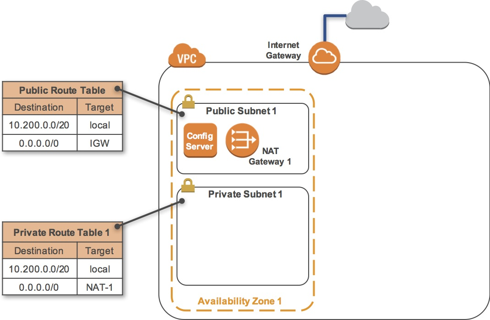
</p>

------------------------------------------------------------

### <span id="1.2">`Step2: Using SSH to Connect(Mac).`</span>

- #### Click here: [BACK TO CONTENT](#1.0)

1. Download button and save the labsuser.pem file.

2. bash command:
```bash
$ cd ~/Downloads
$ chmod 400 labsuser.pem
$ ssh -i labsuser.pem ec2-user@<public-ip> ## Then type ’yes‘
```

### <span id="1.3">`Step3: Download, Install, and Launch Your Web Server's PHP Application`</span>

- #### Click here: [BACK TO CONTENT](#1.0)

```bash
$ sudo yum -y update
$ sudo yum -y install httpd php
$ sudo chkconfig httpd on
$ wget https://aws-tc-largeobjects.s3-us-west-2.amazonaws.com/CUR-TF-200-ACACAD/studentdownload/phpapp.zip
$ sudo unzip phpapp.zip -d /var/www/html/
$ sudo service httpd start
$ exit
```

#### `Comment:`
1. 第三句：This configures the Apache web server to automatically start when the instance starts.
2. 第六句：This starts the Apache web server. `在当前 instance 马上启动 Apache 服务器处理软件。`
3. 第七句：This ends your SSH session. `结束本地电脑对 instance 的操作，但不是关闭instance 运行。`


### <span id="1.4">`Step4: Create an Amazon Machine Image (AMI).`</span>

- #### Click here: [BACK TO CONTENT](#1.0)

- Terminology:
    - Amazon Machine Image (AMI): An AMI is `a copy of the disk volumes attached to an Amazon EC2 instance`. When a new instance is launched from an AMI, the disk volumes will contain exactly the same data as the original instance.

<p align="center">
    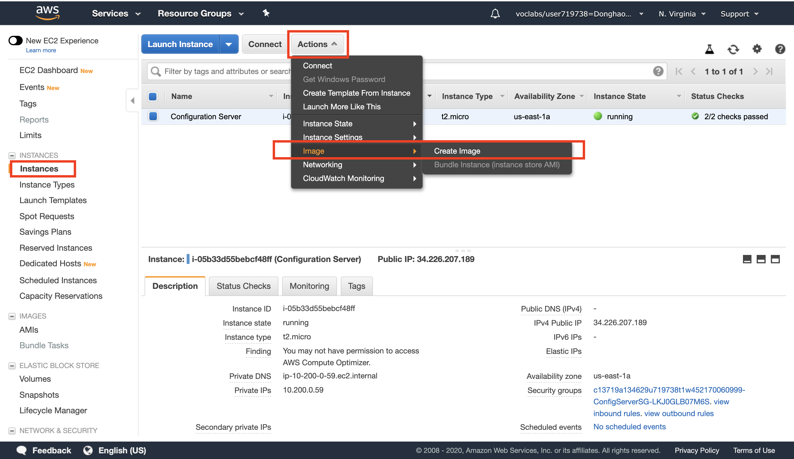
</p>

------------------------------------------------------------------------

#### `Comment:`
1. 创建一个可复制并自动部署的软件系统镜像，这是创建 Auto Scaling Group 之前必须实现的第一步。

2. 这里创建的 AMI 是以上面已经存在的 EC2 里面的数据为基础（包括 Apache 设置及应用）。

3. There is no need to wait while it is being created.


### <span id="1.5">`Step5: Configure a Second Availability Zone.`</span>

- #### Click here: [BACK TO CONTENT](#1.0)

- 大纲：
    - You will duplicate your network environment into a second Availability Zone. You will create:

        - A second public subnet
        - A second private subnet
        - A second NAT Gateway
        - A second private Route Table


1. 创建 `A second Public subnet`:

    这里主要设计以下几个设置：
    1. __`VPC`__：在目标 VPC 内创建 subnet
    2. __`AZ`__：subnet 的 AZ 跟 VPC 内其他 `public subnet 的 AZ 必须不一样`
    3. __`CIDR`__：`需要手动输入这个 subnet 的地址池 （CIDR）。`
    4. __`Route Table`__：必须有一条 `Destination：0.0.0.0/0，target：igw-00ea57db0b42a0107`

<p align="center">
    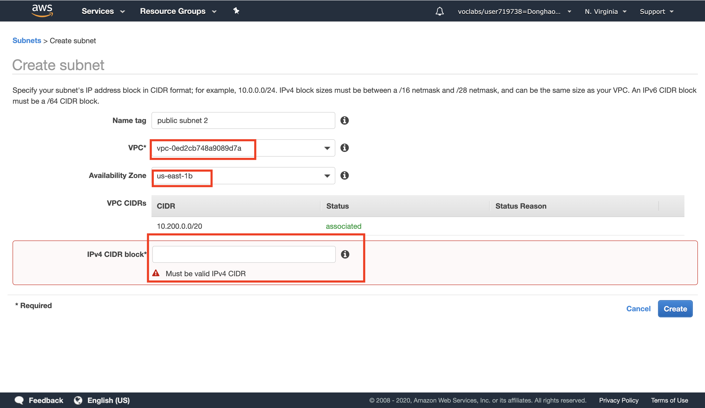
</p>

------------------------------------------------------------------------

2. 创建 `A second Private subnet`:

    这里主要设计以下几个设置：
    1. __`VPC`__：在目标 VPC 内创建 subnet
    2. __`AZ`__：subnet 的 AZ 跟 上一步中一致。
    3. __`CIDR`__：`需要手动输入这个 subnet 的地址池 （CIDR）。`
    4. __`Route Table`__：需要一个新的 Route Table (第四步)，连接内网同时连接第三步创建的 `second NAT gateway`。

3. 创建 `A Second NAT Gateway`

    - 术语：
        - A NAT Gateway (Network Address Translation) is `provisioned into a public Subnet` and provides `outbound Internet connectivity` for resources in a `private Subnet`.

    这里主要设计以下几个设置：
    1. __`subnet`__：第一步中创建的 public subnet。
    2. __`EIP`__：An Elastic IP Address (EIP) is a static IP address that will be associated with this NAT Gateway. The Elastic IP address will `remain unchanged `over the life of the NAT Gateway.

<p align="center">
    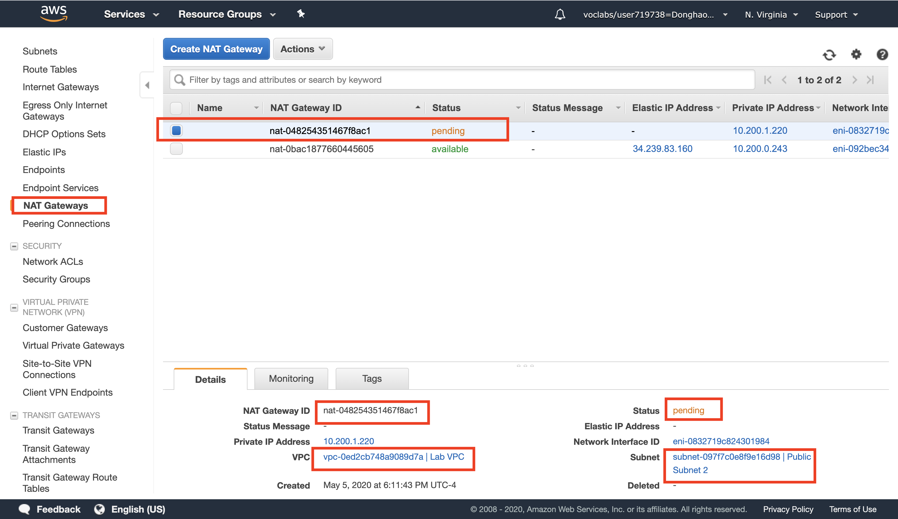
</p>

------------------------------------------------------------------------

4. 创建 `A second private Route Table`

<p align="center">
    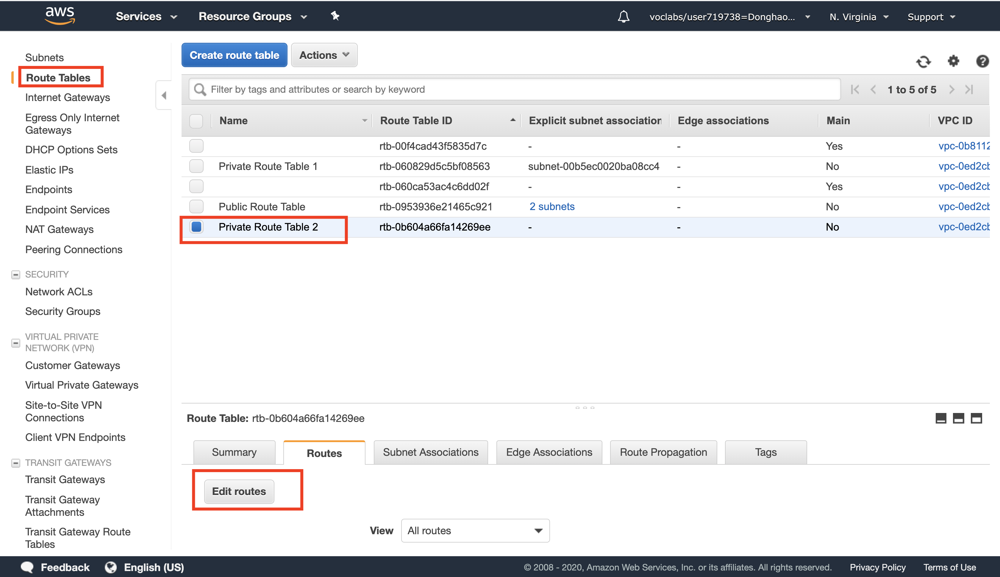
</p>

------------------------------------------------------------------------

<p align="center">
    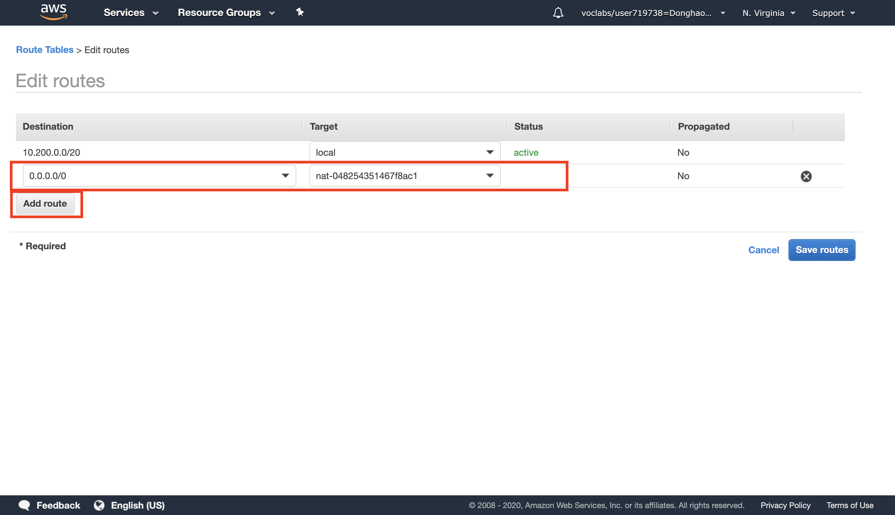
</p>

------------------------------------------------------------------------

##### 记得创建之后 `Edit subnet associations.`

#### `Comment:`
1. To build a highly available application, it is a best practice to launch resources in multiple Availability Zones.

2. NAT 是位于 Public Subnet 内连接 `Private subnet` 的服务，主要作用是可以为 `Private subnet` 提供`外向`数据能力。

3. EIP 也是一个`固定 IP + 灵活底层硬件`的设置。

4. 小结：

```diff
+ subnet:
    - VPC
    - AZ
    - CIDR
    - Route Table

+ NAT Gateway
    - subnet
    - EIP
```

<p align="center">
    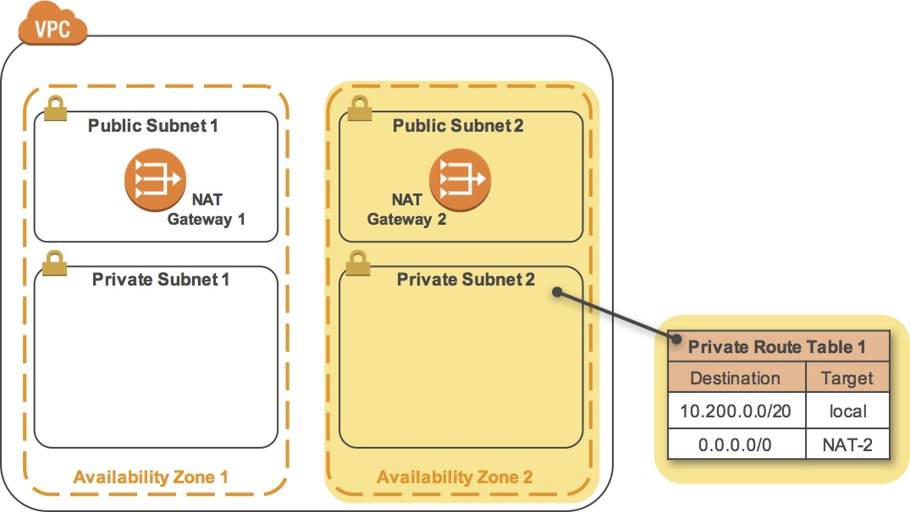
</p>

------------------------------------------------------------------------

### <span id="1.6">`Step6: Create an Application Load Balancer.`</span>

- #### Click here: [BACK TO CONTENT](#1.0)

1. 创建 `An Application Load Balancer`:

    这里主要设计以下几个设置：
    1. __`VPC`__：在目标 VPC 内创建 LB。
    2. __`AZ`__：在目标 AZ 内创建 LB。
    3. __`subnet`__：在目标 subnet 之间创建 LB 作为桥梁。
    4. __`Security Group`__：EC2，LB，ASG 都使用 SG。
    5. __`Target Group`__：这个主要定义`进入 LB 的 traffic 向哪个目标发送`（这里应该目标是 ASG，但在这一步不设置，看第7步），同时这里设置`服务器健康检测`。

<p align="center">
    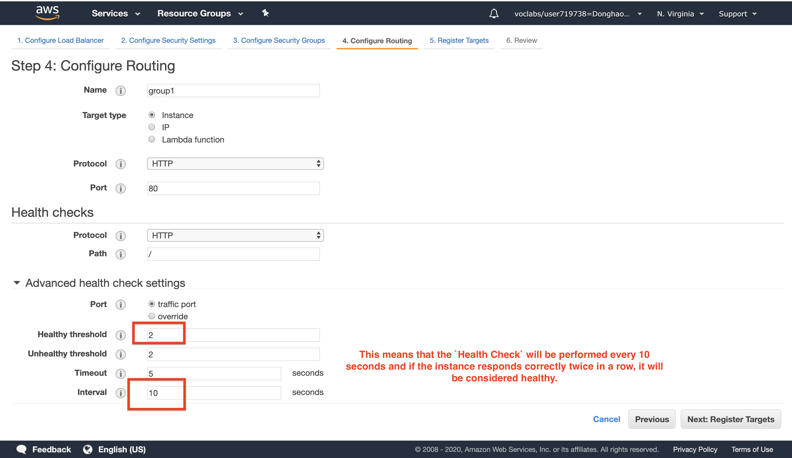
</p>

------------------------------------------------------------------------

#### `Comment:`
1. This is a critical component of a Highly Available architecture because the Load Balancer performs health checks on instances and only sends requests to healthy instances.

2. 在设置 LB 的时候需要关注的一个点是：`LB 连接的所有 subnet 的 Route Table 是否都有连接 Internet Gateway。`如果没有的话那个 subnet 是不会连接到 Internet，这样 LB 也不会对那个 subnet 分配 traffic。

3. Target Groups define where to `send traffic` that comes into the Load Balancer. The Application Load Balancer can send traffic to multiple Target Groups based upon the URL of the incoming request.

4. 5月6日，target groups 的解释不够好。 

<p align="center">
    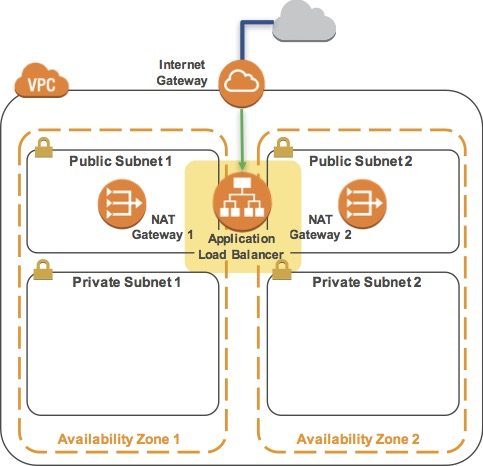
</p>

------------------------------------------------------------------------


### <span id="1.7">`Step7: Create an Auto Scaling Group.`</span>

- #### Click here: [BACK TO CONTENT](#1.0)

1. 做这一步之前先确定 `AMI` 是否已经建立成功.

2. 创建 `An Auto Scaling Group`:

    - 关于 `Launch configuration` 的设置：
        1. __`AMI`__：选择自定义的 AMI 或者系统默认 AMI。
        2. __`Storage`__：AMI 需要的储存空间。
        3. __`Security Group`__：EC2，LB，ASG 都使用 SG。

    - 关于 `Creating Auto Scaling Group` 的设置：
        1. __`Group Size`__：起始 instance 数目。
        2. __`Network`__：对应的 VPC。
        3. __`Subnet`__：ASG 架设的 private subnets。
        4. __`Load Balancer`__：对接的在 `public subnet` 的 Load Balancer。
        5. __`Target Groups`__：对应 LB 的 TG。
        6. __`Keep this group at its initial size`__：保证 instance 的最低数量。
        7. __`Configure Tags`__：Tags placed on the Auto Scaling group can also automatically propagate to the instances launched by Auto Scaling.

<p align="center">
    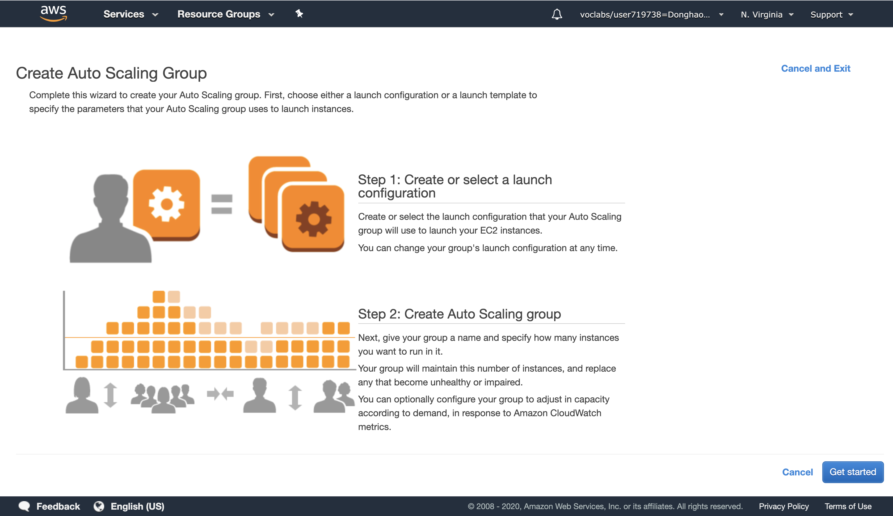
</p>

------------------------------------------------------------------------


#### `Comment:`
1. A Launch Configuration defines what type of instances should be launched by Auto Scaling. The interface looks similar to launching an Amazon `EC2` instance, but `rather than launching an instance it stores the configuration for later use.`

2. You will configure the Launch Configuration to use the AMI that you created earlier. It contains a copy of the software that you installed on the Configuration Server.

3. 小结：

```diff
+ Load Balancer:
    - VPC
    - AZ
    - subnet
    - Security Group
    - Target Group

+ Auto Scaling group:
    - AMI
    - Storage
    - Security Group
    - VPC
    - Subnet
    - Load Balancer
    - Target Groups
    - Configure Tags
```

<p align="center">
    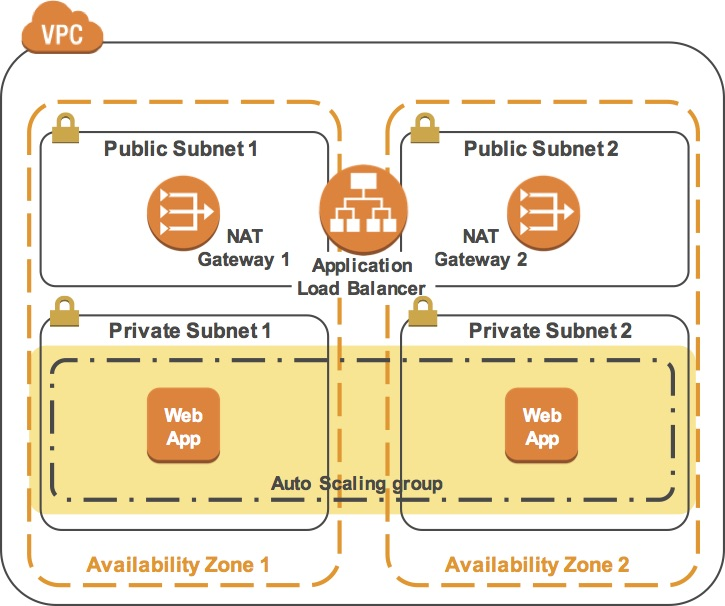
</p>

------------------------------------------------------------------------


- #### Click here: [BACK TO CONTENT](#1.0)
- #### Click here: [BACK TO NAVIGASTION](https://github.com/DonghaoWu/AWS/blob/master/README.md)

<p align="center">
    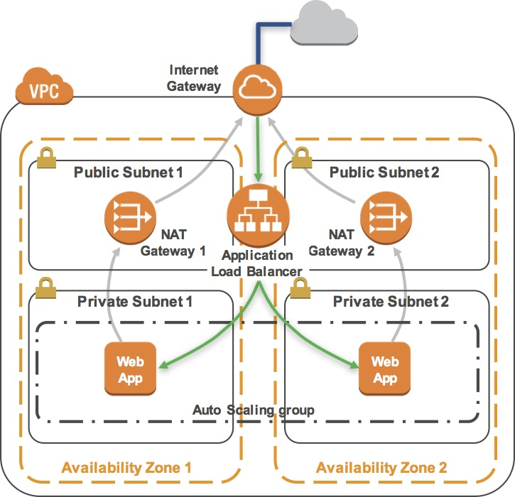
</p>