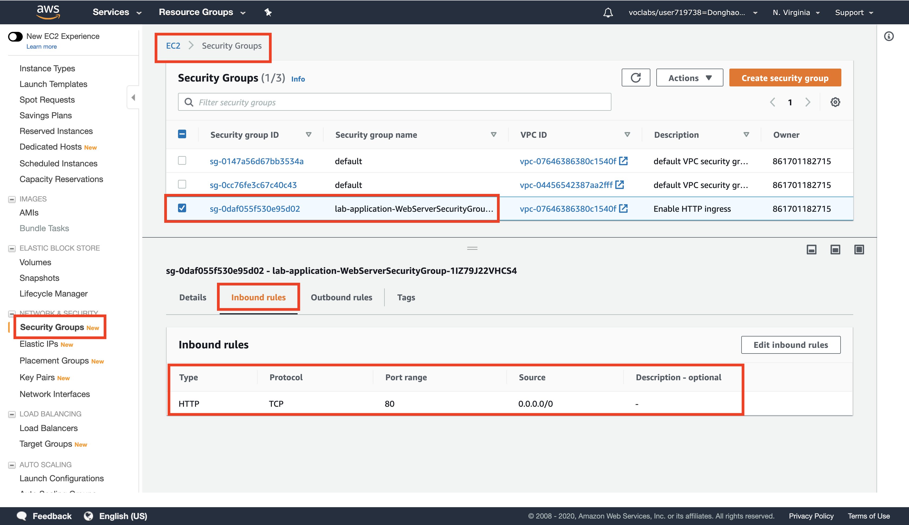

# AWS solution architect (Part 4)

- #### Click here: [BACK TO NAVIGASTION](https://github.com/DonghaoWu/AWS/blob/master/README.md)

## `Section: Serverless Architecture.`

### `Summary`: In this documentation, we learn Implementing a Serverless Architecture with AWS Managed Services.

- Your system will receive a transactions file, automatically load its contents into a database and send notifications. This will be done without using any Amazon EC2 servers.

### `Check Dependencies:`

------------------------------------------------------------

#### `本章背景：`
1. 使用到的 AWS 部件：

<p align="center">
    
</p>

2. 整体规划图：

<p align="center">
    
</p>

- 关键词：

```diff
+ 
```

------------------------------------------------------------

### <span id="4.0">`Brief Contents & codes position`</span>

- #### Click here: [BACK TO NAVIGASTION](https://github.com/DonghaoWu/AWS/blob/master/README.md)

- [4.1 Create a Lambda Function to Process a Transactions File.](#4.1)
- [4.2  Create a Lambda Function to Calculate Transaction Totals and Notify About High Account Balances.](#4.2)
- [4.3 Update a Stack.](#4.3)
- [4.4 Explore Templates with AWS CloudFormation Designer.](#4.4)
- [4.5 Delete the Stack.](#4.5)

------------------------------------------------------------

### <span id="4.1">`Step1: Create a Lambda Function to Process a Transactions File.`</span>

- #### Click here: [BACK TO CONTENT](#4.0)

<p align="center">
    
</p>

------------------------------------------------------------------------

1. Configure Lambda function.
<p align="center">
    
</p>

------------------------------------------------------------------------

2. Add Lambda code.
<p align="center">
    
</p>

------------------------------------------------------------------------

3. Basic settings.
<p align="center">
    
</p>

------------------------------------------------------------------------

4. Add triggers.
<p align="center">
    
</p>

------------------------------------------------------------------------

5. Finished set up.
<p align="center">
    
</p>

------------------------------------------------------------------------

#### `Comment:`
1. Now whenever a file is uploaded to the selected Amazon S3 bucket, this Lambda function will execute. It will read the data from the uploaded file and will store the data it finds into the Customer and Transactions tables in DynamoDB.

2. `TransactionProcessor.py`:

```py
# TransactionProcessor Lambda function
#
# This function is triggered by an object being created in an Amazon S3 bucket.
# The file is downloaded and each line is inserted into DynamoDB tables.

from __future__ import print_function
import json, urllib, boto3, csv

# Connect to S3 and DynamoDB
s3 = boto3.resource('s3')
dynamodb = boto3.resource('dynamodb')

# Connect to the DynamoDB tables
customerTable     = dynamodb.Table('Customer');
transactionsTable = dynamodb.Table('Transactions');

# This handler is executed every time the Lambda function is triggered
def lambda_handler(event, context):

  # Show the incoming event in the debug log
  print("Event received by Lambda function: " + json.dumps(event, indent=2))

  # Get the bucket and object key from the Event
  bucket = event['Records'][0]['s3']['bucket']['name']
  key = urllib.unquote_plus(event['Records'][0]['s3']['object']['key']).decode('utf8')
  localFilename = '/tmp/transactions.txt'

  # Download the file from S3 to the local filesystem
  try:
    s3.meta.client.download_file(bucket, key, localFilename)
  except Exception as e:
    print(e)
    print('Error getting object {} from bucket {}. Make sure they exist and your bucket is in the same region as this function.'.format(key, bucket))
    raise e

  # Read the Transactions CSV file. Delimiter is the '|' character
  with open(localFilename) as csvfile:
    reader = csv.DictReader(csvfile, delimiter='|')

    # Read each row in the file
    rowCount = 0
    for row in reader:
      rowCount += 1

      # Show the row in the debug log
      print(row['customer_id'], row['customer_address'], row['trn_id'], row['trn_date'], row['trn_amount'])

      try:
        # Insert Customer ID and Address into Customer DynamoDB table
        customerTable.put_item(
          Item={
            'CustomerId': row['customer_id'],
            'Address':  row['customer_address']})

        # Insert transaction details into Transactions DynamoDB table
        transactionsTable.put_item(
          Item={
            'CustomerId':    row['customer_id'],
            'TransactionId':   row['trn_id'],
            'TransactionDate':  row['trn_date'],
            'TransactionAmount': int(row['trn_amount'])})

      except Exception as e:
         print(e)
         print("Unable to insert data into DynamoDB table".format(e))

    # Finished!
    return "%d transactions inserted" % rowCount
```

### <span id="4.2">`Step2:  Create a Lambda Function to Calculate Transaction Totals and Notify About High Account Balances.`</span>

- #### Click here: [BACK TO CONTENT](#4.0)

<p align="center">
    
</p>

------------------------------------------------------------------------

1. Configure Lambda function.
<p align="center">
    
</p>

------------------------------------------------------------------------

2. Add Lambda code.
<p align="center">
    
</p>

------------------------------------------------------------------------

3. Basic settings.
<p align="center">
    
</p>

------------------------------------------------------------------------

4. Add triggers.
<p align="center">
    
</p>

------------------------------------------------------------------------

5. Finished set up.
<p align="center">
    
</p>

------------------------------------------------------------------------

#### `Comment:`
1. Now whenever the Transactions DynamoDB table is `updated`, this function will calculate each customer’s transaction total and store it in the TransactionTotal DynamoDB table. It the total exceeds $1500, it will send a message to a `Simple Notification Service topic` to notify the customer and your credit collection department.

2. Now you have two lambda function so far.
<p align="center">
    
</p>

------------------------------------------------------------------------

3. `TotalNotifier.py`:
```py
# TotalNotifier Lambda function
#
# This function is triggered when values are inserted into the Transactions DynamoDB table.
# Transaction totals are calculated and notifications are sent to SNS if limits are exceeded.

from __future__ import print_function
import json, boto3

# Connect to SNS
sns = boto3.client('sns')
alertTopic = 'HighBalanceAlert'
snsTopicArn = [t['TopicArn'] for t in sns.list_topics()['Topics'] if t['TopicArn'].endswith(':' + alertTopic)][0]

# Connect to DynamoDB
dynamodb = boto3.resource('dynamodb')
transactionTotalTableName = 'TransactionTotal'
transactionsTotalTable = dynamodb.Table(transactionTotalTableName);

# This handler is executed every time the Lambda function is triggered
def lambda_handler(event, context):

  # Show the incoming event in the debug log
  print("Event received by Lambda function: " + json.dumps(event, indent=2))

  # For each transaction added, calculate the new Transactions Total
  for record in event['Records']:
    customerId = record['dynamodb']['NewImage']['CustomerId']['S']
    transactionAmount = int(record['dynamodb']['NewImage']['TransactionAmount']['N'])

    # Update the customer's total in the TransactionTotal DynamoDB table
    response = transactionsTotalTable.update_item(
      Key={
        'CustomerId': customerId
      },
      UpdateExpression="add accountBalance :val",
      ExpressionAttributeValues={
        ':val': transactionAmount
      },
      ReturnValues="UPDATED_NEW"
    )

    # Retrieve the latest account balance
    latestAccountBalance = response['Attributes']['accountBalance']
    print("Latest account balance: " + format(latestAccountBalance))

    # If balance > $1500, send a message to SNS
    if latestAccountBalance >= 1500:

      # Construct message to be sent
      message = '{"customerID": "' + customerId + '", ' + '"accountBalance": "' + str(latestAccountBalance) + '"}'
      print(message)

      # Send message to SNS
      sns.publish(
        TopicArn=snsTopicArn,
        Message=message,
        Subject='Warning! Account balance is very high',
        MessageStructure='raw'
      )

  # Finished!
  return 'Successfully processed {} records.'.format(len(event['Records']))
```

### <span id="3.3">`Step3: Update a Stack.`</span>

- #### Click here: [BACK TO CONTENT](#3.0)

1. CloudFormation can also update a stack that has been deployed. When updating a stack, CloudFormation will only modify or replace the resources that are being changed. Any resources that are not being changed will be left as-is.

2. In this task, you will update the lab-application stack to modify a setting in the Security Group. CloudFormation will leave all other resources as-is, without being modified by the update.

- EC2 之前的 Security Group inbound traffic setting.

<p align="center">
    
</p>

------------------------------------------------------------

- 使用新的 CloudFormation 修改已有的 lab-application stack.

<p align="center">
    
</p>

------------------------------------------------------------

- Use a new template.
<p align="center">
    
</p>

------------------------------------------------------------

- Check the NetworkStackName.
<p align="center">
    
</p>

------------------------------------------------------------

- Check the tags.
<p align="center">
    
</p>

------------------------------------------------------------

- Check the change set preview.
<p align="center">
    
</p>

------------------------------------------------------------

- Update in progress.
<p align="center">
    
</p>

------------------------------------------------------------

- Update comleted.
<p align="center">
    
</p>

------------------------------------------------------------

- Check the updated EC2 security group inbound traffic rules tag.

<p align="center">
    
</p>

------------------------------------------------------------

#### `Comment:`
1. lab-application2.yaml 相对于 lab-application.yaml 的修改：
- 增加了：

```yaml
- IpProtocol: tcp
  FromPort: 22
  ToPort: 22
  CidrIp: 0.0.0.0/0
```

2. lab-application2.yaml template:

```yaml
AWSTemplateFormatVersion: 2010-09-09
Description: >-
  Application Template: Demonstrates how to reference resources from a different stack.
  This template provisions an EC2 instance in a VPC Subnet provisioned in a different stack.

# This template creates:
#   Amazon EC2 instance
#   Security Group

######################
# Parameters section
######################

Parameters:

  NetworkStackName:
    Description: >-
      Name of an active CloudFormation stack that contains the networking
      resources, such as the VPC and subnet that will be used in this stack.
    Type: String
    MinLength: 1
    MaxLength: 255
    AllowedPattern: '^[a-zA-Z][-a-zA-Z0-9]*$'
    Default: lab-network

  AmazonLinuxAMIID:
    Type: AWS::SSM::Parameter::Value<AWS::EC2::Image::Id>
    Default: /aws/service/ami-amazon-linux-latest/amzn-ami-hvm-x86_64-gp2

######################
# Resources section
######################

Resources:

  WebServerInstance:
    Type: AWS::EC2::Instance
    Metadata:
      'AWS::CloudFormation::Init':
        configSets:
          All:
            - ConfigureSampleApp
        ConfigureSampleApp:
          packages:
            yum:
              httpd: []
          files:
            /var/www/html/index.html:
              content: |
                
                <h1>Congratulations, you have successfully launched the AWS CloudFormation sample.</h1>
              mode: 000644
              owner: apache
              group: apache
          services:
            sysvinit:
              httpd:
                enabled: true
                ensureRunning: true
    Properties:
      InstanceType: t2.micro
      ImageId: !Ref AmazonLinuxAMIID
      NetworkInterfaces:
        - GroupSet:
            - !Ref WebServerSecurityGroup
          AssociatePublicIpAddress: true
          DeviceIndex: 0
          DeleteOnTermination: true
          SubnetId:
            Fn::ImportValue:
              !Sub ${NetworkStackName}-SubnetID
      Tags:
        - Key: Name
          Value: Web Server
      UserData:
        Fn::Base64: !Sub |
          #!/bin/bash -xe
          yum update -y aws-cfn-bootstrap
          # Install the files and packages from the metadata
          /opt/aws/bin/cfn-init -v --stack ${AWS::StackName} --resource WebServerInstance --configsets All --region ${AWS::Region}
          # Signal the status from cfn-init
          /opt/aws/bin/cfn-signal -e $? --stack ${AWS::StackName} --resource WebServerInstance --region ${AWS::Region}
    CreationPolicy:
      ResourceSignal:
        Timeout: PT5M

  DiskVolume:
    Type: AWS::EC2::Volume
    Properties:
      Size: 100
      AvailabilityZone: !GetAtt WebServerInstance.AvailabilityZone
      Tags:
        - Key: Name
          Value: Web Data
    DeletionPolicy: Snapshot
  
  DiskMountPoint:
    Type: AWS::EC2::VolumeAttachment
    Properties:
      InstanceId: !Ref WebServerInstance
      VolumeId: !Ref DiskVolume
      Device: /dev/sdh

  WebServerSecurityGroup:
    Type: AWS::EC2::SecurityGroup
    Properties:
      GroupDescription: Enable HTTP ingress
      VpcId:
        Fn::ImportValue:
          !Sub ${NetworkStackName}-VPCID
      SecurityGroupIngress:
        - IpProtocol: tcp
          FromPort: 80
          ToPort: 80
          CidrIp: 0.0.0.0/0
        - IpProtocol: tcp
          FromPort: 22
          ToPort: 22
          CidrIp: 0.0.0.0/0
      Tags:
        - Key: Name
          Value: Web Server Security Group

######################
# Outputs section
######################

Outputs:
  URL:
    Description: URL of the sample website
    Value: !Sub 'http://${WebServerInstance.PublicDnsName}'
```

### <span id="3.4">`Step4: Explore Templates with AWS CloudFormation Designer.`</span>

- #### Click here: [BACK TO CONTENT](#3.0)

<p align="center">
    
</p>

--------------------------------------------------------------------

<p align="center">
    
</p>

--------------------------------------------------------------------

#### `Comment:`
1. 


### <span id="3.5">`Step5: Delete the Stack.`</span>

- #### Click here: [BACK TO CONTENT](#3.0)

- A Deletion Policy can also be specified against resources, which can preserve or (in some cases) backup a resource when its stack is deleted. This is useful for retaining databases, disk volumes or any resource that might be required after stack deletion.

- DeletionPolicy in `lab-application.yaml`

```yaml
DiskVolume:
  Type: AWS::EC2::Volume
  Properties:
    Size: 100
    AvailabilityZone: !GetAtt WebServerInstance.AvailabilityZone
    Tags:
      - Key: Name
        Value: Web Data
  DeletionPolicy: Snapshot
```

--------------------------------------------------------------------

- Delete the stack.
<p align="center">
    
</p>

--------------------------------------------------------------------

- Delete in progress.
<p align="center">
    
</p>

--------------------------------------------------------------------

- Delete completed.
<p align="center">
    
</p>

--------------------------------------------------------------------

- A new snapshot is created.
<p align="center">
    
</p>

--------------------------------------------------------------------

#### `Comment:`
1. 

--------------------------------------------------------------------

- #### Click here: [BACK TO CONTENT](#3.0)
- #### Click here: [BACK TO NAVIGASTION](https://github.com/DonghaoWu/AWS/blob/master/README.md)