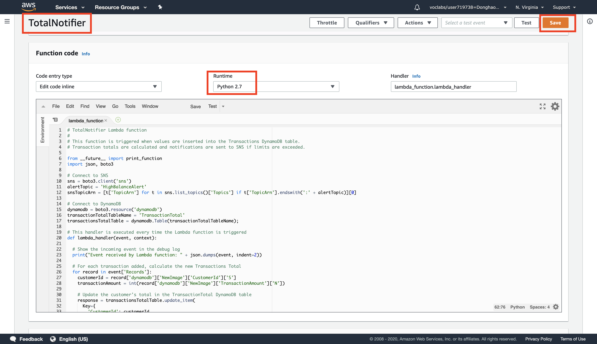

# AWS solution architect (Part 4)

- #### Click here: [BACK TO NAVIGASTION](https://github.com/DonghaoWu/AWS/blob/master/README.md)

## `Section: Serverless Architecture.`

### `Summary`: In this documentation, we learn Implementing a Serverless Architecture with AWS Managed Services.

- Your system will receive a transactions file, automatically load its contents into a database and send notifications. This will be done without using any Amazon EC2 servers.

### `Check Dependencies:`

------------------------------------------------------------

#### `本章背景：`
1. 使用到的 AWS 部件：

<p align="center">
    
</p>

2. 整体规划图：

<p align="center">
    
</p>

- 关键词：

```diff
+ 第一个 Lambda function 是用来读取上传文件和分配数据的；
+ 第二个是用来计算总和并触发 SNS（过程为读取 dynamoDB record 并计算总和后更新表格 transactionsTotal，并附带触发 SNS 条件）。
```
------------------------------------------------------------

### <span id="4.0">`Brief Contents & codes position`</span>

- #### Click here: [BACK TO NAVIGASTION](https://github.com/DonghaoWu/AWS/blob/master/README.md)

- [4.1 Create a Lambda Function to Process a Transactions File.](#4.1)
- [4.2  Create a Lambda Function to Calculate Transaction Totals and Notify About High Account Balances.](#4.2)
- [4.3 Create a Simple Notification Service (SNS) Topic.](#4.3)
- [4.4 Create Two Simple Queue Service Queues.](#4.4)
- [4.5 Testing the Serverless Architecture by Uploading a Transactions File.](#4.5)

------------------------------------------------------------

### <span id="4.1">`Step1: Create a Lambda Function to Process a Transactions File.`</span>

- #### Click here: [BACK TO CONTENT](#4.0)

<p align="center">
    
</p>

------------------------------------------------------------------------

1. Configure Lambda function.
<p align="center">
    
</p>

------------------------------------------------------------------------

2. Add Lambda code.
<p align="center">
    
</p>

------------------------------------------------------------------------

3. Basic settings.
<p align="center">
    
</p>

------------------------------------------------------------------------

4. Add triggers.
<p align="center">
    
</p>

------------------------------------------------------------------------

5. Finished set up.
<p align="center">
    
</p>

------------------------------------------------------------------------

#### `Comment:`
1. Now whenever a file is uploaded to the selected Amazon S3 bucket, this Lambda function will execute. It will read the data from the uploaded file and will store the data it finds into the Customer and Transactions tables in DynamoDB.

2. `TransactionProcessor.py`:

```py
# TransactionProcessor Lambda function
#
# This function is triggered by an object being created in an Amazon S3 bucket.
# The file is downloaded and each line is inserted into DynamoDB tables.

from __future__ import print_function
import json, urllib, boto3, csv

# Connect to S3 and DynamoDB
s3 = boto3.resource('s3')
dynamodb = boto3.resource('dynamodb')

# Connect to the DynamoDB tables
customerTable     = dynamodb.Table('Customer');
transactionsTable = dynamodb.Table('Transactions');

# This handler is executed every time the Lambda function is triggered
def lambda_handler(event, context):

  # Show the incoming event in the debug log
  print("Event received by Lambda function: " + json.dumps(event, indent=2))

  # Get the bucket and object key from the Event
  bucket = event['Records'][0]['s3']['bucket']['name']
  key = urllib.unquote_plus(event['Records'][0]['s3']['object']['key']).decode('utf8')
  localFilename = '/tmp/transactions.txt'

  # Download the file from S3 to the local filesystem
  try:
    s3.meta.client.download_file(bucket, key, localFilename)
  except Exception as e:
    print(e)
    print('Error getting object {} from bucket {}. Make sure they exist and your bucket is in the same region as this function.'.format(key, bucket))
    raise e

  # Read the Transactions CSV file. Delimiter is the '|' character
  with open(localFilename) as csvfile:
    reader = csv.DictReader(csvfile, delimiter='|')

    # Read each row in the file
    rowCount = 0
    for row in reader:
      rowCount += 1

      # Show the row in the debug log
      print(row['customer_id'], row['customer_address'], row['trn_id'], row['trn_date'], row['trn_amount'])

      try:
        # Insert Customer ID and Address into Customer DynamoDB table
        customerTable.put_item(
          Item={
            'CustomerId': row['customer_id'],
            'Address':  row['customer_address']})

        # Insert transaction details into Transactions DynamoDB table
        transactionsTable.put_item(
          Item={
            'CustomerId':    row['customer_id'],
            'TransactionId':   row['trn_id'],
            'TransactionDate':  row['trn_date'],
            'TransactionAmount': int(row['trn_amount'])})

      except Exception as e:
         print(e)
         print("Unable to insert data into DynamoDB table".format(e))

    # Finished!
    return "%d transactions inserted" % rowCount
```

### <span id="4.2">`Step2:  Create a Lambda Function to Calculate Transaction Totals and Notify About High Account Balances.`</span>

- #### Click here: [BACK TO CONTENT](#4.0)

<p align="center">
    
</p>

------------------------------------------------------------------------

1. Configure Lambda function.
<p align="center">
    
</p>

------------------------------------------------------------------------

2. Add Lambda code.
<p align="center">
    
</p>

------------------------------------------------------------------------

3. Basic settings.
<p align="center">
    
</p>

------------------------------------------------------------------------

4. Add triggers.
<p align="center">
    
</p>

------------------------------------------------------------------------

5. Finished setting up.
<p align="center">
    
</p>

------------------------------------------------------------------------

#### `Comment:`
1. Now whenever the Transactions DynamoDB table is `updated`, this function will calculate each customer’s transaction total and store it in the TransactionTotal DynamoDB table. It the total exceeds $1500, it will send a message to a `Simple Notification Service topic` to notify the customer and your credit collection department.

2. Now you have two lambda functions so far.
<p align="center">
    
</p>

------------------------------------------------------------------------


```diff
+ S3 new file uploaded -> Lambda TransactionProcessor -> DynamoDB table updated -> Lambda TotalNotifier
```

3. `TotalNotifier.py`:
```py
# TotalNotifier Lambda function
#
# This function is triggered when values are inserted into the Transactions DynamoDB table.
# Transaction totals are calculated and notifications are sent to SNS if limits are exceeded.

from __future__ import print_function
import json, boto3

# Connect to SNS
sns = boto3.client('sns')
alertTopic = 'HighBalanceAlert'
snsTopicArn = [t['TopicArn'] for t in sns.list_topics()['Topics'] if t['TopicArn'].endswith(':' + alertTopic)][0]

# Connect to DynamoDB
dynamodb = boto3.resource('dynamodb')
transactionTotalTableName = 'TransactionTotal'
transactionsTotalTable = dynamodb.Table(transactionTotalTableName);

# This handler is executed every time the Lambda function is triggered
def lambda_handler(event, context):

  # Show the incoming event in the debug log
  print("Event received by Lambda function: " + json.dumps(event, indent=2))

  # For each transaction added, calculate the new Transactions Total
  for record in event['Records']:
    customerId = record['dynamodb']['NewImage']['CustomerId']['S']
    transactionAmount = int(record['dynamodb']['NewImage']['TransactionAmount']['N'])

    # Update the customer's total in the TransactionTotal DynamoDB table
    response = transactionsTotalTable.update_item(
      Key={
        'CustomerId': customerId
      },
      UpdateExpression="add accountBalance :val",
      ExpressionAttributeValues={
        ':val': transactionAmount
      },
      ReturnValues="UPDATED_NEW"
    )

    # Retrieve the latest account balance
    latestAccountBalance = response['Attributes']['accountBalance']
    print("Latest account balance: " + format(latestAccountBalance))

    # If balance > $1500, send a message to SNS
    if latestAccountBalance >= 1500:

      # Construct message to be sent
      message = '{"customerID": "' + customerId + '", ' + '"accountBalance": "' + str(latestAccountBalance) + '"}'
      print(message)

      # Send message to SNS
      sns.publish(
        TopicArn=snsTopicArn,
        Message=message,
        Subject='Warning! Account balance is very high',
        MessageStructure='raw'
      )

  # Finished!
  return 'Successfully processed {} records.'.format(len(event['Records']))
```

### <span id="4.3">`Step3: Create a Simple Notification Service (SNS) Topic.`</span>

- #### Click here: [BACK TO CONTENT](#4.0)

<p align="center">
    
</p>

------------------------------------------------------------------------
- Create topic.

<p align="center">
    
</p>

------------------------------------------------------------------------
- Create subscription.
<p align="center">
    
</p>

------------------------------------------------------------------------

- Finished.
<p align="center">
    
</p>

------------------------------------------------------------------------
#### `Comment:`
1. You can also subscribe to receive a message on your phone via SMS.
```diff
+ For Protocol, select SMS
```

### <span id="4.4">`Step4: Create Two Simple Queue Service Queues.`</span>

- #### Click here: [BACK TO CONTENT](#4.0)

<p align="center">
    
</p>

------------------------------------------------------------------------
- The first queue. `CustomerNotify`

<p align="center">
    
</p>

------------------------------------------------------------------------
- The second queue. `CreditCollection`

<p align="center">
    
</p>

------------------------------------------------------------------------

- Both queues subscribe to SNS Topic.

<p align="center">
    
</p>

------------------------------------------------------------------------

<p align="center">
    
</p>

------------------------------------------------------------------------


#### `Comment:`
1. In this task, you will create two Simple Queue Service (SQS) queues. You will subscribe these queues to the Simple Notification Service (SNS) topic you just created. This setup is known as a `fan-out scenario` because each SNS notification is `sent to multiple subscribers and those subscribers can independently consume messages from their own queue.`

2. Your two queues are now subscribed to your Simple Notification Service topic. They will automatically receive any messages sent to that topic.


### <span id="4.5">`Step5: Testing the Serverless Architecture by Uploading a Transactions File.`</span>

- #### Click here: [BACK TO CONTENT](#4.0)

1. Upload the Transactions File.

<p align="center">
    
</p>

--------------------------------------------------------------------

<p align="center">
    
</p>

--------------------------------------------------------------------

2. Check the DynamoDB tables.

<p align="center">
    
</p>

--------------------------------------------------------------------

<p align="center">
    
</p>

--------------------------------------------------------------------

<p align="center">
    
</p>

--------------------------------------------------------------------

3. Check your SQS Queues.

<p align="center">
    
</p>

--------------------------------------------------------------------

<p align="center">
    
</p>

--------------------------------------------------------------------

<p align="center">
    
</p>

--------------------------------------------------------------------

<p align="center">
    
</p>

--------------------------------------------------------------------

4. Check your Lambda Functions.

- `TransactionProcessor` function
<p align="center">
    
</p>

--------------------------------------------------------------------

- `TotalNotifier` function
<p align="center">
    
</p>

--------------------------------------------------------------------

5. Check your email.

<p align="center">
    
</p>

--------------------------------------------------------------------

<p align="center">
    
</p>

--------------------------------------------------------------------

#### `Comment:`
1. Both messages in SQS queues are same, they are from SNS and created in Lambda function. (`TotalNotifier`)

2. By now you should have received a new email from HighAlert that includes an alert about customer C2’s high account balance. That same message was also sent to your two Simple Queue Service queues, ready to be picked up by another process.

--------------------------------------------------------------------

- #### Click here: [BACK TO CONTENT](#4.0)
- #### Click here: [BACK TO NAVIGASTION](https://github.com/DonghaoWu/AWS/blob/master/README.md)