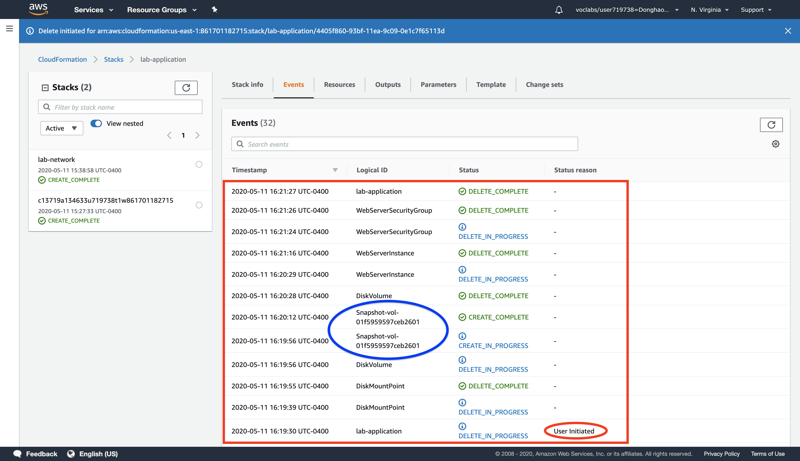

# AWS solution architect (Part 4)

- #### Click here: [BACK TO NAVIGASTION](https://github.com/DonghaoWu/AWS/blob/master/README.md)

## `Section: Serverless Architecture.`

### `Summary`: In this documentation, we learn Implementing a Serverless Architecture with AWS Managed Services.

- Your system will receive a transactions file, automatically load its contents into a database and send notifications. This will be done without using any Amazon EC2 servers.

### `Check Dependencies:`

------------------------------------------------------------

#### `本章背景：`
1. 使用到的 AWS 部件：

<p align="center">
    
</p>

2. 整体规划图：

<p align="center">
    
</p>

- 关键词：

```diff
+ 
```

------------------------------------------------------------

### <span id="4.0">`Brief Contents & codes position`</span>

- #### Click here: [BACK TO NAVIGASTION](https://github.com/DonghaoWu/AWS/blob/master/README.md)

- [4.1 Deploy a Networking Layer.](#4.1)
- [4.2 Deploy an Application Layer.](#4.2)
- [4.3 Update a Stack.](#4.3)
- [4.4 Explore Templates with AWS CloudFormation Designer.](#4.4)
- [4.5 Delete the Stack.](#4.5)

------------------------------------------------------------

### <span id="3.1">`Step1: Deploy a Networking Layer.`</span>

- #### Click here: [BACK TO CONTENT](#3.0)

- Create stack.
<p align="center">
    
</p>

------------------------------------------------------------

- Upload a template file.
<p align="center">
    
</p>

------------------------------------------------------------

- Name the stack.
<p align="center">
    
</p>

------------------------------------------------------------

- Tag the resources in your stack.
<p align="center">
    
</p>

------------------------------------------------------------

- Review the configuration.
<p align="center">
    
</p>

------------------------------------------------------------

- Stack in creating in progress.
<p align="center">
    
</p>

------------------------------------------------------------

- Stack created complete. (Stack info tag)
<p align="center">
    
</p>

------------------------------------------------------------

- Stack created complete. (Event tag)
<p align="center">
    
</p>

------------------------------------------------------------

- Stack created complete. (Resources tag)
<p align="center">
    
</p>

------------------------------------------------------------

- Stack created complete. (Output tag)
<p align="center">
    
</p>

------------------------------------------------------------

#### `Comment:`
1. lab-network.yaml template:

```yaml
AWSTemplateFormatVersion: 2010-09-09
Description: >-
  Network Template: Sample template that creates a VPC with DNS and public IPs enabled.

# This template creates:
#   VPC
#   Internet Gateway
#   Public Route Table
#   Public Subnet

######################
# Resources section
######################

Resources:

  ## VPC

  VPC:
    Type: AWS::EC2::VPC
    Properties:
      EnableDnsSupport: true
      EnableDnsHostnames: true
      CidrBlock: 10.0.0.0/16
      
  ## Internet Gateway

  InternetGateway:
    Type: AWS::EC2::InternetGateway
  
  VPCGatewayAttachment:
    Type: AWS::EC2::VPCGatewayAttachment
    Properties:
      VpcId: !Ref VPC
      InternetGatewayId: !Ref InternetGateway
  
  ## Public Route Table

  PublicRouteTable:
    Type: AWS::EC2::RouteTable
    Properties:
      VpcId: !Ref VPC
  
  PublicRoute:
    Type: AWS::EC2::Route
    DependsOn: VPCGatewayAttachment
    Properties:
      RouteTableId: !Ref PublicRouteTable
      DestinationCidrBlock: 0.0.0.0/0
      GatewayId: !Ref InternetGateway
  
  ## Public Subnet
  
  PublicSubnet:
    Type: AWS::EC2::Subnet
    Properties:
      VpcId: !Ref VPC
      CidrBlock: 10.0.0.0/24
  
  PublicSubnetRouteTableAssociation:
    Type: AWS::EC2::SubnetRouteTableAssociation
    Properties:
      SubnetId: !Ref PublicSubnet
      RouteTableId: !Ref PublicRouteTable
  
  PublicSubnetNetworkAclAssociation:
    Type: AWS::EC2::SubnetNetworkAclAssociation
    Properties:
      SubnetId: !Ref PublicSubnet
      NetworkAclId: !GetAtt 
        - VPC
        - DefaultNetworkAcl
  
######################
# Outputs section
######################

Outputs:
  
  VPC:
    Description: VPC ID
    Value: !Ref VPC
    Export:
      Name: !Sub '${AWS::StackName}-VPCID'
  
  PublicSubnet:
    Description: The subnet ID to use for public web servers
    Value: !Ref PublicSubnet
    Export:
      Name: !Sub '${AWS::StackName}-SubnetID'
```

### <span id="3.2">`Step2: Deploy an Application Layer.`</span>

- #### Click here: [BACK TO CONTENT](#3.0)

1. Same step as network layer but different CloudFormation template.

2. 这个 layer 主要生成一个 SG 和一个 EC2。

<p align="center">
    
</p>

----------------------------------------------------------

<p align="center">
    
</p>

----------------------------------------------------------

<p align="center">
    
</p>

----------------------------------------------------------

3. A CloudFormation stack can also reference values from another CloudFormation stack. For example, here is a portion of the lab-application template that references the lab-network template:

    ```yaml
    WebServerSecurityGroup:
    Type: AWS::EC2::SecurityGroup
    Properties:
        GroupDescription: Enable HTTP ingress
        VpcId:
        Fn::ImportValue:
            !Sub ${NetworkStackName}-VPCID
    ```

    - The last line uses to the Network Stack Name that you provided ("lab-network") when the stack was created. It then imports the value of lab-network-VPCID from the Outputs of the first stack and inserts the value into the VPC ID field of the security group definition. `The result is that the security group is created in the VPC created by the first stack.`

    - 这里的 `NetworkStackName` 需要参考代码里面的 `Parameters`。

4. In another example, here is the code that places the Amazon EC2 instance into the correct subnet:

    ```yaml
    SubnetId:
        Fn::ImportValue:
        !Sub ${NetworkStackName}-SubnetID
    ```

    - It takes the Subnet ID from the lab-network stack and uses it in the lab-application stack to launch the instance into the public subnet that created by the first stack.

------------------------------------------------------------

#### `Comment:`
1. 对于这一步来说，最重要的是找出在这个代码中找出跟 network-layer 之间的衔接处。
2. 具体来说，这段代码就是从 network-layer 获取 VPC ID 然后部署 SG，然后从 network-layer 获取 Subnet ID 然后部署 EC2。

```diff
+ 1. lab-network.yaml
  Outputs:
  
  VPC:
    Description: VPC ID
    Value: !Ref VPC
    Export:
      Name: !Sub '${AWS::StackName}-VPCID'
  
  PublicSubnet:
    Description: The subnet ID to use for public web servers
    Value: !Ref PublicSubnet
    Export:
      Name: !Sub '${AWS::StackName}-SubnetID'

+ 2. Define stack name in AWS console: Stack name: lab-network
    (./assets/a35.png)

+ 3. lab-application.yaml
  Parameters:

  NetworkStackName:
    Description: >-
      Name of an active CloudFormation stack that contains the networking
      resources, such as the VPC and subnet that will be used in this stack.
    Type: String
    MinLength: 1
    MaxLength: 255
    AllowedPattern: '^[a-zA-Z][-a-zA-Z0-9]*$'
    Default: lab-network

+ 4. lab-application.yaml
    WebServerSecurityGroup:
    Type: AWS::EC2::SecurityGroup
    Properties:
        GroupDescription: Enable HTTP ingress
        VpcId:
        Fn::ImportValue:
            !Sub ${NetworkStackName}-VPCID

+ 5. lab-application.yaml
    SubnetId:
        Fn::ImportValue:
        !Sub ${NetworkStackName}-SubnetID          
```

3. lab-application.yaml template:

```yaml
AWSTemplateFormatVersion: 2010-09-09
Description: >-
  Application Template: Demonstrates how to reference resources from a different stack.
  This template provisions an EC2 instance in a VPC Subnet provisioned in a different stack.

# This template creates:
#   Amazon EC2 instance
#   Security Group

######################
# Parameters section
######################

Parameters:

  NetworkStackName:
    Description: >-
      Name of an active CloudFormation stack that contains the networking
      resources, such as the VPC and subnet that will be used in this stack.
    Type: String
    MinLength: 1
    MaxLength: 255
    AllowedPattern: '^[a-zA-Z][-a-zA-Z0-9]*$'
    Default: lab-network

  AmazonLinuxAMIID:
    Type: AWS::SSM::Parameter::Value<AWS::EC2::Image::Id>
    Default: /aws/service/ami-amazon-linux-latest/amzn-ami-hvm-x86_64-gp2

######################
# Resources section
######################

Resources:

  WebServerInstance:
    Type: AWS::EC2::Instance
    Metadata:
      'AWS::CloudFormation::Init':
        configSets:
          All:
            - ConfigureSampleApp
        ConfigureSampleApp:
          packages:
            yum:
              httpd: []
          files:
            /var/www/html/index.html:
              content: |
                
                <h1>Congratulations, you have successfully launched the AWS CloudFormation sample.</h1>
              mode: 000644
              owner: apache
              group: apache
          services:
            sysvinit:
              httpd:
                enabled: true
                ensureRunning: true
    Properties:
      InstanceType: t2.micro
      ImageId: !Ref AmazonLinuxAMIID
      NetworkInterfaces:
        - GroupSet:
            - !Ref WebServerSecurityGroup
          AssociatePublicIpAddress: true
          DeviceIndex: 0
          DeleteOnTermination: true
          SubnetId:
            Fn::ImportValue:
              !Sub ${NetworkStackName}-SubnetID
      Tags:
        - Key: Name
          Value: Web Server
      UserData:
        Fn::Base64: !Sub |
          #!/bin/bash -xe
          yum update -y aws-cfn-bootstrap
          # Install the files and packages from the metadata
          /opt/aws/bin/cfn-init -v --stack ${AWS::StackName} --resource WebServerInstance --configsets All --region ${AWS::Region}
          # Signal the status from cfn-init
          /opt/aws/bin/cfn-signal -e $? --stack ${AWS::StackName} --resource WebServerInstance --region ${AWS::Region}
    CreationPolicy:
      ResourceSignal:
        Timeout: PT5M

  DiskVolume:
    Type: AWS::EC2::Volume
    Properties:
      Size: 100
      AvailabilityZone: !GetAtt WebServerInstance.AvailabilityZone
      Tags:
        - Key: Name
          Value: Web Data
    DeletionPolicy: Snapshot

  DiskMountPoint:
    Type: AWS::EC2::VolumeAttachment
    Properties:
      InstanceId: !Ref WebServerInstance
      VolumeId: !Ref DiskVolume
      Device: /dev/sdh

  WebServerSecurityGroup:
    Type: AWS::EC2::SecurityGroup
    Properties:
      GroupDescription: Enable HTTP ingress
      VpcId:
        Fn::ImportValue:
          !Sub ${NetworkStackName}-VPCID
      SecurityGroupIngress:
        - IpProtocol: tcp
          FromPort: 80
          ToPort: 80
          CidrIp: 0.0.0.0/0
      Tags:
        - Key: Name
          Value: Web Server Security Group

######################
# Outputs section
######################

Outputs:
  URL:
    Description: URL of the sample website
    Value: !Sub 'http://${WebServerInstance.PublicDnsName}'
```

### <span id="3.3">`Step3: Update a Stack.`</span>

- #### Click here: [BACK TO CONTENT](#3.0)

1. CloudFormation can also update a stack that has been deployed. When updating a stack, CloudFormation will only modify or replace the resources that are being changed. Any resources that are not being changed will be left as-is.

2. In this task, you will update the lab-application stack to modify a setting in the Security Group. CloudFormation will leave all other resources as-is, without being modified by the update.

- EC2 之前的 Security Group inbound traffic setting.

<p align="center">
    
</p>

------------------------------------------------------------

- 使用新的 CloudFormation 修改已有的 lab-application stack.

<p align="center">
    
</p>

------------------------------------------------------------

- Use a new template.
<p align="center">
    
</p>

------------------------------------------------------------

- Check the NetworkStackName.
<p align="center">
    
</p>

------------------------------------------------------------

- Check the tags.
<p align="center">
    
</p>

------------------------------------------------------------

- Check the change set preview.
<p align="center">
    
</p>

------------------------------------------------------------

- Update in progress.
<p align="center">
    
</p>

------------------------------------------------------------

- Update comleted.
<p align="center">
    
</p>

------------------------------------------------------------

- Check the updated EC2 security group inbound traffic rules tag.

<p align="center">
    
</p>

------------------------------------------------------------

#### `Comment:`
1. lab-application2.yaml 相对于 lab-application.yaml 的修改：
- 增加了：

```yaml
- IpProtocol: tcp
  FromPort: 22
  ToPort: 22
  CidrIp: 0.0.0.0/0
```

2. lab-application2.yaml template:

```yaml
AWSTemplateFormatVersion: 2010-09-09
Description: >-
  Application Template: Demonstrates how to reference resources from a different stack.
  This template provisions an EC2 instance in a VPC Subnet provisioned in a different stack.

# This template creates:
#   Amazon EC2 instance
#   Security Group

######################
# Parameters section
######################

Parameters:

  NetworkStackName:
    Description: >-
      Name of an active CloudFormation stack that contains the networking
      resources, such as the VPC and subnet that will be used in this stack.
    Type: String
    MinLength: 1
    MaxLength: 255
    AllowedPattern: '^[a-zA-Z][-a-zA-Z0-9]*$'
    Default: lab-network

  AmazonLinuxAMIID:
    Type: AWS::SSM::Parameter::Value<AWS::EC2::Image::Id>
    Default: /aws/service/ami-amazon-linux-latest/amzn-ami-hvm-x86_64-gp2

######################
# Resources section
######################

Resources:

  WebServerInstance:
    Type: AWS::EC2::Instance
    Metadata:
      'AWS::CloudFormation::Init':
        configSets:
          All:
            - ConfigureSampleApp
        ConfigureSampleApp:
          packages:
            yum:
              httpd: []
          files:
            /var/www/html/index.html:
              content: |
                
                <h1>Congratulations, you have successfully launched the AWS CloudFormation sample.</h1>
              mode: 000644
              owner: apache
              group: apache
          services:
            sysvinit:
              httpd:
                enabled: true
                ensureRunning: true
    Properties:
      InstanceType: t2.micro
      ImageId: !Ref AmazonLinuxAMIID
      NetworkInterfaces:
        - GroupSet:
            - !Ref WebServerSecurityGroup
          AssociatePublicIpAddress: true
          DeviceIndex: 0
          DeleteOnTermination: true
          SubnetId:
            Fn::ImportValue:
              !Sub ${NetworkStackName}-SubnetID
      Tags:
        - Key: Name
          Value: Web Server
      UserData:
        Fn::Base64: !Sub |
          #!/bin/bash -xe
          yum update -y aws-cfn-bootstrap
          # Install the files and packages from the metadata
          /opt/aws/bin/cfn-init -v --stack ${AWS::StackName} --resource WebServerInstance --configsets All --region ${AWS::Region}
          # Signal the status from cfn-init
          /opt/aws/bin/cfn-signal -e $? --stack ${AWS::StackName} --resource WebServerInstance --region ${AWS::Region}
    CreationPolicy:
      ResourceSignal:
        Timeout: PT5M

  DiskVolume:
    Type: AWS::EC2::Volume
    Properties:
      Size: 100
      AvailabilityZone: !GetAtt WebServerInstance.AvailabilityZone
      Tags:
        - Key: Name
          Value: Web Data
    DeletionPolicy: Snapshot
  
  DiskMountPoint:
    Type: AWS::EC2::VolumeAttachment
    Properties:
      InstanceId: !Ref WebServerInstance
      VolumeId: !Ref DiskVolume
      Device: /dev/sdh

  WebServerSecurityGroup:
    Type: AWS::EC2::SecurityGroup
    Properties:
      GroupDescription: Enable HTTP ingress
      VpcId:
        Fn::ImportValue:
          !Sub ${NetworkStackName}-VPCID
      SecurityGroupIngress:
        - IpProtocol: tcp
          FromPort: 80
          ToPort: 80
          CidrIp: 0.0.0.0/0
        - IpProtocol: tcp
          FromPort: 22
          ToPort: 22
          CidrIp: 0.0.0.0/0
      Tags:
        - Key: Name
          Value: Web Server Security Group

######################
# Outputs section
######################

Outputs:
  URL:
    Description: URL of the sample website
    Value: !Sub 'http://${WebServerInstance.PublicDnsName}'
```

### <span id="3.4">`Step4: Explore Templates with AWS CloudFormation Designer.`</span>

- #### Click here: [BACK TO CONTENT](#3.0)

<p align="center">
    
</p>

--------------------------------------------------------------------

<p align="center">
    
</p>

--------------------------------------------------------------------

#### `Comment:`
1. 


### <span id="3.5">`Step5: Delete the Stack.`</span>

- #### Click here: [BACK TO CONTENT](#3.0)

- A Deletion Policy can also be specified against resources, which can preserve or (in some cases) backup a resource when its stack is deleted. This is useful for retaining databases, disk volumes or any resource that might be required after stack deletion.

- DeletionPolicy in `lab-application.yaml`

```yaml
DiskVolume:
  Type: AWS::EC2::Volume
  Properties:
    Size: 100
    AvailabilityZone: !GetAtt WebServerInstance.AvailabilityZone
    Tags:
      - Key: Name
        Value: Web Data
  DeletionPolicy: Snapshot
```

--------------------------------------------------------------------

- Delete the stack.
<p align="center">
    
</p>

--------------------------------------------------------------------

- Delete in progress.
<p align="center">
    
</p>

--------------------------------------------------------------------

- Delete completed.
<p align="center">
    
</p>

--------------------------------------------------------------------

- A new snapshot is created.
<p align="center">
    
</p>

--------------------------------------------------------------------

#### `Comment:`
1. 

--------------------------------------------------------------------

- #### Click here: [BACK TO CONTENT](#3.0)
- #### Click here: [BACK TO NAVIGASTION](https://github.com/DonghaoWu/AWS/blob/master/README.md)