# AWS serverless services (Part 7)

- #### Click here: [BACK TO NAVIGASTION](https://github.com/DonghaoWu/AWS/blob/master/README.md)

- #### Click here: [GO TO REPO SAMPLE](https://github.com/aws-samples/aws-serverless-workshop-innovator-island)

## `Section: Implement a serverless application.`

### `Summary`: In this documentation, we learn using general aws service to implement a serverless app.

### `Check Dependencies:`

------------------------------------------------------------

#### `本章背景：`
1. 

- 整体规划图：

<p align="center">
    
</p>

------------------------------------------------------------

<p align="center">
    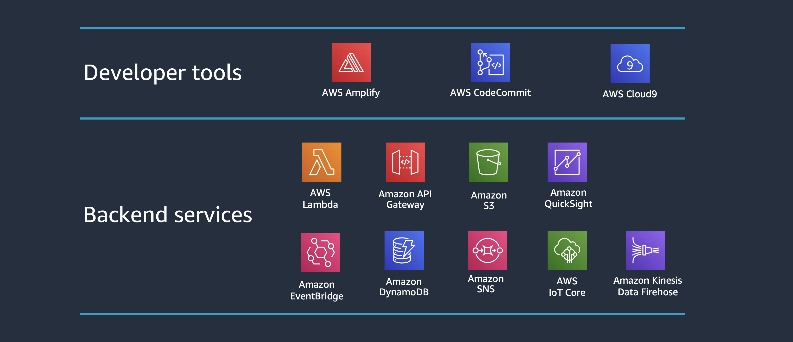
</p>

------------------------------------------------------------

2.

```diff

```

------------------------------------------------------------

### <span id="7.0">`Brief Contents & codes position`</span>

- #### Click here: [BACK TO NAVIGASTION](https://github.com/DonghaoWu/AWS/blob/master/README.md)

- [7.1 Introduction to related services.](#7.1)
- [7.2 Front-end and Back-end.](#7.2)
- [7.3 An IAM Role for the Lambda function.](#7.3)
- [7.4 Create a Lambda Function.](#7.4)
- [7.5 Scale-Out the Auto Scaling Group to Trigger the Lambda function.](#7.5)
- [7.6 Result.](#7.6)

------------------------------------------------------------

### <span id="7.1">`Step1: Introduction to related services.`</span>

- #### Click here: [BACK TO CONTENT](#7.0)

    :star: AWS Cloud9 IDE

    - [AWS Cloud9](https://aws.amazon.com/cloud9/) is a cloud-based integrated development environment (IDE) that lets you write, run, and debug your code with just a browser. It includes a code editor, debugger, and terminal. Cloud9 comes pre-packaged with essential tools for popular programming languages and the AWS Command Line Interface (CLI) pre-installed so you don’t need to install files or configure your laptop for this workshop. Your Cloud9 environment will have access to the same AWS resources as the user with which you logged into the AWS Management Console.

    :key: Cloud9 key command:

    ```zsh
    # Verify that your user is logged in by running the command aws sts get-caller-identity
    aws sts get-caller-identity
    ```

    :star: AWS CodeCommit(How it works - Frontend)
    - You will create a code repository in AWS CodeCommit.
    - You will download the existing frontend code into your Cloud9 IDE and push the code to this repository.
    - You will configure Amplify Console to connect to your repository and publish the web app.

    :star: AWS Amplify
    - All of your static web content including HTML, CSS, JavaScript, images and other files will be managed by AWS Amplify Console and served via Amazon CloudFront.

    - Your end users will then access your site using the public website URL exposed by AWS Amplify Console. You don't need to run any web servers or use other services in order to make your site available.

------------------------------------------------------------

#### `Comment:`
1. cloud9 可以执行 github 的下载 repo 命令。
2. cloud9 可以执行 yum 安装，如
```bash
sudo yum install jq -y
```
3. Amplify 使用 cloudFront 支持服务，而不需要服务器。
4. 在这个 workshop 中，front-end 代码在 S3，backend 代码在 github。
5. AWS CodeCommit 也使用类似 git 的命令，如
```bash
$ cd ~/environment/theme-park-frontend/
$ AWS_REGION=$(curl -s http://169.254.169.254/latest/meta-data/placement/availability-zone | sed 's/\(.*\)[a-z]/\1/')
$ git push --set-upstream https://git-codecommit.$AWS_REGION.amazonaws.com/v1/repos/theme-park-frontend master
```

### <span id="7.2">`Step2: Front-end and Back-end.`</span>

- #### Click here: [BACK TO CONTENT](#7.0)

<p align="center">
    
</p>

------------------------------------------------------------

<p align="center">
    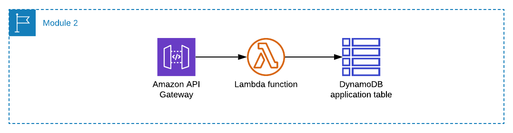
</p>

------------------------------------------------------------

#### `Comment:`
1. 


### <span id="2.3">`Step3: An IAM Role for the Lambda function.`</span>

- #### Click here: [BACK TO CONTENT](#2.0)

<p align="center">
    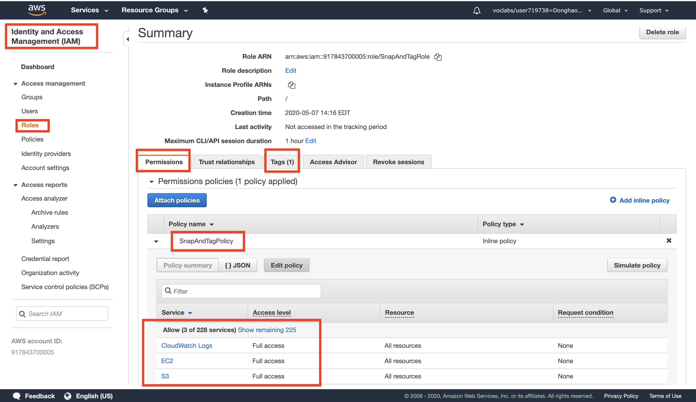
</p>

------------------------------------------------------------

#### `Comment:`
1. 名词：IAM Role policy，这里设置的 `policy: SnapAndTagRole` 会应用在第四步 `Lambda role` 设置中。

### <span id="2.4">`Step4: Create a Lambda Function.`</span>

- #### Click here: [BACK TO CONTENT](#2.0)

<p align="center">
    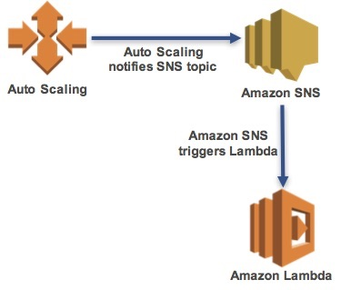
</p>

------------------------------------------------------------------------

1. Configure Lambda function.
<p align="center">
    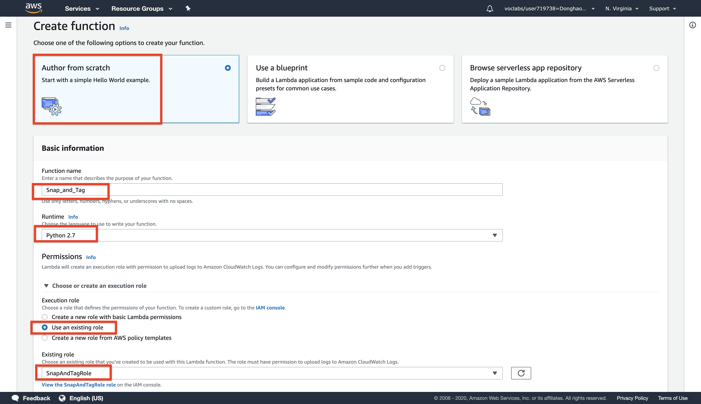
</p>

------------------------------------------------------------------------

2. Add Lambda code.
<p align="center">
    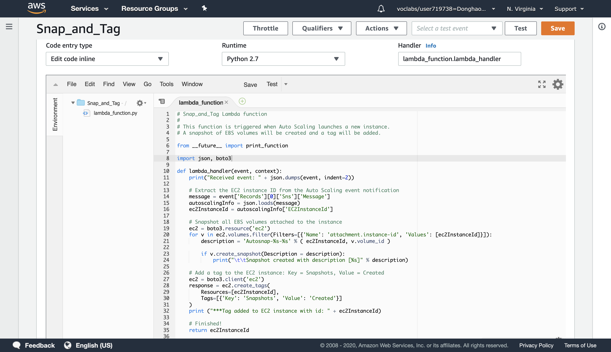
</p>

------------------------------------------------------------------------

3. Add trigger (SNS topic)
<p align="center">
    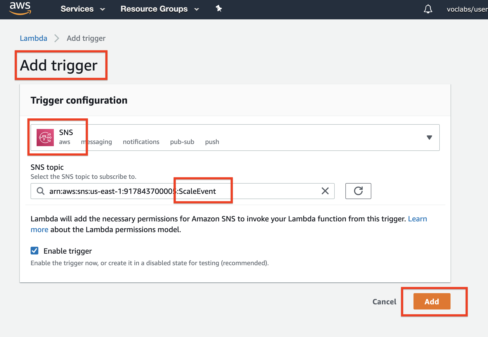
</p>

------------------------------------------------------------------------

4. Finished set up.
<p align="center">
    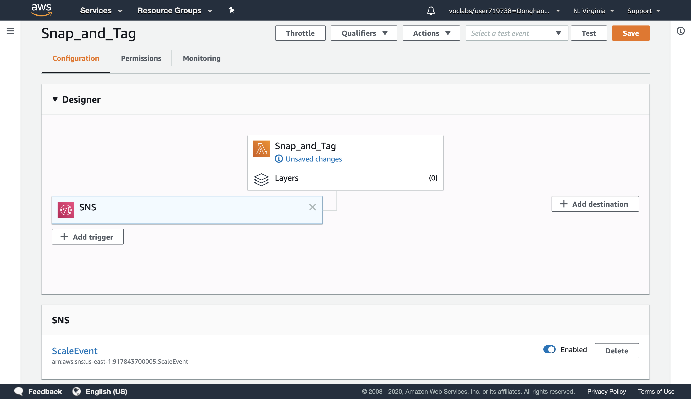
</p>

------------------------------------------------------------------------

#### `Comment:`
1. Lambda function code (runtime: python 2.7)

```py
# Snap_and_Tag Lambda function
#
# This function is triggered when Auto Scaling launches a new instance.
# A snapshot of EBS volumes will be created and a tag will be added.

from __future__ import print_function

import json, boto3

def lambda_handler(event, context):
    print("Received event: " + json.dumps(event, indent=2))

    # Extract the EC2 instance ID from the Auto Scaling event notification
    message = event['Records'][0]['Sns']['Message']
    autoscalingInfo = json.loads(message)
    ec2InstanceId = autoscalingInfo['EC2InstanceId']

    # Snapshot all EBS volumes attached to the instance
    ec2 = boto3.resource('ec2')
    for v in ec2.volumes.filter(Filters=[{'Name': 'attachment.instance-id', 'Values': [ec2InstanceId]}]):
        description = 'Autosnap-%s-%s' % ( ec2InstanceId, v.volume_id )

        if v.create_snapshot(Description = description):
            print("\t\tSnapshot created with description [%s]" % description)

    # Add a tag to the EC2 instance: Key = Snapshots, Value = Created
    ec2 = boto3.client('ec2')
    response = ec2.create_tags(
        Resources=[ec2InstanceId],
        Tags=[{'Key': 'Snapshots', 'Value': 'Created'}]
    )
    print ("***Tag added to EC2 instance with id: " + ec2InstanceId)

    # Finished!
    return ec2InstanceId
```

2. Examine the code. It is performing the following steps:

    - Extract the EC2 instance ID from the notification message
    - Create a snapshot of all EBS volumes attached to the instance
    - Add a tag to the instance to indicate that snapshots were created

### <span id="2.5">`Step5: Scale-Out the Auto Scaling Group to Trigger the Lambda function.`</span>

- #### Click here: [BACK TO CONTENT](#2.0)

<p align="center">
    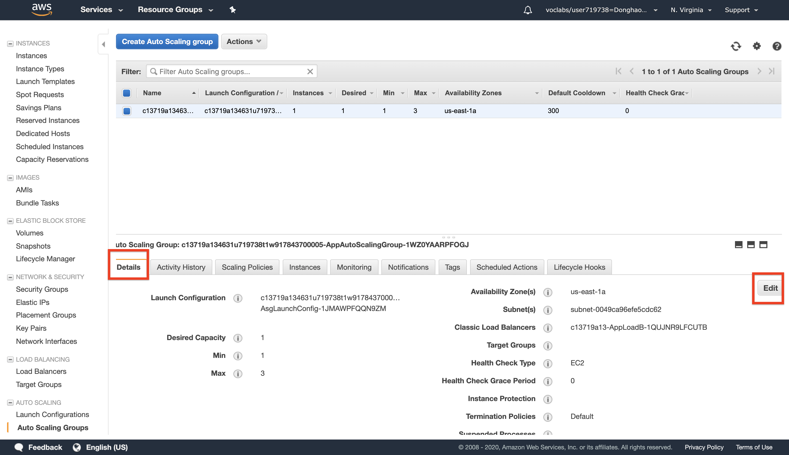
</p>

------------------------------------------------------------------------

<p align="center">
    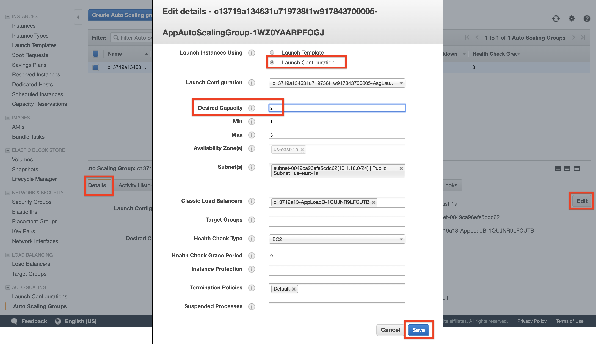
</p>

------------------------------------------------------------------------

<p align="center">
    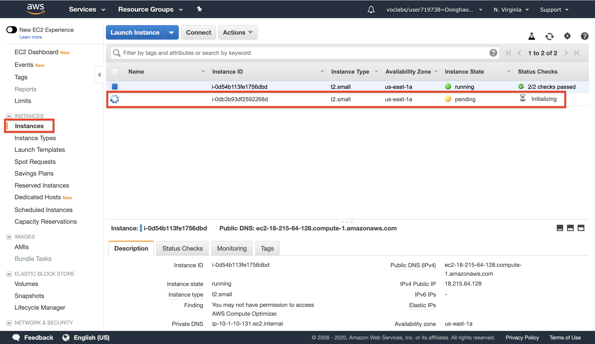
</p>

------------------------------------------------------------------------

#### `Comment:`
1. 如上图修改 `Desired capacity` 之后 ASG 就会自动启动一个新的 EC2。

### <span id="2.6">`Step6: Result.`</span>

- #### Click here: [BACK TO CONTENT](#2.0)

1. Lambda Function code.
<p align="center">
    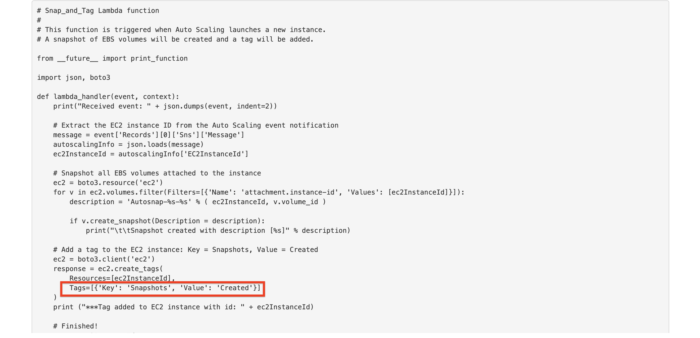
</p>

------------------------------------------------------------------------

2. `The new EC2 has a new tag from Lambda Function.`
<p align="center">
    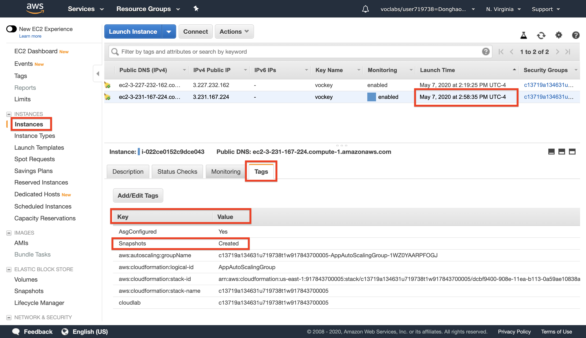
</p>

------------------------------------------------------------------------

3. Two new snapshots created at a same time.
<p align="center">
    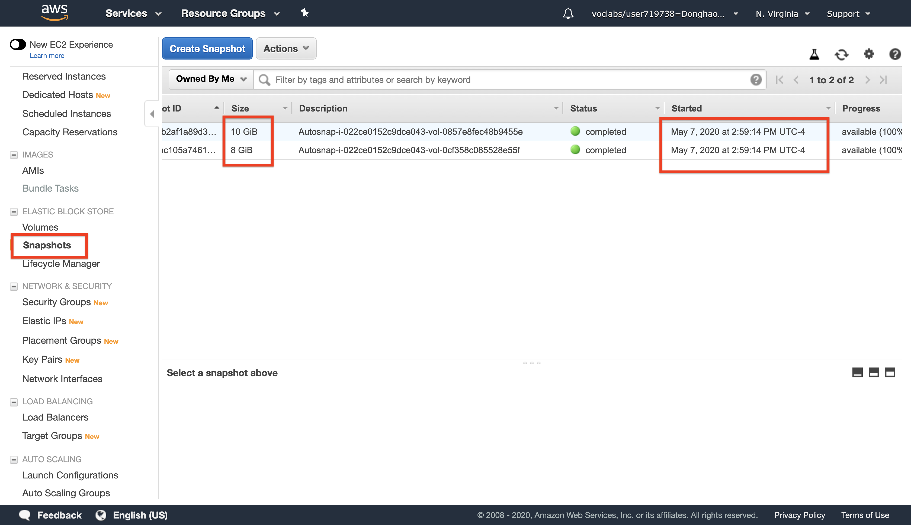
</p>

------------------------------------------------------------------------

4. 查看原来的 EC2 附带的 Volumes，上面一共有两个，说明 Lambda 运行成功。
<p align="center">
    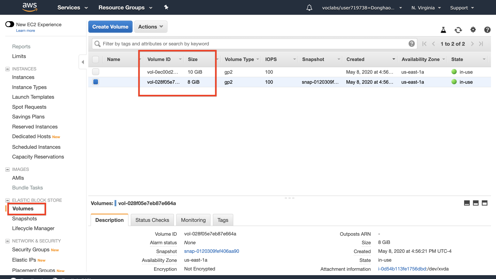
</p>

------------------------------------------------------------------------

#### `Comment:`
1. 

------------------------------------------------------------------------

- #### Click here: [BACK TO CONTENT](#2.0)
- #### Click here: [BACK TO NAVIGASTION](https://github.com/DonghaoWu/AWS/blob/master/README.md)

<p align="center">
    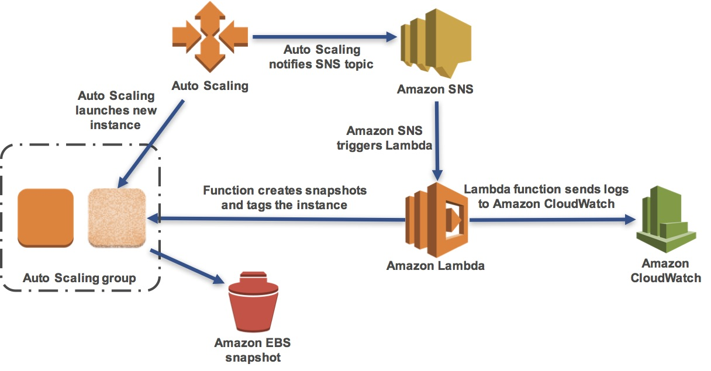
</p>