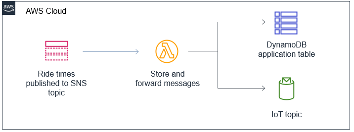

# AWS serverless services (Part 7)

- #### Click here: [BACK TO NAVIGASTION](https://github.com/DonghaoWu/AWS/blob/master/README.md)

- #### Click here: [GO TO REPO SAMPLE](https://github.com/aws-samples/aws-serverless-workshop-innovator-island)

## `Section: Implement a serverless application.`

### `Summary`: In this documentation, we learn using general aws services to implement a serverless app.

### `Check Dependencies:`

------------------------------------------------------------

#### `本章背景：`
1. 整体规划图：

<p align="center">
    
</p>

------------------------------------------------------------

2. 关键数据接口：
    1. front-end & backend : front-end <- API Gateway <- Lambda <- DynamoDB

    2. Real-Time backend : front-end <- IoT topic <- Lambda <- Flow & Traffic Controller's SNS topic <- seperate AWS account

    3. On-ride photo : front-end <- IoT topic <- Lambda <- final S3 <- Lambda <- processing S3 <- Lambda <- origin S3 <- Lambda <- API Gateway

    4. Analyzing visitor stats: Amazon QuickSight <- S3 <- Amazon Kinesis Data Firehose <- Visitor wristbands (simulator application)

    5. Event-based architecture: (Email, SMS) <- (Lambda function， CloudWatch log group, SNS topic)<- rules <- EventBridge event bus <- Lambda <- Flow & Traffic Controller's SNS topic <- seperate AWS account

3. 应用到的 AWS 服务。
<p align="center">
    
</p>

------------------------------------------------------------

### <span id="7.0">`Brief Contents & codes position`</span>

- #### Click here: [BACK TO NAVIGASTION](https://github.com/DonghaoWu/AWS/blob/master/README.md)

- [7.1 Introduction to related services.](#7.1)
- [7.2 Front-end and Back-end.](#7.2)
- [7.3 Real-Time Serverless Backend.](#7.3)
- [7.4 On-ride photo processing.](#7.4)
- [7.5 Language translation.](#7.5)
- [7.6 Analyzing visitor stats.](#7.6)
- [7.7 Developing event-based architecture.](#7.7)

------------------------------------------------------------

### <span id="7.1">`Step1: Introduction to related services.`</span>

- #### Click here: [BACK TO CONTENT](#7.0)

    :star: AWS Cloud9 IDE

    - [AWS Cloud9](https://aws.amazon.com/cloud9/) is a cloud-based integrated development environment (IDE) that lets you write, run, and debug your code with just a browser. It includes a code editor, debugger, and terminal. Cloud9 comes pre-packaged with essential tools for popular programming languages and the AWS Command Line Interface (CLI) pre-installed so you don’t need to install files or configure your laptop for this workshop. Your Cloud9 environment will have access to the same AWS resources as the user with which you logged into the AWS Management Console.

    :key: Cloud9 key command:

    ```zsh
    # Verify that your user is logged in by running the command aws sts get-caller-identity
    aws sts get-caller-identity
    ```

    :star: AWS CodeCommit(How it works - Frontend)
    - You will create a code repository in AWS CodeCommit.
    - You will download the existing frontend code into your Cloud9 IDE and push the code to this repository.
    - You will configure Amplify Console to connect to your repository and publish the web app.

    :star: AWS Amplify
    - All of your static web content including HTML, CSS, JavaScript, images and other files will be managed by AWS Amplify Console and served via Amazon CloudFront.

    - Your end users will then access your site using the public website URL exposed by AWS Amplify Console. You don't need to run any web servers or use other services in order to make your site available.

    :star: AWS DynamoDB `(backend)`
    - A DynamoDB table which you will populate with information about all the rides and attractions throughout the park.
    
    - DynamoDB is a key-value and document database which we will use to store information about all the rides and attractions throughout the park.

    :star: AWS Lambda function `(backend)`
    - A Lambda function which performs a table scan on the DynamoDB to return all the items.

    :star: AWS API Gateway `(backend)`
    - `An API Gateway API creates a public http endpoint for the front-end application to query. This invokes the Lambda function to return a list of rides and attractions.`

    :star: AWS SAM - Serverless Application Model
    - SAM is an open-source framework that makes it easier to deploy serverless infrastructure.
    - This allows you to specify your application requirements in code and SAM transforms and `expands the SAM syntax into AWS CloudFormation` to deploy your application. 

    :star: SNS Topic

    :star: AWS Cognito

    :star: AWS IoT endpoint :+1:

    :star: Amazon Kinesis Firehose
    - Every tap from a wristband creates an IoT message routed to the Amazon Kinesis Firehose delivery stream.
    - All messages are sent to the Kinesis Firehose delivery stream. This ingests large numbers of messages and stores the result in Amazon S3.
    - Amazon Kinesis Data Firehose is a fully managed service that reliably loads streaming data into data lakes, data stores and analytics tools. It can capture, transform, and load streaming data into Amazon S3, Amazon Redshift, Amazon Elasticsearch Service, and Splunk, enabling near real-time analytics with existing business intelligence tools like Amazon QuickSight.

    - It automatically scales to match the throughput of your data and requires no ongoing administration. You can configure a delivery stream and start sending data from hundreds of thousands of data sources to be loaded continuously to AWS – all in just a few minutes.

    :star: AWS QuickSight
    - 这里的 QuickSight 从 S3 引入文件数据，进行可视化分析。

    :star: AWS EventBridge

    :star: AWS CloudWatch metrics

------------------------------------------------------------

#### `Comment:`
1. cloud9 可以执行 github 的下载 repo 命令。
2. cloud9 可以执行 yum 安装，如
    ```console
    sudo yum install jq -y
    ```
3. Amplify 使用 cloudFront 支持服务，而不需要服务器。
4. 在这个 workshop 中，front-end 代码在 S3，backend 代码在 github。
5. AWS CodeCommit 也使用类似 git 的命令，如
    ```console
    $ cd ~/environment/theme-park-frontend/
    $ AWS_REGION=$(curl -s http://169.254.169.254/latest/meta-data/placement/availability-zone | sed 's/\(.*\)[a-z]/\1/')
    $ git push --set-upstream https://git-codecommit.$AWS_REGION.amazonaws.com/v1/repos/theme-park-frontend master
    ```
6. SAM 有自己的 CLI 去 deploy，如
    ```console
    sam build

    sam package --output-template-file packaged.yaml --s3-bucket $s3_deploy_bucket

    sam deploy --template-file packaged.yaml --stack-name theme-park-backend --capabilities CAPABILITY_IAM
    ```
7. SAM 的作用相当于 cloudFormation。
8. 把现成数据往数据库导入叫做：`Populate the DynamoDB Table`，如命令：
    ```console
    node ./importData.js $AWS_REGION $DDB_TABLE
    ```
9. SAM 生成 API Gateway endpoint URL 的查询：

    ```console
    aws cloudformation describe-stacks --stack-name theme-park-backend --query "Stacks[0].Outputs[?OutputKey=='InitStateApi'].OutputValue" --output text
    ```

10. 有了这个 endpoint. You have now created a public API that your frontend application can use to populate the map with points of interest.

11. 当 front-end 修改后，执行以下命令，从而驱动 Amplify 自动重新部署：
    ```console
    git commit -am "your comment"
    git push
    ```

12. 目前三者的关系是，在 cloud9 完成编码，然后将代码 push 到 codeCommit 中，最后 Amplify 连接 codeCommit，每当 codeCommit 的代码发生更换时，Amplify 就会自动 deploy。

### <span id="7.2">`Step2: Front-end and Back-end.`</span>

- #### Click here: [BACK TO CONTENT](#7.0)

<p align="center">
    
</p>

------------------------------------------------------------

<p align="center">
    
</p>

------------------------------------------------------------

#### `Comment:`
1. 前端跟后端是利用一个 API endpoint URL 串联起来，而这个 URL 实际上是调用一个 Lambda 函数去读取 DynamoDB 中的数据。

2. 目前获得：
    1. Created a code repository in Cloud9 and configured Amplify Console to publish the web app in this repository. You now have a public URL endpoint for your application. :sunny:（`Cloud9, Amplify, codeCommit`）
    2. Deployed the backend infrastructure for the theme park and application. :sunny:（`SAM, Lambda, DynamoDB, API Gateway`）
    3. Populated a DynamoDB table containing ride and attraction information for the park.:sunny:（`DynamoDB`）
    4. Tested the deployment by using the CLI to scan the DynamoDB table, and using curl to test the API Gateway endpoint :sunny:（`API Gateway`）
    5. Updated the front-end with this new API endpoint and saw the results in the application. :sunny: (`codeCommit, Amplify`)
    6. Pushed code changes (in the form of a configuration update) to CodeCommit, and saw how Amplify Console automatically detected the new commit and published the changes to the public frontend. :sunny:（`Cloud9, codeCommit, Amplify`）


### <span id="7.3">`Step3: Real-Time Serverless Backend.`</span>

- #### Click here: [BACK TO CONTENT](#7.0)

<p align="center">
    
</p>

------------------------------------------------------------

#### `Comment:`
- 概括：SNS 侦听外部资源，从而 SNS topic 调用Lambda，Lambda 一方面更新 DynamoDB，另一方面把信息传送到 IoT 端口，在前端侦听到 IoT topic 后更新显示信息。

1. 过程分析：设计一个 Lambda function， trigger 是一个 SNS topic。
    - This Lambda function code reads the latest message from the SNS topic, writes it to `DynamoDB` and then pushes the message to the frontend application `via an IoT topic`.

2. 在这个模块中学会：
    1. Connected your backend application with the Flow & Traffic Controller's SNS topic. :sunny: `(SNS topic)`
    2. Created a Lambda function that was invoked by the SNS topic whenever a new message is published. :sunny: `(Lambda, SNS topic)`
    3. Set up IAM permissions so your Lambda function could write this message to the application's DynamoDB table, and publish the message to the IoT topic for the front end. :sunny: `(IAM, Lambda, DynamoDB, IoT topic)`
    4. Updated the frontend with the configuration information so `it can listen to new messages on the IoT topic.（这一部没有详细交代是前端怎样侦听的）`

3. 关于 SNS topic 是怎样被调用的：
    - The Flow & Traffic Controller exists in a separate AWS account owned by the theme park. You are provided with the SNS topic ARN to use.`(更新的游客信息等都是通过另外一个账号的开放资料提供)`。

4. :question:个人觉得现在一共有两个 DynamoDB table，一个记录游客信息，一个记录实时行程？。

### <span id="7.4">`Step4: On-ride photo processing.`</span>

- #### Click here: [BACK TO CONTENT](#7.0)

<p align="center">
    
</p>

------------------------------------------------------------------------

- 设计路径：
    1. S3 Event Type : `theme-park-backend-uploadbucket` All object create events ---> Lambda trigger
    2. Lambda: Add layer to function, add environment variables
    3. S3: store the output object

    4. 使用 SAM 部署第二阶段：Lambda, IAM policy to S3
    5. S3 Event Type : `theme-park-backend-processingbucket` All object create events ---> Lambda trigger

    6. S3 Event Type : `theme-park-backend-uploadbucket` All object create events ---> Lambda trigger
    7. DynaomoDB: Save the image info for query.
    8. IoT topic: notify the frontend to update.


#### `Comment:`
1. 本部分使用到3个 S3 bucket，分别是：
    - theme-park-backend-uploadbucket
    - theme-park-backend-processingbucket
    - theme-park-backend-finalbucket

2. 本部分使用到3个 Lambda function，分别是：
    - theme-park-photos-chromakey
    - theme-park-photos-CompositeFunction
    - theme-park-photos-postprocess

3. The final Lambda function in the photo processing pipeline is triggered when the final image is rendered and saved into the S3 finalbucket. It will save the photo object information into DynamoDB and send a message to the IoT topic so the frontend application is notified.

4. 在这一步中还提到在第一步 deploy backend 时生成的 uploads API。
    ```console
    aws cloudformation describe-stacks --stack-name theme-park-backend --query "Stacks[0].Outputs[?OutputKey=='UploadApi'].OutputValue" --output text
    ```

### <span id="7.5">`Step5: Language translation.`</span>

- #### Click here: [BACK TO CONTENT](#7.0)

- 设计思路：
    - The front-end application uses a local languages resource file to substitute language strings when the locale is changed.
    - You will download this file and use a Node function that uses Amazon Translate to create a new file with a range of translations.
    - After the new language file is created, you will copy it into the frontend code and republish through Amplify Console. `(替换旧repo 中的语言文件 translation.json)`

------------------------------------------------------------------------

#### `Comment:`
1. 这一步跟很多软件的本地语言功能差不多，它这里的差别是上传英语版本，然后通过 Amazon translate 翻译成多个版本返回 json 文件，不是通过实时翻译。

### <span id="7.6">`Step6: Analyzing visitor stats.`</span>

- #### Click here: [BACK TO CONTENT](#7.0)

<p align="center">
    
</p>

---------------------------------------------------------------------

- 运作：
    1. The wristbands emit messages through the IoT infrastructure. These are sent to Kinesis Firehose.
    2. Firehose aggegrates data into objects stored in a dedicated S3 bucket.
    3. QuickSight uses the objects in the S3 bucket as a data source for analysis.

----------------------------------------------------------------------

#### `Comment:`
1. 原理：
    - Each park visitor has a wristband that collects data throughout the day. It records when visitors arrive and leave, and keeps track of every ride they visit.

    - When participants exit each ride, they tap the wristband on a ratings collection device. This leaves a rating from 1 (bad) to 5 (great). The wristband also transmits information about the visitor's name, age and home location.

    - 腕带信息包括出入景点信息，还有沿途状况，景点评分，游客姓名年龄和地址。
    - Kinesis 需要设置 Destination，在这里是 S3，同时需要设置 IAM Role。

2. :question:`目前剩下的疑问是，simulator application 跟 Kinesis 之间是怎样连接起来的？`

------------------------------------------------------------------------

### <span id="7.7">`Step7: Developing event-based architecture.`</span>

- #### Click here: [BACK TO CONTENT](#7.0)

- In this module, you are going to build new functionality that allows the park's maintenance teams to get alerts from the ride systems.

<p align="center">
    
</p>

------------------------------------------------------------------------

<p align="center">
    
</p>

------------------------------------------------------------------------

- 设计组件：
    1. A Lambda function can push data from the SNS topic to EventBridge. This helps decouple the producers and consumers of events, so if there are any more "new requirements" later, it will be easy to address these without impacting existing systems.

    2. EventBridge uses rules to filter incoming events and decided where they should be routed. You will be using rules to filter a subset of events to each of three services you need to build.

    3. The Flow & Traffic Controller is a separate system in the park. You are provided with the SNS topic ARN to use.

    4. The Lambda function receive new messages from the SNS topic. It parses this message and sends events to the EventBridge event bus.

    5. EventBridge receives these events and uses rules to decide where they should be routed.

    6. Events are routed to any number of downstream consumers, which are completely decoupled from the event producers.

------------------------------------------------------------------------

#### `Comment:`
1. 需要注意的是，这里应用的外部数据跟第一部分的 Flow & Traffic Controller 是一样的。在选择 SNS topic 时都是选择 `theme-park-ride-FATcontroller-...`
2. 生成的 Lambda function，作用为将 SNS topic 数据发送至 Amazon EventBridge。这个 Lambda 的生成是通过 SAM。
3. 在这一步中，关于下面的步骤没有详细描述：
    - EventBridge will now filter events on the default bus and send events matching the pattern to the Lambda function that populates CloudWatch metrics.
4. CloudWatch 收到数据之后，还要通过配置才能在创建一个 dashboard 进行监控。
5. 在 EventBridge 的设计 rule 的思路是，设定好是否是事件驱动型，然后选择 target， target 就是发生符合 rule 的事件时调用哪些资源。在本模块中选择了  :star2: Lambda function， CloudWatch log group, SNS topic。
    - `EventBridge will now filter events on the default bus and send events matching the pattern to the Lambda function and a CloudWatch log group.`
6. 设定 SNS topic 向用户发送 email 或者 SMS，而在这一步 SNS topic 就是作为 EventBridge 的 target， EventBridge 将符合的 event 数据激发 SNS topic 并传递到它里面，SNS topic 通过 confirm 的 subscription 向用户发送 email。
7. 同理也可以通过 EventBridge， SNS topic， SMS subscription 建立向用户发送 SMS 信息的系统。

------------------------------------------------------------------------

- #### Click here: [BACK TO CONTENT](#7.0)
- #### Click here: [BACK TO NAVIGASTION](https://github.com/DonghaoWu/AWS/blob/master/README.md)