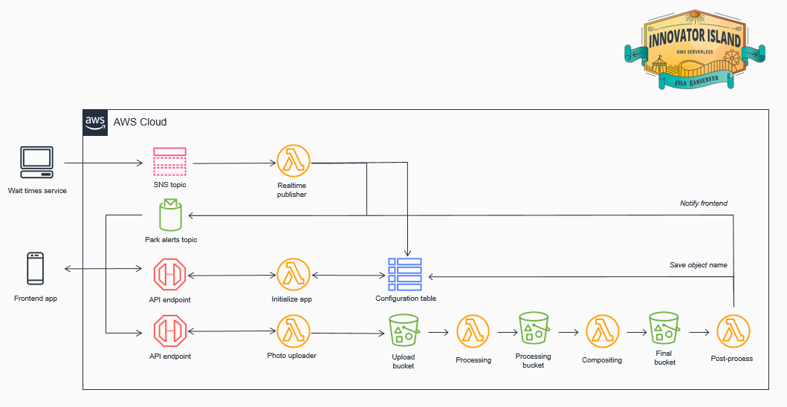

# AWS serverless services (Part 7)

- #### Click here: [BACK TO NAVIGASTION](https://github.com/DonghaoWu/AWS/blob/master/README.md)

- #### Click here: [GO TO REPO SAMPLE](https://github.com/aws-samples/aws-serverless-workshop-innovator-island)

## `Section: Implement a serverless application.`

### `Summary`: In this documentation, we learn using general aws service to implement a serverless app.

### `Check Dependencies:`

------------------------------------------------------------

#### `本章背景：`
1. 整体规划图：

<p align="center">
    
</p>

------------------------------------------------------------

<p align="center">
    
</p>

------------------------------------------------------------

### <span id="7.0">`Brief Contents & codes position`</span>

- #### Click here: [BACK TO NAVIGASTION](https://github.com/DonghaoWu/AWS/blob/master/README.md)

- [7.1 Introduction to related services.](#7.1)
- [7.2 Front-end and Back-end.](#7.2)
- [7.3 Real-Time Serverless Backend.](#7.3)
- [7.4 On-ride photo processing.](#7.4)
- [7.5 Scale-Out the Auto Scaling Group to Trigger the Lambda function.](#7.5)
- [7.6 Result.](#7.6)

------------------------------------------------------------

### <span id="7.1">`Step1: Introduction to related services.`</span>

- #### Click here: [BACK TO CONTENT](#7.0)

    :star: AWS Cloud9 IDE

    - [AWS Cloud9](https://aws.amazon.com/cloud9/) is a cloud-based integrated development environment (IDE) that lets you write, run, and debug your code with just a browser. It includes a code editor, debugger, and terminal. Cloud9 comes pre-packaged with essential tools for popular programming languages and the AWS Command Line Interface (CLI) pre-installed so you don’t need to install files or configure your laptop for this workshop. Your Cloud9 environment will have access to the same AWS resources as the user with which you logged into the AWS Management Console.

    :key: Cloud9 key command:

    ```zsh
    # Verify that your user is logged in by running the command aws sts get-caller-identity
    aws sts get-caller-identity
    ```

    :star: AWS CodeCommit(How it works - Frontend)
    - You will create a code repository in AWS CodeCommit.
    - You will download the existing frontend code into your Cloud9 IDE and push the code to this repository.
    - You will configure Amplify Console to connect to your repository and publish the web app.

    :star: AWS Amplify
    - All of your static web content including HTML, CSS, JavaScript, images and other files will be managed by AWS Amplify Console and served via Amazon CloudFront.

    - Your end users will then access your site using the public website URL exposed by AWS Amplify Console. You don't need to run any web servers or use other services in order to make your site available.

    :star: AWS DynamoDB `(backend)`
    - A DynamoDB table which you will populate with information about all the rides and attractions throughout the park.
    
    - DynamoDB is a key-value and document database which we will use to store information about all the rides and attractions throughout the park.

    :star: AWS Lambda function `(backend)`
    - A Lambda function which performs a table scan on the DynamoDB to return all the items.

    :star: AWS API Gateway `(backend)`
    - `An API Gateway API creates a public http endpoint for the front-end application to query. This invokes the Lambda function to return a list of rides and attractions.`

    :star: AWS SAM - Serverless Application Model
    - SAM is an open-source framework that makes it easier to deploy serverless infrastructure.
    - This allows you to specify your application requirements in code and SAM transforms and `expands the SAM syntax into AWS CloudFormation` to deploy your application. 

    :star: SNS Topic

    :star: AWS Cognito

    :star: AWS IoT endpoint

------------------------------------------------------------

#### `Comment:`
1. cloud9 可以执行 github 的下载 repo 命令。
2. cloud9 可以执行 yum 安装，如
    ```console
    sudo yum install jq -y
    ```
3. Amplify 使用 cloudFront 支持服务，而不需要服务器。
4. 在这个 workshop 中，front-end 代码在 S3，backend 代码在 github。
5. AWS CodeCommit 也使用类似 git 的命令，如
    ```console
    $ cd ~/environment/theme-park-frontend/
    $ AWS_REGION=$(curl -s http://169.254.169.254/latest/meta-data/placement/availability-zone | sed 's/\(.*\)[a-z]/\1/')
    $ git push --set-upstream https://git-codecommit.$AWS_REGION.amazonaws.com/v1/repos/theme-park-frontend master
    ```
6. SAM 有自己的 CLI 去 deploy，如
    ```console
    sam build

    sam package --output-template-file packaged.yaml --s3-bucket $s3_deploy_bucket

    sam deploy --template-file packaged.yaml --stack-name theme-park-backend --capabilities CAPABILITY_IAM
    ```
7. SAM 的作用相当于 cloudFormation。
8. 把现成数据往数据库导入叫做：`Populate the DynamoDB Table`，如命令：
    ```console
    node ./importData.js $AWS_REGION $DDB_TABLE
    ```
9. SAM 生成 API Gateway endpoint URL 的查询：

    ```console
    aws cloudformation describe-stacks --stack-name theme-park-backend --query "Stacks[0].Outputs[?OutputKey=='InitStateApi'].OutputValue" --output text
    ```

10. 有了这个 endpoint. You have now created a public API that your frontend application can use to populate the map with points of interest.

11. 当 front-end 修改后，执行以下命令，从而驱动 Amplify 自动重新部署：
    ```console
    git commit -am "your comment"
    git push
    ```

12. 目前三者的关系是，在 cloud9 完成编码，然后将代码 push 到 codeCommit 中，最后 Amplify 连接 codeCommit，每当 codeCommit 的代码发生更换时，Amplify 就会自动 deploy。

### <span id="7.2">`Step2: Front-end and Back-end.`</span>

- #### Click here: [BACK TO CONTENT](#7.0)

<p align="center">
    
</p>

------------------------------------------------------------

<p align="center">
    
</p>

------------------------------------------------------------

#### `Comment:`
1. 前端跟后端是利用一个 API endpoint URL 串联起来，而这个 URL 实际上是调用一个 Lambda 函数去读取 DynamoDB 中的数据。

2. 目前获得：
    1. Created a code repository in Cloud9 and configured Amplify Console to publish the web app in this repository. You now have a public URL endpoint for your application. :zap:（`Cloud9, Amplify, codeCommit`）
    2. Deployed the backend infrastructure for the theme park and application. :zap:（`SAM, Lambda, DynamoDB, API Gateway`）
    3. Populated a DynamoDB table containing ride and attraction information for the park.:zap:（`DynamoDB`）
    4. Tested the deployment by using the CLI to scan the DynamoDB table, and using curl to test the API Gateway endpoint :zap:（`API Gateway`）
    5. Updated the front-end with this new API endpoint and saw the results in the application. :zap: (`codeCommit, Amplify`)
    6. Pushed code changes (in the form of a configuration update) to CodeCommit, and saw how Amplify Console automatically detected the new commit and published the changes to the public frontend. :zap:（`Cloud9, codeCommit, Amplify`）


### <span id="7.3">`Step3: Real-Time Serverless Backend.`</span>

- #### Click here: [BACK TO CONTENT](#2.0)

<p align="center">
    
</p>

------------------------------------------------------------

#### `Comment:`
- 概括：SNS 侦听外部资源，从而 SNS topic 调用Lambda，Lambda 一方面更新 DynamoDB，另一方面把信息传送到 IoT 端口，在前端侦听到 IoT topic 后更新显示信息。

1. 过程分析：设计一个 Lambda function， trigger 是一个 SNS topic。
    - This Lambda function code reads the latest message from the SNS topic, writes it to `DynamoDB` and then pushes the message to the frontend application `via an IoT topic`.

2. 在这个模块中学会：
    1. Connected your backend application with the Flow & Traffic Controller's SNS topic. :zap: `(SNS topic)`
    2. Created a Lambda function that was invoked by the SNS topic whenever a new message is published. :zap: `(Lambda, SNS topic)`
    3. Set up IAM permissions so your Lambda function could write this message to the application's DynamoDB table, and publish the message to the IoT topic for the front end. :zap: `(IAM, Lambda, DynamoDB, IoT topic)`
    4. Updated the frontend with the configuration information so `it can listen to new messages on the IoT topic.（这一部没有详细交代是前端怎样侦听的）`

3. 关于 SNS topic 是怎样被调用的：
    - The Flow & Traffic Controller exists in a separate AWS account owned by the theme park. You are provided with the SNS topic ARN to use.`(更新的游客信息等都是通过另外一个账号的开放资料提供)`。

4. 个人觉得现在一共有两个 DynamoDB table，一个记录游客信息，一个记录实时行程？ :zap: `(思考)`。

### <span id="7.4">`Step4: On-ride photo processing.`</span>

- #### Click here: [BACK TO CONTENT](#7.0)

<p align="center">
    
</p>

------------------------------------------------------------------------

1. Configure Lambda function.
<p align="center">
    
</p>

------------------------------------------------------------------------

2. Add Lambda code.
<p align="center">
    
</p>

------------------------------------------------------------------------

3. Add trigger (SNS topic)
<p align="center">
    
</p>

------------------------------------------------------------------------

4. Finished set up.
<p align="center">
    
</p>

------------------------------------------------------------------------

#### `Comment:`
1. Lambda function code (runtime: python 2.7)

```py
# Snap_and_Tag Lambda function
#
# This function is triggered when Auto Scaling launches a new instance.
# A snapshot of EBS volumes will be created and a tag will be added.

from __future__ import print_function

import json, boto3

def lambda_handler(event, context):
    print("Received event: " + json.dumps(event, indent=2))

    # Extract the EC2 instance ID from the Auto Scaling event notification
    message = event['Records'][0]['Sns']['Message']
    autoscalingInfo = json.loads(message)
    ec2InstanceId = autoscalingInfo['EC2InstanceId']

    # Snapshot all EBS volumes attached to the instance
    ec2 = boto3.resource('ec2')
    for v in ec2.volumes.filter(Filters=[{'Name': 'attachment.instance-id', 'Values': [ec2InstanceId]}]):
        description = 'Autosnap-%s-%s' % ( ec2InstanceId, v.volume_id )

        if v.create_snapshot(Description = description):
            print("\t\tSnapshot created with description [%s]" % description)

    # Add a tag to the EC2 instance: Key = Snapshots, Value = Created
    ec2 = boto3.client('ec2')
    response = ec2.create_tags(
        Resources=[ec2InstanceId],
        Tags=[{'Key': 'Snapshots', 'Value': 'Created'}]
    )
    print ("***Tag added to EC2 instance with id: " + ec2InstanceId)

    # Finished!
    return ec2InstanceId
```

2. Examine the code. It is performing the following steps:

    - Extract the EC2 instance ID from the notification message
    - Create a snapshot of all EBS volumes attached to the instance
    - Add a tag to the instance to indicate that snapshots were created

### <span id="2.5">`Step5: Scale-Out the Auto Scaling Group to Trigger the Lambda function.`</span>

- #### Click here: [BACK TO CONTENT](#2.0)

<p align="center">
    
</p>

------------------------------------------------------------------------

<p align="center">
    
</p>

------------------------------------------------------------------------

<p align="center">
    
</p>

------------------------------------------------------------------------

#### `Comment:`
1. 如上图修改 `Desired capacity` 之后 ASG 就会自动启动一个新的 EC2。

### <span id="2.6">`Step6: Result.`</span>

- #### Click here: [BACK TO CONTENT](#2.0)

1. Lambda Function code.
<p align="center">
    
</p>

------------------------------------------------------------------------

2. `The new EC2 has a new tag from Lambda Function.`
<p align="center">
    
</p>

------------------------------------------------------------------------

3. Two new snapshots created at a same time.
<p align="center">
    
</p>

------------------------------------------------------------------------

4. 查看原来的 EC2 附带的 Volumes，上面一共有两个，说明 Lambda 运行成功。
<p align="center">
    
</p>

------------------------------------------------------------------------

#### `Comment:`
1. 

------------------------------------------------------------------------

- #### Click here: [BACK TO CONTENT](#2.0)
- #### Click here: [BACK TO NAVIGASTION](https://github.com/DonghaoWu/AWS/blob/master/README.md)

<p align="center">
    
</p>