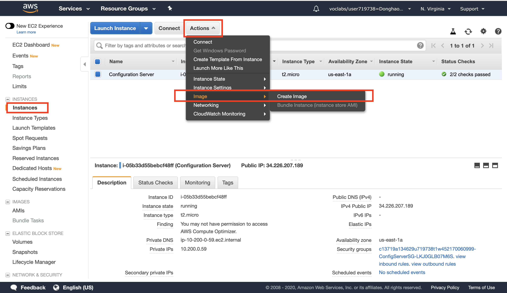
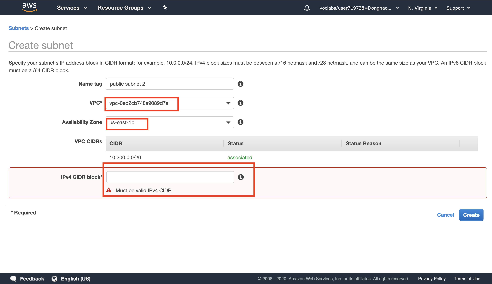
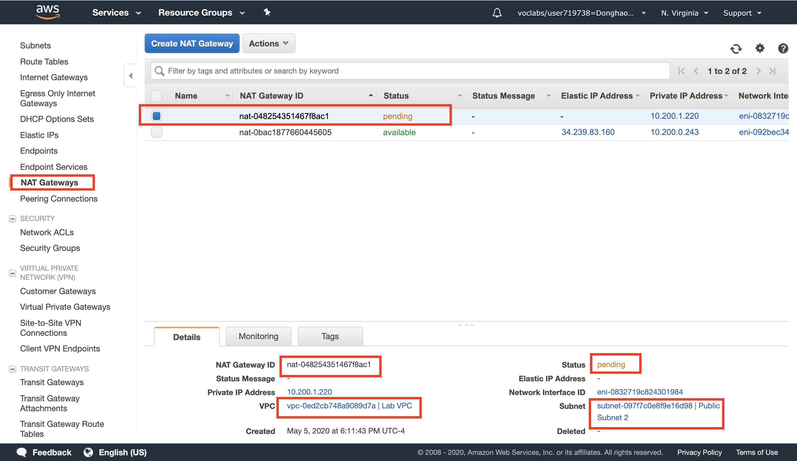
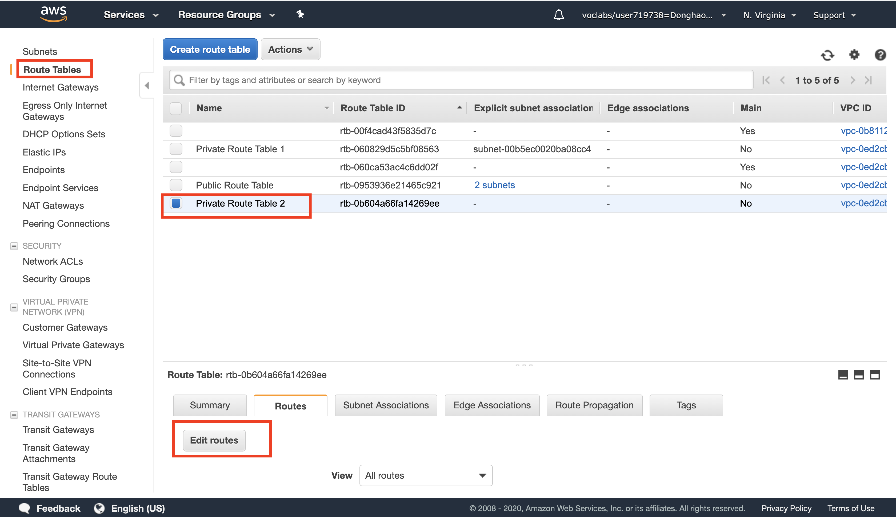

# AWS solution architect (Part 1)

- #### Click here: [BACK TO NAVIGASTION](https://github.com/DonghaoWu/WebDev-tools-demo/blob/master/README.md)

## `Section: Making Your Environment Highly Available`

### `Summary`: In this documentation, we learn Making Your Environment Highly Available.

### `Check Dependencies:`

------------------------------------------------------------

#### `本章背景：`
1. 这一部分的内容是要求在已经建立好的简单 VPC 基础上添加 Load balancer 和 Auto Scaling Group 从而使整个系统的 `持续可用能力` 提高。

2. To build a highly available application, `it is a best practice to launch resources in multiple Availability Zones`.

3. 本章设置的地址池：

    - VPC：`10.200.0.0/20`
    - Public subnet 1: `10.200.0.0/24`
    - Private subnet 1: `10.200.2.0/23`
    - Public subnet 2: `10.200.1.0/24`
    - Private subnet 2: `10.200.4.0/23`

4. 数据流管道：

outbound：
```diff
+ EC2 -> Private subnet + Route Table -> NAT gateway -> Public subnet + Route Table -> Internet Gateway 
```

5. NAT gateway 必须是在 `public subnet CIDR` 内。

- 设计 HA 整体的步骤是：

```diff
+ AMI
+ AZ
+ Application Load Balancer
+ Auto Scaling Group
```

### <span id="1.0">`Brief Contents & codes position`</span>

- #### Click here: [BACK TO NAVIGASTION](https://github.com/DonghaoWu/WebDev-tools-demo/blob/master/README.md)

- [1.1 Inspect Your environment.](#1.1)
- [1.2 Using SSH to Connect(Mac).](#1.2)
- [1.3 Download, Install, and Launch Your Web Server's PHP Application.](#1.3)
- [1.4 Create an Amazon Machine Image (AMI)](#1.4)
- [1.5 Configure a Second Availability Zone.](#1.5)
- [1.6 Create an Application Load Balancer.](#1.6)
- [1.7 ](#1.7)


------------------------------------------------------------

### <span id="1.1">`Step1: Inspect Your environment.`</span>

- #### Click here: [BACK TO CONTENT](#1.0)

1. 设定好的基本的 VPC 结构：

    - IPv4 CIDR：10.200.0.0/20 - 10.200.15.255 。一共`4096`个地址（包含几个 aws 保留地址），这些地址都是只能够在 VPC 内部使用的，也是所谓的地址池。

    - Route Table：这个是很多部件都有的。

    - Subnets：理解成把内部地址切割成小部分，这是 VPC 里面很重要的部件设定。
    - Availability Zone：每个 subnet 都要设定所属的 AZ。
    - Internet Gateway：相当于一个 VPC 跟 Internet 的交流处，所有 VPC 内需要跟 Internet 交流的服务都需要在 `Route Table` 中接上它。

    - Security Group：一个用来限制出入协议类型和地址范围的安全设定，可以套用在很多地方，比如 EC2，Load Balancer，Auto Scaling Group 等等。在 VPC 层面可以查看所有已经生成的 SG 规则。`这是个常用策略，后续详细分解。`

2. Subnet

    - Route Table：一个 public subnet 的 Route Table 设置有基本两条设定：
        - Destination：10.200.0.0/20，target：local 
        - Destination：0.0.0.0/0，target：igw-00ea57db0b42a0107

        - 备注：第一条的意思是，这个 subnet 任何向 10.200.0.0/20 范围的地址发出的请求都是指向 `VPC` 而不是外网的，这相当于`设定了 subnet 跟 VPC 的从属关系。`
        - 备注：第二条的意思是，这个 subnet 任何向 0.0.0.0/0 范围的地址发出的请求都是指向一个 `internet gateway` 的，这相当于`设定了 subnet 跟 internet 之间的交流通过 gateway。`（也因为这个设定使这个 subnet 成为 public。）
    
    - Network ACL：这个是 subnet 特有的，`作用跟 SG 差不多，但应用对象只能是 subnet。`

    - Availability zone：Subnet 所属 AZ。 

3. EC2

    - IPv4 Public IP：这个是每个 EC2 在网络上的标记，也就是说从浏览器可以访问的地址。
    - Private IPs：这个 EC2 在 VPC 内部地址。
    - Security Group：应用在这个 EC2 的 SG 规则。
    - Availability zone：EC2 所属 AZ。 


#### `Comment:`
1. 同一个 Route Table 里面的不同规则会有不同的覆盖或独立关系，后面更新。

2. 一个比较难理解的点，就是虽然是同一个 VPC，但是里面的 subnet 可以属于不同的差异非常大的 AZ，也就是说同一个 VPC 地址池的 IP 可以分配到很多 AZ 的服务器。

3. `subnet 有 Network ACL，其他服务如 EC2 有 Security Group。`

4. 判断 EC2 跟 Subnet 的关系可以通过 VPC 地址从属关系看出。

5. EC2 是没有 `Route Table` 的，它只能从所属 Subnet 那里直接继承下来，这样隐性的 `Route Table` 和 显式的 `Security Group` 构成了 EC2 的对外通讯规则。

### <span id="1.2">`Step2: Using SSH to Connect(Mac).`</span>

- #### Click here: [BACK TO CONTENT](#1.0)

1. Download button and save the labsuser.pem file.

2. bash command:
```bash
$ cd ~/Downloads
$ chmod 400 labsuser.pem
$ ssh -i labsuser.pem ec2-user@<public-ip> ## Then type ’yes‘
```

### <span id="1.3">`Step3: Download, Install, and Launch Your Web Server's PHP Application`</span>

- #### Click here: [BACK TO CONTENT](#1.0)

```bash
$ sudo yum -y update
$ sudo yum -y install httpd php
$ sudo chkconfig httpd on
$ wget https://aws-tc-largeobjects.s3-us-west-2.amazonaws.com/CUR-TF-200-ACACAD/studentdownload/phpapp.zip
$ sudo unzip phpapp.zip -d /var/www/html/
$ sudo service httpd start
$ exit
```

#### `Comment:`
1. 第三句：This configures the Apache web server to automatically start when the instance starts.
2. 第六句：This starts the Apache web server. `在当前 instance 马上启动 Apache 服务器处理软件。`
3. 第七句：This ends your SSH session. `结束本地电脑对 instance 的操作，但不是关闭instance 运行。`


### <span id="1.4">`Step4: Create an Amazon Machine Image (AMI).`</span>

- #### Click here: [BACK TO CONTENT](#1.0)

- Terminology:
    - Amazon Machine Image (AMI): An AMI is `a copy of the disk volumes attached to an Amazon EC2 instance`. When a new instance is launched from an AMI, the disk volumes will contain exactly the same data as the original instance.

<p align="center">
    
</p>

------------------------------------------------------------------------

#### `Comment:`
1. 创建一个可复制并自动部署的软件系统镜像，这是创建 Auto Scaling Group 之前必须实现的第一步。

2. 这里创建的 AMI 是以上面已经存在的 EC2 里面的数据为基础（包括 Apache 设置及应用）。

3. There is no need to wait while it is being created.


### <span id="1.5">`Step5: Configure a Second Availability Zone.`</span>

- #### Click here: [BACK TO CONTENT](#1.0)

- 大纲：
    - You will duplicate your network environment into a second Availability Zone. You will create:

        - A second public subnet
        - A second private subnet
        - A second NAT Gateway
        - A second private Route Table


1. 创建 `A second Public subnet`:

    这里主要设计以下几个设置：
    1. __`VPC`__：在目标 VPC 内创建 subnet
    2. __`AZ`__：subnet 的 AZ 跟 VPC 内其他 `public subnet 的 AZ 必须不一样`
    3. __`CIDR`__：`需要手动输入这个 subnet 的地址池 （CIDR）。`
    4. __`Route Table`__：必须有一条 `Destination：0.0.0.0/0，target：igw-00ea57db0b42a0107`

<p align="center">
    
</p>

------------------------------------------------------------------------

2. 创建 `A second Private subnet`:

    这里主要设计以下几个设置：
    1. __`VPC`__：在目标 VPC 内创建 subnet
    2. __`AZ`__：subnet 的 AZ 跟 上一步中一致。
    3. __`CIDR`__：`需要手动输入这个 subnet 的地址池 （CIDR）。`
    4. __`Route Table`__：需要一个新的 Route Table (第四步)，连接内网同时连接第三步创建的 `second NAT gateway`。

3. 创建 `A Second NAT Gateway`

    - 术语：
        - A NAT Gateway (Network Address Translation) is `provisioned into a public Subnet` and provides `outbound Internet connectivity` for resources in a `private Subnet`.

    这里主要设计以下几个设置：
    1. __`subnet`__：第一步中创建的 public subnet。
    2. __`EIP`__：An Elastic IP Address (EIP) is a static IP address that will be associated with this NAT Gateway. The Elastic IP address will `remain unchanged `over the life of the NAT Gateway.

<p align="center">
    
</p>

------------------------------------------------------------------------

4. 创建 `A second private Route Table`

<p align="center">
    
</p>

------------------------------------------------------------------------

<p align="center">
    
</p>

------------------------------------------------------------------------

##### 记得创建之后 `Edit subnet associations.`

#### `Comment:`
1. To build a highly available application, it is a best practice to launch resources in multiple Availability Zones.

2. NAT 是位于 Public Subnet 内连接 `Private subnet` 的服务，主要作用是可以为 `Private subnet` 提供`外向`数据能力。

3. EIP 也是一个`固定 IP + 灵活底层硬件`的设置。

4. 小结：

```diff
+ subnet:
    - VPC
    - AZ
    - CIDR
    - Route Table

+ NAT Gateway
    - subnet
    - EIP
```

### <span id="1.6">`Step6: Create an Application Load Balancer.`</span>

- #### Click here: [BACK TO CONTENT](#1.0)

```js
const fs = require("fs");
const superagent = require("superagent");

const readFilePro = file => {
    return new Promise((resolve, reject) => {
        fs.readFile(file, (err, data) => {
            if (err) reject({ message: 'I could not find the file.' });
            resolve(data);
        })
    })
}

const writeFilePro = (file, data) => {
    return new Promise((resolve, reject) => {
        fs.writeFile(file, data, err => {
            if (err) reject({ message: 'I could not write the file.' });
            resolve('success');
        })
    })
}

const example3 = async () => {
    try {
        // stop the code here and wait for the promise finish. stop ... until
        const data = await readFilePro(`${__dirname}/dog.txt`); //await 后面跟 promise，之后的代码相当于从这里开始进入了 promise 链。
        console.log(`Breed:${data}`);
        const res = await superagent.get(`https://dog.ceo/api/breed/${data}/images/random`);
        console.log(res.body.message);
        await writeFilePro('dog-img.txt', res.body.message);
        console.log('Random dog image saved to file!');
    } catch (error) {
        console.log(error.message);
    }
};

example3();
```

#### `Comment:`
1. 第一个必须注明的是，这只是一种新的形式去处理`async action/ promise`。`example3`写法更好理解和维护，但是后台执行的原理跟`example1`和`example2`一模一样。其实这里使用的还是处理 promise 的方法，只是形式改变了，底下执行的原理跟原生 promise 一样。

2. 使用 `async` 定义的函数，表示里面可以使用关键词`await`和`try catch`。
3. 目前从代码上面看，`await` 后面是必须跟一个 `promise`的，所以必须要把异步函数先`promise`化。`await`的意思是等待这个`promise`成功完成，有返回值的话就赋值，`且之后的所有语句都进入 promise 链条。`
4. 可以看出，在异步模式下加上`async`和`await`就可以使`promise`返回一个值，不过这个异步模式的赋值不能用在同步模式的执行上，因为执行模式不一样，所以跟同步函数的运行和思考模式不一样。操作模式不一样，对应的结果也难互相使用，当然同步函数的值可以使用在异步函数中。

5. 目前为止，提到几个比较容易混淆的单词：同步函数，异步函数，同步模式，异步模式，同步动作，异步动作，同步输出，异步输出。后面需要继续解释，理清概念边界。（4月20日）

6. 总的来说，`async function` 加上`Promise`生成`promise`，`promise`使用`async`定义并内部调用是一种简化的`处理 promise`的方式。还是那句话，没有`async`定义并调用，`promise`也可以使用旧方式处理。

### <span id="7.7">`Step7: More about async function.`</span>

- #### Click here: [BACK TO CONTENT](#7.0)
- #### Click here: [Part8: Async-Research (doc)](https://github.com/DonghaoWu/WebDev-tools-demo/blob/master/Async/Async-Research(doc).md)

- #### Click here: [Part9: Async-Research (code)](https://github.com/DonghaoWu/WebDev-tools-demo/blob/master/Async/Async-Research(code).md)

#### `Comment:`
1. 4月20日，目前来看，一个函数里面如果有 `async function`或者`promise`,那么整个函数就是 `async fucntion`，Node 会使用异步方式执行整个函数。（这个观点是不正确的，async 里面的同步动作还是会直接执行的，4月28日。）
2. 使用 `async` 定义的函数，返回值一定是一个`promise`，所以可以跟着用 .then 和 .catch。

3. 待补充材料：`throw` & `promise.all`

- #### Click here: [BACK TO CONTENT](#7.0)
- #### Click here: [BACK TO NAVIGASTION](https://github.com/DonghaoWu/WebDev-tools-demo/blob/master/README.md)